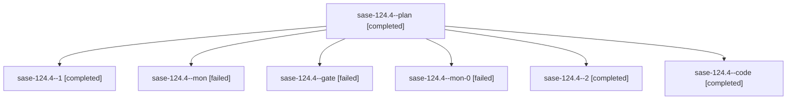

# Family: sase-124.4

[Agent Hoods](../README.md) / [bbugyi200](../users/bbugyi200/README.md) / [athena](../users/bbugyi200/machines/athena/README.md) / [sase-124](../users/bbugyi200/machines/athena/hoods/sase-124/README.md) / sase-124.4

Owner: `bbugyi200.athena` · Hood: `sase-124` · Members: 7 · Bead: [sase-124.4](https://github.com/sase-org/sase--beads/blob/main/pages/sase-124/sase-124.4.md)

## Lineage

The diagram is an optional enhancement; the ordered table below contains the same lineage in accessible text.

| Role | Agent | State | Model / provider | Timing | Commits | Prompt | Chat |
|---|---|---|---|---|---:|---|---|
| plan | sase-124.4--plan | completed | gpt-5.6-sol / codex | 2026-09-17T17:18:19.267823+00:00 → 2026-09-17T18:25:03.040619+00:00 | 0 | [Prompt](../agents/bbugyi200.athena.sase-124.4--plan/prompt.md) | [Chat](../agents/bbugyi200.athena.sase-124.4--plan/chat.md) |
| 1 | sase-124.4--1 | completed | sonnet / claude | 2026-09-17T18:55:31.200762+00:00 → 2026-09-17T18:59:16.061963+00:00 | 0 | [Prompt](../agents/bbugyi200.athena.sase-124.4--1/prompt.md) | [Chat](../agents/bbugyi200.athena.sase-124.4--1/chat.md) |
| mon | sase-124.4--mon | failed | gpt-5.5 / codex | 2026-09-17T18:24:42.247242+00:00 → 2026-09-17T18:55:31.565475+00:00 | 0 | — | [Chat](../agents/bbugyi200.athena.sase-124.4--mon/chat.md) |
| gate | sase-124.4--gate | failed | gpt-5.6-sol / codex | 2026-09-17T17:30:46.587994+00:00 → 2026-09-17T17:31:29.339694+00:00 | 0 | — | [Chat](../agents/bbugyi200.athena.sase-124.4--gate/chat.md) |
| mon-0 | sase-124.4--mon-0 | failed | sonnet / claude | 2026-09-17T18:58:56.030743+00:00 → 2026-09-17T19:21:42.334183+00:00 | 0 | — | [Chat](../agents/bbugyi200.athena.sase-124.4--mon-0/chat.md) |
| 2 | sase-124.4--2 | completed | sonnet / claude | 2026-09-17T19:21:42.181986+00:00 → 2026-09-17T19:25:59.083133+00:00 | [1](../agents/bbugyi200.athena.sase-124.4--2/README.md#commits) | [Prompt](../agents/bbugyi200.athena.sase-124.4--2/prompt.md) | [Chat](../agents/bbugyi200.athena.sase-124.4--2/chat.md) |
| code | sase-124.4--code | completed | gpt-5.5 / codex | 2026-09-17T17:32:05.643050+00:00 → 2026-09-17T18:25:03.040619+00:00 | 0 | — | [Chat](../agents/bbugyi200.athena.sase-124.4--code/chat.md) |

## Commits

| Role | Repo | Commit | Subject | Committed |
|---|---|---|---|---|
| 2 | sase | [`26a43d2`](https://github.com/sase-org/sase/commit/26a43d29f47f59011b44128505bef4500010fbe9) | perf(tui): narrow agent-loading refreshes with artifact/claims caches | 2026-09-17 15:23:04 EDT |

## Neighbors

| Agent | Relation | State |
|---|---|---|
| [sase-124.1](../agents/bbugyi200.athena.sase-124.1/README.md) | sase-124 hood | active |
| [sase-124.2](../agents/bbugyi200.athena.sase-124.2/README.md) | sase-124 hood | completed |
| [sase-124.3](../agents/bbugyi200.athena.sase-124.3/README.md) | sase-124 hood | completed |
| [sase-124.5](bbugyi200.athena.sase-124.5.md) (family · 3) | sase-124 hood | completed 2, failed 1 |
| [sase-124.6](../agents/bbugyi200.athena.sase-124.6/README.md) | sase-124 hood | completed |
| [sase-124.7](../agents/bbugyi200.athena.sase-124.7/README.md) | sase-124 hood | completed |
| [sase-124.8.1](../agents/bbugyi200.athena.sase-124.8.1/README.md) | sase-124 hood | completed |
| [sase-124.8.2](../agents/bbugyi200.athena.sase-124.8.2/README.md) | sase-124 hood | completed |
| [sase-124.8.3](bbugyi200.athena.sase-124.8.3.md) (family · 7) | sase-124 hood | completed 4, failed 3 |
| [sase-124.8.4.1](bbugyi200.athena.sase-124.8.4.1.md) (family · 3) | sase-124 hood | active 1, completed 1, failed 1 |
| [sase-124.8.4.2](../agents/bbugyi200.athena.sase-124.8.4.2/README.md) | sase-124 hood | waiting |
| [sase-124.8.4.land](../agents/bbugyi200.athena.sase-124.8.4.land/README.md) | sase-124 hood | waiting |
| [sase-124.8.land](bbugyi200.athena.sase-124.8.land.md) (family · 3) | sase-124 hood | failed 3 |
| [sase-124.land](bbugyi200.athena.sase-124.land.md) (family · 3) | sase-124 hood | failed 3 |
