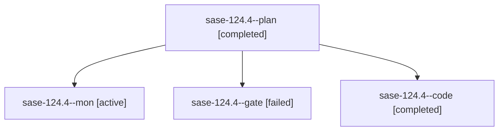

# Family: sase-124.4

[Agent Hoods](../README.md) / [bbugyi200](../users/bbugyi200/README.md) / [athena](../users/bbugyi200/machines/athena/README.md) / [sase-124](../users/bbugyi200/machines/athena/hoods/sase-124/README.md) / sase-124.4

Owner: `bbugyi200.athena` · Hood: `sase-124` · Members: 4 · Bead: [sase-124.4](https://github.com/sase-org/sase--beads/blob/main/pages/sase-124/sase-124.4.md)

## Lineage

The diagram is an optional enhancement; the ordered table below contains the same lineage in accessible text.

| Role | Agent | State | Model / provider | Timing | Commits | Prompt | Chat |
|---|---|---|---|---|---:|---|---|
| plan | sase-124.4--plan | completed | gpt-5.6-sol / codex | 2026-09-17T17:18:19.267823+00:00 → 2026-09-17T18:25:03.040619+00:00 | 0 | [Prompt](../agents/bbugyi200.athena.sase-124.4--plan/prompt.md) | [Chat](../agents/bbugyi200.athena.sase-124.4--plan/chat.md) |
| mon | sase-124.4--mon | active | gpt-5.5 / codex | 2026-09-17T18:24:42.247242+00:00 | 0 | — | — |
| gate | sase-124.4--gate | failed | gpt-5.6-sol / codex | 2026-09-17T17:30:46.587994+00:00 → 2026-09-17T17:31:29.339694+00:00 | 0 | — | [Chat](../agents/bbugyi200.athena.sase-124.4--gate/chat.md) |
| code | sase-124.4--code | completed | gpt-5.5 / codex | 2026-09-17T17:32:05.643050+00:00 → 2026-09-17T18:25:03.040619+00:00 | 0 | — | [Chat](../agents/bbugyi200.athena.sase-124.4--code/chat.md) |

## Neighbors

| Agent | Relation | State |
|---|---|---|
| [sase-124.1](../agents/bbugyi200.athena.sase-124.1/README.md) | sase-124 hood | active |
| [sase-124.2](../agents/bbugyi200.athena.sase-124.2/README.md) | sase-124 hood | active |
| [sase-124.3](../agents/bbugyi200.athena.sase-124.3/README.md) | sase-124 hood | active |
| [sase-124.5](bbugyi200.athena.sase-124.5.md) (family · 3) | sase-124 hood | completed 2, failed 1 |
| [sase-124.6](../agents/bbugyi200.athena.sase-124.6/README.md) | sase-124 hood | completed |
| [sase-124.7](../agents/bbugyi200.athena.sase-124.7/README.md) | sase-124 hood | waiting |
| [sase-124.land](../agents/bbugyi200.athena.sase-124.land/README.md) | sase-124 hood | waiting |
