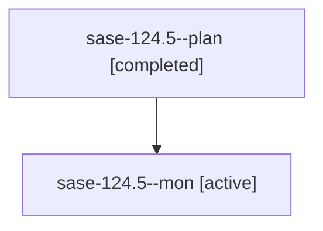

# Family: sase-124.5

[Agent Hoods](../README.md) / [bbugyi200](../users/bbugyi200/README.md) / [athena](../users/bbugyi200/machines/athena/README.md) / [sase-124](../users/bbugyi200/machines/athena/hoods/sase-124/README.md) / sase-124.5

Owner: `bbugyi200.athena` · Hood: `sase-124` · Members: 2 · Bead: [sase-124.5](https://github.com/sase-org/sase--beads/blob/main/pages/sase-124/sase-124.5.md)

## Lineage

The diagram is an optional enhancement; the ordered table below contains the same lineage in accessible text.

| Role | Agent | State | Model / provider | Timing | Commits | Prompt | Chat |
|---|---|---|---|---|---:|---|---|
| plan | sase-124.5--plan | completed | gpt-5.5 / codex | 2026-09-17T17:18:29.758295+00:00 → 2026-09-17T17:55:40.603166+00:00 | 0 | [Prompt](../agents/bbugyi200.athena.sase-124.5--plan/prompt.md) | [Chat](../agents/bbugyi200.athena.sase-124.5--plan/chat.md) |
| mon | sase-124.5--mon | active | gpt-5.5 / codex | 2026-09-17T17:54:42.772032+00:00 | 0 | — | — |

## Neighbors

| Agent | Relation | State |
|---|---|---|
| [sase-124.1](../agents/bbugyi200.athena.sase-124.1/README.md) | sase-124 hood | active |
| [sase-124.2](../agents/bbugyi200.athena.sase-124.2/README.md) | sase-124 hood | active |
| [sase-124.3](../agents/bbugyi200.athena.sase-124.3/README.md) | sase-124 hood | active |
| [sase-124.4](bbugyi200.athena.sase-124.4.md) (family · 3) | sase-124 hood | active 2, failed 1 |
| [sase-124.6](../agents/bbugyi200.athena.sase-124.6/README.md) | sase-124 hood | active |
| [sase-124.7](../agents/bbugyi200.athena.sase-124.7/README.md) | sase-124 hood | waiting |
| [sase-124.land](../agents/bbugyi200.athena.sase-124.land/README.md) | sase-124 hood | waiting |
