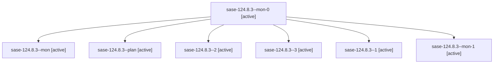

# Family: sase-124.8.3

[Agent Hoods](../README.md) / [bbugyi200](../users/bbugyi200/README.md) / [athena](../users/bbugyi200/machines/athena/README.md) / [sase-124](../users/bbugyi200/machines/athena/hoods/sase-124/README.md) / sase-124.8.3

Owner: `bbugyi200.athena` · Hood: `sase-124` · Members: 7 · Bead: [sase-124.8.3](https://github.com/sase-org/sase--beads/blob/main/pages/sase-124/sase-124.8.3.md)

## Lineage

The diagram is an optional enhancement; the ordered table below contains the same lineage in accessible text.

| Role | Agent | State | Model / provider | Timing | Commits | Prompt | Chat |
|---|---|---|---|---|---:|---|---|
| mon-0 | sase-124.8.3--mon-0 | active | gpt-5.5 / codex | 2026-09-18T00:30:29.041443+00:00 | 0 | — | [Chat](../agents/bbugyi200.athena.sase-124.8.3--mon-0/chat.md) |
| mon | sase-124.8.3--mon | active | gpt-5.5 / codex | 2026-09-17T23:48:41.783418+00:00 | 0 | — | [Chat](../agents/bbugyi200.athena.sase-124.8.3--mon/chat.md) |
| plan | sase-124.8.3--plan | active | gpt-5.5 / codex | 2026-09-17T23:39:19.467034+00:00 | 0 | [Prompt](../agents/bbugyi200.athena.sase-124.8.3--plan/prompt.md) | [Chat](../agents/bbugyi200.athena.sase-124.8.3--plan/chat.md) |
| 2 | sase-124.8.3--2 | active | gpt-5.5 / codex | 2026-09-18T00:34:10.577844+00:00 | 0 | [Prompt](../agents/bbugyi200.athena.sase-124.8.3--2/prompt.md) | [Chat](../agents/bbugyi200.athena.sase-124.8.3--2/chat.md) |
| 3 | sase-124.8.3--3 | active | gpt-5.5 / codex | 2026-09-18T00:53:03.277370+00:00 | [1](../agents/bbugyi200.athena.sase-124.8.3--3/README.md#commits) | [Prompt](../agents/bbugyi200.athena.sase-124.8.3--3/prompt.md) | [Chat](../agents/bbugyi200.athena.sase-124.8.3--3/chat.md) |
| 1 | sase-124.8.3--1 | active | gpt-5.5 / codex | 2026-09-18T00:24:58.182858+00:00 | 0 | [Prompt](../agents/bbugyi200.athena.sase-124.8.3--1/prompt.md) | [Chat](../agents/bbugyi200.athena.sase-124.8.3--1/chat.md) |
| mon-1 | sase-124.8.3--mon-1 | active | gpt-5.5 / codex | 2026-09-18T00:51:25.482531+00:00 | 0 | — | [Chat](../agents/bbugyi200.athena.sase-124.8.3--mon-1/chat.md) |

## Commits

| Role | Repo | Commit | Subject | Committed |
|---|---|---|---|---|
| 3 | sase | [`76df547`](https://github.com/sase-org/sase/commit/76df54778f84bacc454887815a771ef4d159e1c9) | fix(gate): provide wire ids for no-attempt failures | 2026-09-17 22:08:00 EDT |

## Neighbors

| Agent | Relation | State |
|---|---|---|
| [sase-124.8.1](../agents/bbugyi200.athena.sase-124.8.1/README.md) | sase-124.8 hood | active |
| [sase-124.8.2](../agents/bbugyi200.athena.sase-124.8.2/README.md) | sase-124.8 hood | active |
| [sase-124.8.4.1](bbugyi200.athena.sase-124.8.4.1.md) (family · 5) | sase-124.8 hood | active 5 |
| [sase-124.8.4.2](../agents/bbugyi200.athena.sase-124.8.4.2/README.md) | sase-124.8 hood | active |
| [sase-124.8.4.3.1](bbugyi200.athena.sase-124.8.4.3.1.md) (family · 3) | sase-124.8 hood | active 3 |
| [sase-124.8.4.3.2](bbugyi200.athena.sase-124.8.4.3.2.md) (family · 3) | sase-124.8 hood | active 3 |
| [sase-124.8.4.3.land](../agents/bbugyi200.athena.sase-124.8.4.3.land/README.md) | sase-124.8 hood | waiting |
| [sase-124.8.4.land](bbugyi200.athena.sase-124.8.4.land.md) (family · 3) | sase-124.8 hood | active 3 |
| [sase-124.8.land](bbugyi200.athena.sase-124.8.land.md) (family · 3) | sase-124.8 hood | active 3 |
| [sase-124.1](../agents/bbugyi200.athena.sase-124.1/README.md) | sase-124 hood | active |
| [sase-124.2](../agents/bbugyi200.athena.sase-124.2/README.md) | sase-124 hood | active |
| [sase-124.3](../agents/bbugyi200.athena.sase-124.3/README.md) | sase-124 hood | active |
| [sase-124.4](bbugyi200.athena.sase-124.4.md) (family · 7) | sase-124 hood | active 5, completed 1, failed 1 |
| [sase-124.5](bbugyi200.athena.sase-124.5.md) (family · 3) | sase-124 hood | active 3 |
| [sase-124.6](../agents/bbugyi200.athena.sase-124.6/README.md) | sase-124 hood | active |
| [sase-124.7](../agents/bbugyi200.athena.sase-124.7/README.md) | sase-124 hood | active |
| [sase-124.land](bbugyi200.athena.sase-124.land.md) (family · 3) | sase-124 hood | active 3 |
