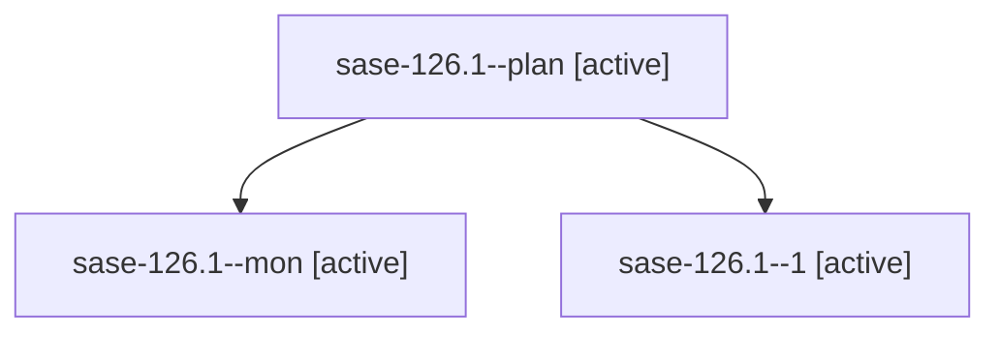

# Family: sase-126.1

[Agent Hoods](../README.md) / [bbugyi200](../users/bbugyi200/README.md) / [athena](../users/bbugyi200/machines/athena/README.md) / [sase-126](../users/bbugyi200/machines/athena/hoods/sase-126/README.md) / sase-126.1

Owner: `bbugyi200.athena` · Hood: `sase-126` · Members: 3 · Bead: [sase-126.1](https://github.com/sase-org/sase--beads/blob/main/pages/sase-126/sase-126.1.md)

## Lineage

The diagram is an optional enhancement; the ordered table below contains the same lineage in accessible text.

| Role | Agent | State | Model / provider | Timing | Commits | Prompt | Chat |
|---|---|---|---|---|---:|---|---|
| plan | sase-126.1--plan | active | gpt-5.5 / codex | 2026-09-17T19:13:56.659571+00:00 | 0 | [Prompt](../agents/bbugyi200.athena.sase-126.1--plan/prompt.md) | [Chat](../agents/bbugyi200.athena.sase-126.1--plan/chat.md) |
| mon | sase-126.1--mon | active | gpt-5.5 / codex | 2026-09-17T19:45:12.854111+00:00 | 0 | — | [Chat](../agents/bbugyi200.athena.sase-126.1--mon/chat.md) |
| 1 | sase-126.1--1 | active | gpt-5.5 / codex | 2026-09-17T20:04:39.254675+00:00 | [1](../agents/bbugyi200.athena.sase-126.1--1/README.md#commits) | [Prompt](../agents/bbugyi200.athena.sase-126.1--1/prompt.md) | [Chat](../agents/bbugyi200.athena.sase-126.1--1/chat.md) |

## Commits

| Role | Repo | Commit | Subject | Committed |
|---|---|---|---|---|
| 1 | sase | [`02fc83e`](https://github.com/sase-org/sase/commit/02fc83e11ad3268bc29b0910ed2caaf921e3bb7f) | chore(core): ratchet core dependency floor | 2026-09-17 16:07:25 EDT |

## Neighbors

| Agent | Relation | State |
|---|---|---|
| [sase-126.2](../agents/bbugyi200.athena.sase-126.2/README.md) | sase-126 hood | active |
| [sase-126.3](../agents/bbugyi200.athena.sase-126.3/README.md) | sase-126 hood | active |
| [sase-126.4](bbugyi200.athena.sase-126.4.md) (family · 31) | sase-126 hood | active 31 |
| [sase-126.land](bbugyi200.athena.sase-126.land.md) (family · 7) | sase-126 hood | active 5, completed 1, failed 1 |
