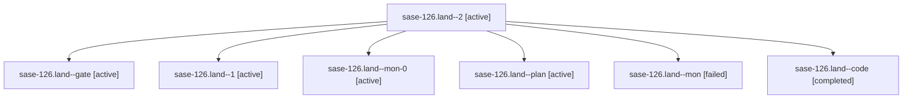

# Family: sase-126.land

[Agent Hoods](../README.md) / [bbugyi200](../users/bbugyi200/README.md) / [athena](../users/bbugyi200/machines/athena/README.md) / [sase-126](../users/bbugyi200/machines/athena/hoods/sase-126/README.md) / sase-126.land

Owner: `bbugyi200.athena` · Hood: `sase-126` · Members: 7 · Bead: [sase-126](https://github.com/sase-org/sase--beads/blob/main/pages/sase-126/README.md)

## Lineage

The diagram is an optional enhancement; the ordered table below contains the same lineage in accessible text.

| Role | Agent | State | Model / provider | Timing | Commits | Prompt | Chat |
|---|---|---|---|---|---:|---|---|
| 2 | sase-126.land--2 | active | gpt-5.5 / codex | 2026-09-18T11:53:19.018448+00:00 | [1](../agents/bbugyi200.athena.sase-126.land--2/README.md#commits) | [Prompt](../agents/bbugyi200.athena.sase-126.land--2/prompt.md) | [Chat](../agents/bbugyi200.athena.sase-126.land--2/chat.md) |
| gate | sase-126.land--gate | active | gpt-5.6-sol / codex | 2026-09-18T10:43:13.107122+00:00 | 0 | — | [Chat](../agents/bbugyi200.athena.sase-126.land--gate/chat.md) |
| 1 | sase-126.land--1 | active | gpt-5.5 / codex | 2026-09-18T11:22:21.116470+00:00 | 0 | [Prompt](../agents/bbugyi200.athena.sase-126.land--1/prompt.md) | [Chat](../agents/bbugyi200.athena.sase-126.land--1/chat.md) |
| mon-0 | sase-126.land--mon-0 | active | gpt-5.5 / codex | 2026-09-18T11:29:49.556974+00:00 | 0 | — | [Chat](../agents/bbugyi200.athena.sase-126.land--mon-0/chat.md) |
| plan | sase-126.land--plan | active | gpt-5.6-sol / codex | 2026-09-18T10:19:43.613958+00:00 | 0 | [Prompt](../agents/bbugyi200.athena.sase-126.land--plan/prompt.md) | [Chat](../agents/bbugyi200.athena.sase-126.land--plan/chat.md) |
| mon | sase-126.land--mon | failed | gpt-5.5 / codex | 2026-09-18T10:54:15.749674+00:00 → 2026-09-18T11:22:02.544347+00:00 | 0 | — | [Chat](../agents/bbugyi200.athena.sase-126.land--mon/chat.md) |
| code | sase-126.land--code | completed | gpt-5.5 / codex | 2026-09-18T10:44:48.479193+00:00 → 2026-09-18T10:56:10.541050+00:00 | 0 | — | [Chat](../agents/bbugyi200.athena.sase-126.land--code/chat.md) |

## Commits

| Role | Repo | Commit | Subject | Committed |
|---|---|---|---|---|
| 2 | sase | [`2c46c84`](https://github.com/sase-org/sase/commit/2c46c84b7bc45d76d433aabf709667a7ee613498) | test: reconcile sase-126 verification baselines | 2026-09-18 07:55:38 EDT |

## Neighbors

| Agent | Relation | State |
|---|---|---|
| [sase-126.1](bbugyi200.athena.sase-126.1.md) (family · 3) | sase-126 hood | active 3 |
| [sase-126.2](../agents/bbugyi200.athena.sase-126.2/README.md) | sase-126 hood | active |
| [sase-126.3](../agents/bbugyi200.athena.sase-126.3/README.md) | sase-126 hood | active |
| [sase-126.4](bbugyi200.athena.sase-126.4.md) (family · 31) | sase-126 hood | active 31 |
