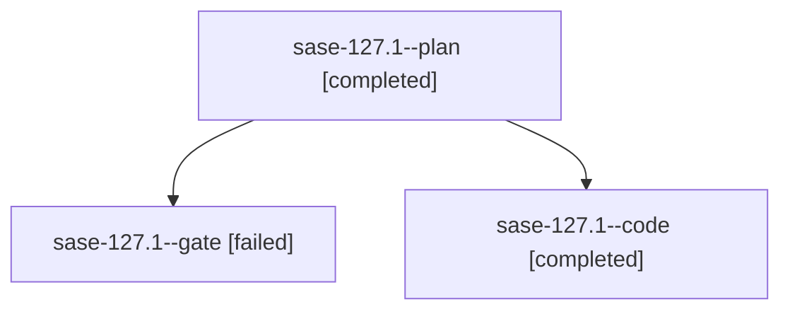

# Family: sase-127.1

[Agent Hoods](../README.md) / [bbugyi200](../users/bbugyi200/README.md) / [athena](../users/bbugyi200/machines/athena/README.md) / [sase-127](../users/bbugyi200/machines/athena/hoods/sase-127/README.md) / sase-127.1

Owner: `bbugyi200.athena` · Hood: `sase-127` · Members: 3 · Bead: [sase-127.1](https://github.com/sase-org/sase--beads/blob/main/pages/sase-127/sase-127.1.md)

## Lineage

The diagram is an optional enhancement; the ordered table below contains the same lineage in accessible text.

| Role | Agent | State | Model / provider | Timing | Commits | Prompt | Chat |
|---|---|---|---|---|---:|---|---|
| plan | sase-127.1--plan | completed | gpt-5.6-sol / codex | 2026-09-17T20:59:14.711103+00:00 → 2026-09-17T23:01:31.826322+00:00 | 0 | [Prompt](../agents/bbugyi200.athena.sase-127.1--plan/prompt.md) | [Chat](../agents/bbugyi200.athena.sase-127.1--plan/chat.md) |
| gate | sase-127.1--gate | failed | gpt-5.6-sol / codex | 2026-09-17T21:06:48.139559+00:00 → 2026-09-17T21:07:28.504298+00:00 | 0 | — | [Chat](../agents/bbugyi200.athena.sase-127.1--gate/chat.md) |
| code | sase-127.1--code | completed | gpt-5.5 / codex | 2026-09-17T21:07:55.943946+00:00 → 2026-09-17T23:01:31.826322+00:00 | [1](../agents/bbugyi200.athena.sase-127.1--code/README.md#commits) | — | [Chat](../agents/bbugyi200.athena.sase-127.1--code/chat.md) |

## Commits

| Role | Repo | Commit | Subject | Committed |
|---|---|---|---|---|
| code | sase | [`7058f16`](https://github.com/sase-org/sase/commit/7058f16ceb867bd5ea3f3d865c9fb24300cdd5dd) | fix(agents): stabilize bounded load convergence | 2026-09-17 18:55:27 EDT |

## Neighbors

| Agent | Relation | State |
|---|---|---|
| [sase-127.2](../agents/bbugyi200.athena.sase-127.2/README.md) | sase-127 hood | completed |
| [sase-127.3](../agents/bbugyi200.athena.sase-127.3/README.md) | sase-127 hood | completed |
| [sase-127.4](../agents/bbugyi200.athena.sase-127.4/README.md) | sase-127 hood | completed |
| [sase-127.land](../agents/bbugyi200.athena.sase-127.land/README.md) | sase-127 hood | active |
