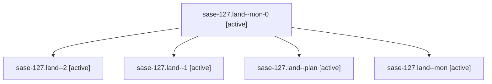

# Family: sase-127.land

[Agent Hoods](../README.md) / [bbugyi200](../users/bbugyi200/README.md) / [athena](../users/bbugyi200/machines/athena/README.md) / [sase-127](../users/bbugyi200/machines/athena/hoods/sase-127/README.md) / sase-127.land

Owner: `bbugyi200.athena` · Hood: `sase-127` · Members: 5 · Bead: [sase-127](https://github.com/sase-org/sase--beads/blob/main/pages/sase-127/README.md)

## Lineage

The diagram is an optional enhancement; the ordered table below contains the same lineage in accessible text.

| Role | Agent | State | Model / provider | Timing | Commits | Prompt | Chat |
|---|---|---|---|---|---:|---|---|
| mon-0 | sase-127.land--mon-0 | active | gpt-5.6-sol / codex | 2026-09-18T01:48:45.058832+00:00 | 0 | — | [Chat](../agents/bbugyi200.athena.sase-127.land--mon-0/chat.md) |
| 2 | sase-127.land--2 | active | gpt-5.6-sol / codex | 2026-09-18T02:11:17.210214+00:00 | 0 | [Prompt](../agents/bbugyi200.athena.sase-127.land--2/prompt.md) | [Chat](../agents/bbugyi200.athena.sase-127.land--2/chat.md) |
| 1 | sase-127.land--1 | active | gpt-5.6-sol / codex | 2026-09-18T01:35:45.645288+00:00 | 0 | [Prompt](../agents/bbugyi200.athena.sase-127.land--1/prompt.md) | [Chat](../agents/bbugyi200.athena.sase-127.land--1/chat.md) |
| plan | sase-127.land--plan | active | gpt-5.6-sol / codex | 2026-09-18T00:50:33.412049+00:00 | 0 | [Prompt](../agents/bbugyi200.athena.sase-127.land--plan/prompt.md) | [Chat](../agents/bbugyi200.athena.sase-127.land--plan/chat.md) |
| mon | sase-127.land--mon | active | gpt-5.6-sol / codex | 2026-09-18T00:59:33.306379+00:00 | 0 | — | [Chat](../agents/bbugyi200.athena.sase-127.land--mon/chat.md) |

## Neighbors

| Agent | Relation | State |
|---|---|---|
| [sase-127.1](bbugyi200.athena.sase-127.1.md) (family · 3) | sase-127 hood | active 2, completed 1 |
| [sase-127.2](../agents/bbugyi200.athena.sase-127.2/README.md) | sase-127 hood | active |
| [sase-127.3](../agents/bbugyi200.athena.sase-127.3/README.md) | sase-127 hood | active |
| [sase-127.4](../agents/bbugyi200.athena.sase-127.4/README.md) | sase-127 hood | active |
