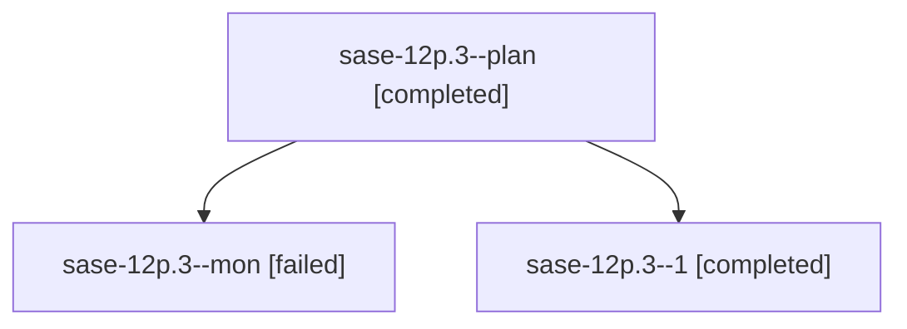

# Family: sase-12p.3

[Agent Hoods](../README.md) / [bbugyi200](../users/bbugyi200/README.md) / [athena](../users/bbugyi200/machines/athena/README.md) / [sase-12p](../users/bbugyi200/machines/athena/hoods/sase-12p/README.md) / sase-12p.3

Owner: `bbugyi200.athena` · Hood: `sase-12p` · Members: 3 · Bead: [sase-12p.3](https://github.com/sase-org/sase--beads/blob/main/pages/sase-12p/sase-12p.3.md)

## Lineage

The diagram is an optional enhancement; the ordered table below contains the same lineage in accessible text.

| Role | Agent | State | Model / provider | Timing | Commits | Prompt | Chat |
|---|---|---|---|---|---:|---|---|
| plan | sase-12p.3--plan | completed | gpt-5.5 / codex | 2026-09-18T12:00:10.938263+00:00 → 2026-09-18T12:10:56.461158+00:00 | 0 | [Prompt](../agents/bbugyi200.athena.sase-12p.3--plan/prompt.md) | [Chat](../agents/bbugyi200.athena.sase-12p.3--plan/chat.md) |
| mon | sase-12p.3--mon | failed | gpt-5.5 / codex | 2026-09-18T12:10:38.240582+00:00 → 2026-09-18T12:41:56.629874+00:00 | 0 | — | [Chat](../agents/bbugyi200.athena.sase-12p.3--mon/chat.md) |
| 1 | sase-12p.3--1 | completed | gpt-5.5 / codex | 2026-09-18T12:41:57.991431+00:00 → 2026-09-18T13:36:03.088707+00:00 | [1](../agents/bbugyi200.athena.sase-12p.3--1/README.md#commits) | [Prompt](../agents/bbugyi200.athena.sase-12p.3--1/prompt.md) | [Chat](../agents/bbugyi200.athena.sase-12p.3--1/chat.md) |

## Commits

| Role | Repo | Commit | Subject | Committed |
|---|---|---|---|---|
| 1 | sase | [`1af9c0b`](https://github.com/sase-org/sase/commit/1af9c0b7b24e37624bc62efac1fcd6f23a1813bb) | test(tui): guard by-status live churn display path | 2026-09-18 09:34:45 EDT |

## Neighbors

| Agent | Relation | State |
|---|---|---|
| [sase-12p.1](../agents/bbugyi200.athena.sase-12p.1/README.md) | sase-12p hood | completed |
| [sase-12p.2](../agents/bbugyi200.athena.sase-12p.2/README.md) | sase-12p hood | completed |
| [sase-12p.land](bbugyi200.athena.sase-12p.land.md) (family · 3) | sase-12p hood | active 1, completed 1, failed 1 |
