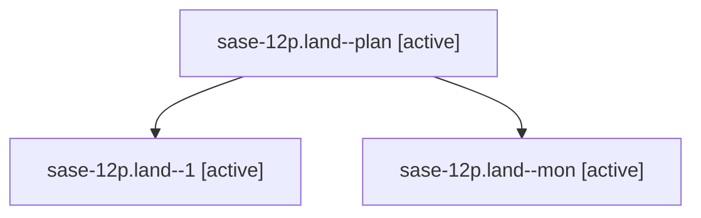

# Family: sase-12p.land

[Agent Hoods](../README.md) / [bbugyi200](../users/bbugyi200/README.md) / [athena](../users/bbugyi200/machines/athena/README.md) / [sase-12p](../users/bbugyi200/machines/athena/hoods/sase-12p/README.md) / sase-12p.land

Owner: `bbugyi200.athena` · Hood: `sase-12p` · Members: 3 · Bead: [sase-12p](https://github.com/sase-org/sase--beads/blob/main/pages/sase-12p/README.md)

## Lineage

The diagram is an optional enhancement; the ordered table below contains the same lineage in accessible text.

| Role | Agent | State | Model / provider | Timing | Commits | Prompt | Chat |
|---|---|---|---|---|---:|---|---|
| plan | sase-12p.land--plan | active | gpt-5.6-sol / codex | 2026-09-18T13:36:58.912563+00:00 | 0 | [Prompt](../agents/bbugyi200.athena.sase-12p.land--plan/prompt.md) | [Chat](../agents/bbugyi200.athena.sase-12p.land--plan/chat.md) |
| 1 | sase-12p.land--1 | active | gpt-5.6-sol / codex | 2026-09-18T14:26:41.498157+00:00 | 0 | [Prompt](../agents/bbugyi200.athena.sase-12p.land--1/prompt.md) | [Chat](../agents/bbugyi200.athena.sase-12p.land--1/chat.md) |
| mon | sase-12p.land--mon | active | gpt-5.6-sol / codex | 2026-09-18T13:57:55.580185+00:00 | 0 | — | [Chat](../agents/bbugyi200.athena.sase-12p.land--mon/chat.md) |

## Neighbors

| Agent | Relation | State |
|---|---|---|
| [sase-12p.1](../agents/bbugyi200.athena.sase-12p.1/README.md) | sase-12p hood | active |
| [sase-12p.2](../agents/bbugyi200.athena.sase-12p.2/README.md) | sase-12p hood | active |
| [sase-12p.3](bbugyi200.athena.sase-12p.3.md) (family · 3) | sase-12p hood | active 3 |
