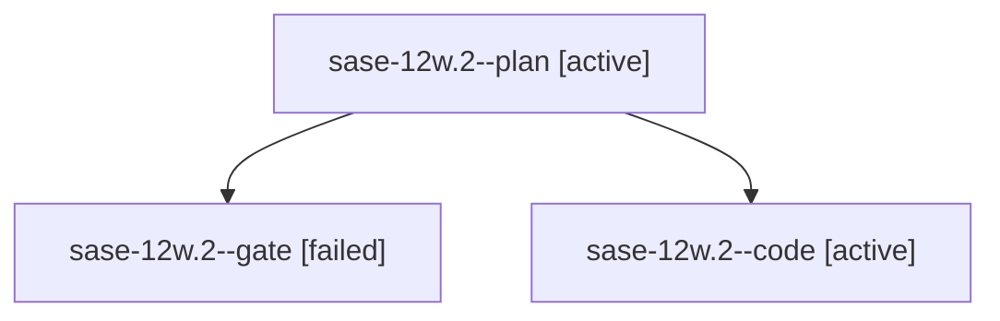

# Family: sase-12w.2

[Agent Hoods](../README.md) / [bbugyi200](../users/bbugyi200/README.md) / [athena](../users/bbugyi200/machines/athena/README.md) / [sase-12w](../users/bbugyi200/machines/athena/hoods/sase-12w/README.md) / sase-12w.2

Owner: `bbugyi200.athena` · Hood: `sase-12w` · Members: 3 · Bead: [sase-12w.2](https://github.com/sase-org/sase--beads/blob/main/pages/sase-12w/sase-12w.2.md)

## Lineage

The diagram is an optional enhancement; the ordered table below contains the same lineage in accessible text.

| Role | Agent | State | Model / provider | Timing | Commits | Prompt | Chat |
|---|---|---|---|---|---:|---|---|
| plan | sase-12w.2--plan | active | gpt-5.6-sol / codex | 2026-09-18T13:37:46.731189+00:00 | 0 | [Prompt](../agents/bbugyi200.athena.sase-12w.2--plan/prompt.md) | [Chat](../agents/bbugyi200.athena.sase-12w.2--plan/chat.md) |
| gate | sase-12w.2--gate | failed | gpt-5.6-sol / codex | 2026-09-18T13:42:32.389872+00:00 → 2026-09-18T13:43:18.981019+00:00 | 0 | — | [Chat](../agents/bbugyi200.athena.sase-12w.2--gate/chat.md) |
| code | sase-12w.2--code | active | grok-4.6 / grok | 2026-09-18T13:43:38.047333+00:00 | 0 | — | — |

## Neighbors

| Agent | Relation | State |
|---|---|---|
| [sase-12w.1](bbugyi200.athena.sase-12w.1.md) (family · 3) | sase-12w hood | completed 2, failed 1 |
| [sase-12w.3](../agents/bbugyi200.athena.sase-12w.3/README.md) | sase-12w hood | waiting |
| [sase-12w.4](../agents/bbugyi200.athena.sase-12w.4/README.md) | sase-12w hood | waiting |
| [sase-12w.5](../agents/bbugyi200.athena.sase-12w.5/README.md) | sase-12w hood | waiting |
| [sase-12w.land](../agents/bbugyi200.athena.sase-12w.land/README.md) | sase-12w hood | waiting |
