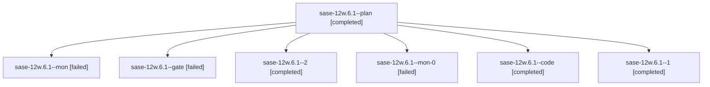

# Family: sase-12w.6.1

[Agent Hoods](../README.md) / [bbugyi200](../users/bbugyi200/README.md) / [athena](../users/bbugyi200/machines/athena/README.md) / [sase-12w](../users/bbugyi200/machines/athena/hoods/sase-12w/README.md) / sase-12w.6.1

Owner: `bbugyi200.athena` · Hood: `sase-12w` · Members: 7 · Bead: [sase-12w.6.1](https://github.com/sase-org/sase--beads/blob/main/pages/sase-12w/sase-12w.6.1.md)

## Lineage

The diagram is an optional enhancement; the ordered table below contains the same lineage in accessible text.

| Role | Agent | State | Model / provider | Timing | Commits | Prompt | Chat |
|---|---|---|---|---|---:|---|---|
| plan | sase-12w.6.1--plan | completed | gpt-5.6-sol / codex | 2026-09-18T17:59:01.055576+00:00 → 2026-09-18T18:28:30.006491+00:00 | 0 | [Prompt](../agents/bbugyi200.athena.sase-12w.6.1--plan/prompt.md) | [Chat](../agents/bbugyi200.athena.sase-12w.6.1--plan/chat.md) |
| mon | sase-12w.6.1--mon | failed | grok-4.6 / grok | 2026-09-18T18:28:10.075282+00:00 → 2026-09-18T18:33:00.194487+00:00 | 0 | — | [Chat](../agents/bbugyi200.athena.sase-12w.6.1--mon/chat.md) |
| gate | sase-12w.6.1--gate | failed | gpt-5.6-sol / codex | 2026-09-18T18:04:12.920305+00:00 → 2026-09-18T18:04:55.200989+00:00 | 0 | — | [Chat](../agents/bbugyi200.athena.sase-12w.6.1--gate/chat.md) |
| 2 | sase-12w.6.1--2 | completed | grok-4.6 / grok | 2026-09-18T18:46:05.249757+00:00 → 2026-09-18T18:54:35.996395+00:00 | 0 | [Prompt](../agents/bbugyi200.athena.sase-12w.6.1--2/prompt.md) | [Chat](../agents/bbugyi200.athena.sase-12w.6.1--2/chat.md) |
| mon-0 | sase-12w.6.1--mon-0 | failed | grok-4.6 / grok | 2026-09-18T18:39:59.553086+00:00 → 2026-09-18T18:45:57.820404+00:00 | 0 | — | [Chat](../agents/bbugyi200.athena.sase-12w.6.1--mon-0/chat.md) |
| code | sase-12w.6.1--code | completed | grok-4.6 / grok | 2026-09-18T18:05:15.869087+00:00 → 2026-09-18T18:28:30.006491+00:00 | 0 | — | [Chat](../agents/bbugyi200.athena.sase-12w.6.1--code/chat.md) |
| 1 | sase-12w.6.1--1 | completed | grok-4.6 / grok | 2026-09-18T18:33:07.815255+00:00 → 2026-09-18T18:40:18.577789+00:00 | 0 | [Prompt](../agents/bbugyi200.athena.sase-12w.6.1--1/prompt.md) | [Chat](../agents/bbugyi200.athena.sase-12w.6.1--1/chat.md) |

## Neighbors

| Agent | Relation | State |
|---|---|---|
| [sase-12w.6.2](bbugyi200.athena.sase-12w.6.2.md) (family · 3) | sase-12w.6 hood | completed 2, failed 1 |
| [sase-12w.6.3](bbugyi200.athena.sase-12w.6.3.md) (family · 5) | sase-12w.6 hood | completed 3, failed 2 |
| [sase-12w.6.4.1](../agents/bbugyi200.athena.sase-12w.6.4.1/README.md) | sase-12w.6 hood | active |
| [sase-12w.6.4.2](../agents/bbugyi200.athena.sase-12w.6.4.2/README.md) | sase-12w.6 hood | waiting |
| [sase-12w.6.4.land](../agents/bbugyi200.athena.sase-12w.6.4.land/README.md) | sase-12w.6 hood | waiting |
| [sase-12w.6.land](bbugyi200.athena.sase-12w.6.land.md) (family · 3) | sase-12w.6 hood | failed 3 |
| [sase-12w.1](bbugyi200.athena.sase-12w.1.md) (family · 3) | sase-12w hood | completed 2, failed 1 |
| [sase-12w.2](bbugyi200.athena.sase-12w.2.md) (family · 3) | sase-12w hood | completed 2, failed 1 |
| [sase-12w.3](../agents/bbugyi200.athena.sase-12w.3/README.md) | sase-12w hood | completed |
| [sase-12w.4](../agents/bbugyi200.athena.sase-12w.4/README.md) | sase-12w hood | completed |
| [sase-12w.5](../agents/bbugyi200.athena.sase-12w.5/README.md) | sase-12w hood | completed |
| [sase-12w.land](bbugyi200.athena.sase-12w.land.md) (family · 3) | sase-12w hood | failed 3 |
