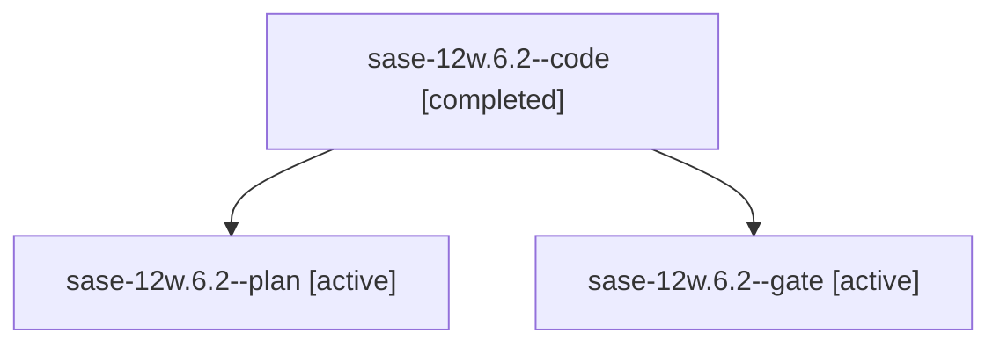

# Family: sase-12w.6.2

[Agent Hoods](../README.md) / [bbugyi200](../users/bbugyi200/README.md) / [athena](../users/bbugyi200/machines/athena/README.md) / [sase-12w](../users/bbugyi200/machines/athena/hoods/sase-12w/README.md) / sase-12w.6.2

Owner: `bbugyi200.athena` · Hood: `sase-12w` · Members: 3 · Bead: [sase-12w.6.2](https://github.com/sase-org/sase--beads/blob/main/pages/sase-12w/sase-12w.6.2.md)

## Lineage

The diagram is an optional enhancement; the ordered table below contains the same lineage in accessible text.

| Role | Agent | State | Model / provider | Timing | Commits | Prompt | Chat |
|---|---|---|---|---|---:|---|---|
| code | sase-12w.6.2--code | completed | gpt-5.5 / codex | 2026-09-18T19:01:02.419741+00:00 → 2026-09-18T20:26:43.295067+00:00 | [1](../agents/bbugyi200.athena.sase-12w.6.2--code/README.md#commits) | — | [Chat](../agents/bbugyi200.athena.sase-12w.6.2--code/chat.md) |
| plan | sase-12w.6.2--plan | active | gpt-5.6-sol / codex | 2026-09-18T18:55:14.961561+00:00 | 0 | [Prompt](../agents/bbugyi200.athena.sase-12w.6.2--plan/prompt.md) | [Chat](../agents/bbugyi200.athena.sase-12w.6.2--plan/chat.md) |
| gate | sase-12w.6.2--gate | active | gpt-5.6-sol / codex | 2026-09-18T19:00:12.224143+00:00 | 0 | — | [Chat](../agents/bbugyi200.athena.sase-12w.6.2--gate/chat.md) |

## Commits

| Role | Repo | Commit | Subject | Committed |
|---|---|---|---|---|
| code | sase | [`7179ec2`](https://github.com/sase-org/sase/commit/7179ec2e23ad5ac9470fec9da8b8f37cc0c3bd8b) | feat(sudo): authorize durable completion ownership | 2026-09-18 16:20:04 EDT |

## Neighbors

| Agent | Relation | State |
|---|---|---|
| [sase-12w.6.1](bbugyi200.athena.sase-12w.6.1.md) (family · 7) | sase-12w.6 hood | active 5, completed 1, failed 1 |
| [sase-12w.6.3](bbugyi200.athena.sase-12w.6.3.md) (family · 5) | sase-12w.6 hood | active 3, completed 1, failed 1 |
| [sase-12w.6.4.1](../agents/bbugyi200.athena.sase-12w.6.4.1/README.md) | sase-12w.6 hood | active |
| [sase-12w.6.4.2](../agents/bbugyi200.athena.sase-12w.6.4.2/README.md) | sase-12w.6 hood | active |
| [sase-12w.6.4.land](../agents/bbugyi200.athena.sase-12w.6.4.land/README.md) | sase-12w.6 hood | active |
| [sase-12w.6.land](bbugyi200.athena.sase-12w.6.land.md) (family · 3) | sase-12w.6 hood | active 3 |
| [sase-12w.1](bbugyi200.athena.sase-12w.1.md) (family · 3) | sase-12w hood | active 2, completed 1 |
| [sase-12w.2](bbugyi200.athena.sase-12w.2.md) (family · 3) | sase-12w hood | active 2, completed 1 |
| [sase-12w.3](../agents/bbugyi200.athena.sase-12w.3/README.md) | sase-12w hood | active |
| [sase-12w.4](../agents/bbugyi200.athena.sase-12w.4/README.md) | sase-12w hood | active |
| [sase-12w.5](../agents/bbugyi200.athena.sase-12w.5/README.md) | sase-12w hood | active |
| [sase-12w.land](bbugyi200.athena.sase-12w.land.md) (family · 3) | sase-12w hood | active 3 |
