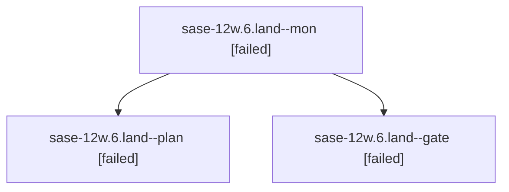

# Family: sase-12w.6.land

[Agent Hoods](../README.md) / [bbugyi200](../users/bbugyi200/README.md) / [athena](../users/bbugyi200/machines/athena/README.md) / [sase-12w](../users/bbugyi200/machines/athena/hoods/sase-12w/README.md) / sase-12w.6.land

Owner: `bbugyi200.athena` · Hood: `sase-12w` · Members: 3 · Bead: [sase-12w.6](https://github.com/sase-org/sase--beads/blob/main/pages/sase-12w/sase-12w.6.md)

## Lineage

The diagram is an optional enhancement; the ordered table below contains the same lineage in accessible text.

| Role | Agent | State | Model / provider | Timing | Commits | Prompt | Chat |
|---|---|---|---|---|---:|---|---|
| mon | sase-12w.6.land--mon | failed | gpt-5.6-sol / codex | 2026-09-18T23:34:50.299976+00:00 → 2026-09-18T23:37:35.268422+00:00 | 0 | — | [Chat](../agents/bbugyi200.athena.sase-12w.6.land--mon/chat.md) |
| plan | sase-12w.6.land--plan | failed | gpt-5.6-sol / codex | 2026-09-18T23:21:32.189018+00:00 → 2026-09-18T23:35:24.766654+00:00 | 0 | [Prompt](../agents/bbugyi200.athena.sase-12w.6.land--plan/prompt.md) | [Chat](../agents/bbugyi200.athena.sase-12w.6.land--plan/chat.md) |
| gate | sase-12w.6.land--gate | failed | gpt-5.6-sol / codex | 2026-09-18T23:33:19.746712+00:00 → 2026-09-18T23:35:02.694422+00:00 | 0 | — | [Chat](../agents/bbugyi200.athena.sase-12w.6.land--gate/chat.md) |

## Neighbors

| Agent | Relation | State |
|---|---|---|
| [sase-12w.6.1](bbugyi200.athena.sase-12w.6.1.md) (family · 7) | sase-12w.6 hood | completed 4, failed 3 |
| [sase-12w.6.2](bbugyi200.athena.sase-12w.6.2.md) (family · 3) | sase-12w.6 hood | completed 2, failed 1 |
| [sase-12w.6.3](bbugyi200.athena.sase-12w.6.3.md) (family · 5) | sase-12w.6 hood | completed 3, failed 2 |
| [sase-12w.6.4.1](../agents/bbugyi200.athena.sase-12w.6.4.1/README.md) | sase-12w.6 hood | active |
| [sase-12w.6.4.2](../agents/bbugyi200.athena.sase-12w.6.4.2/README.md) | sase-12w.6 hood | waiting |
| [sase-12w.6.4.land](../agents/bbugyi200.athena.sase-12w.6.4.land/README.md) | sase-12w.6 hood | waiting |
| [sase-12w.1](bbugyi200.athena.sase-12w.1.md) (family · 3) | sase-12w hood | completed 2, failed 1 |
| [sase-12w.2](bbugyi200.athena.sase-12w.2.md) (family · 3) | sase-12w hood | completed 2, failed 1 |
| [sase-12w.3](../agents/bbugyi200.athena.sase-12w.3/README.md) | sase-12w hood | completed |
| [sase-12w.4](../agents/bbugyi200.athena.sase-12w.4/README.md) | sase-12w hood | completed |
| [sase-12w.5](../agents/bbugyi200.athena.sase-12w.5/README.md) | sase-12w hood | completed |
| [sase-12w.land](bbugyi200.athena.sase-12w.land.md) (family · 3) | sase-12w hood | failed 3 |
