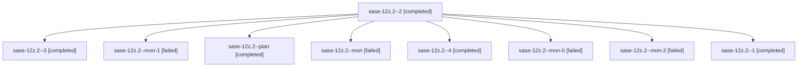

# Family: sase-12z.2

[Agent Hoods](../README.md) / [bbugyi200](../users/bbugyi200/README.md) / [athena](../users/bbugyi200/machines/athena/README.md) / [sase-12z](../users/bbugyi200/machines/athena/hoods/sase-12z/README.md) / sase-12z.2

Owner: `bbugyi200.athena` · Hood: `sase-12z` · Members: 9 · Bead: [sase-12z.2](https://github.com/sase-org/sase--beads/blob/main/pages/sase-12z/sase-12z.2.md)

## Lineage

The diagram is an optional enhancement; the ordered table below contains the same lineage in accessible text.

| Role | Agent | State | Model / provider | Timing | Commits | Prompt | Chat |
|---|---|---|---|---|---:|---|---|
| 2 | sase-12z.2--2 | completed | grok-4.6 / grok | 2026-09-18T16:54:56.389151+00:00 → 2026-09-18T17:03:39.283718+00:00 | 0 | [Prompt](../agents/bbugyi200.athena.sase-12z.2--2/prompt.md) | [Chat](../agents/bbugyi200.athena.sase-12z.2--2/chat.md) |
| 3 | sase-12z.2--3 | completed | grok-4.6 / grok | 2026-09-18T17:12:37.185250+00:00 → 2026-09-18T17:24:02.885418+00:00 | 0 | [Prompt](../agents/bbugyi200.athena.sase-12z.2--3/prompt.md) | [Chat](../agents/bbugyi200.athena.sase-12z.2--3/chat.md) |
| mon-1 | sase-12z.2--mon-1 | failed | grok-4.6 / grok | 2026-09-18T17:02:43.246659+00:00 → 2026-09-18T17:12:24.273379+00:00 | 0 | — | [Chat](../agents/bbugyi200.athena.sase-12z.2--mon-1/chat.md) |
| plan | sase-12z.2--plan | completed | grok-4.6 / grok | 2026-09-18T15:49:29.825743+00:00 → 2026-09-18T16:26:36.257767+00:00 | 0 | [Prompt](../agents/bbugyi200.athena.sase-12z.2--plan/prompt.md) | [Chat](../agents/bbugyi200.athena.sase-12z.2--plan/chat.md) |
| mon | sase-12z.2--mon | failed | grok-4.6 / grok | 2026-09-18T16:25:47.369717+00:00 → 2026-09-18T16:44:24.953171+00:00 | 0 | — | [Chat](../agents/bbugyi200.athena.sase-12z.2--mon/chat.md) |
| 4 | sase-12z.2--4 | completed | grok-4.6 / grok | 2026-09-18T17:30:32.271310+00:00 → 2026-09-18T17:35:55.319218+00:00 | [1](../agents/bbugyi200.athena.sase-12z.2--4/README.md#commits) | [Prompt](../agents/bbugyi200.athena.sase-12z.2--4/prompt.md) | [Chat](../agents/bbugyi200.athena.sase-12z.2--4/chat.md) |
| mon-0 | sase-12z.2--mon-0 | failed | grok-4.6 / grok | 2026-09-18T16:52:10.809818+00:00 → 2026-09-18T16:54:47.591135+00:00 | 0 | — | [Chat](../agents/bbugyi200.athena.sase-12z.2--mon-0/chat.md) |
| mon-2 | sase-12z.2--mon-2 | failed | grok-4.6 / grok | 2026-09-18T17:23:02.484429+00:00 → 2026-09-18T17:30:24.914033+00:00 | 0 | — | [Chat](../agents/bbugyi200.athena.sase-12z.2--mon-2/chat.md) |
| 1 | sase-12z.2--1 | completed | grok-4.6 / grok | 2026-09-18T16:44:25.253788+00:00 → 2026-09-18T16:52:32.573355+00:00 | 0 | [Prompt](../agents/bbugyi200.athena.sase-12z.2--1/prompt.md) | [Chat](../agents/bbugyi200.athena.sase-12z.2--1/chat.md) |

## Commits

| Role | Repo | Commit | Subject | Committed |
|---|---|---|---|---|
| 4 | sase | [`9243c0b`](https://github.com/sase-org/sase/commit/9243c0bdd7563d2271de57833084e721fec4958e) | feat(visual): add screenshot golden maintenance runner | 2026-09-18 13:34:39 EDT |

## Neighbors

| Agent | Relation | State |
|---|---|---|
| [sase-12z.1](../agents/bbugyi200.athena.sase-12z.1/README.md) | sase-12z hood | completed |
| [sase-12z.3](../agents/bbugyi200.athena.sase-12z.3/README.md) | sase-12z hood | active |
| [sase-12z.4](../agents/bbugyi200.athena.sase-12z.4/README.md) | sase-12z hood | waiting |
| [sase-12z.land](../agents/bbugyi200.athena.sase-12z.land/README.md) | sase-12z hood | waiting |
