# Family: sase-12z.4

[Agent Hoods](../README.md) / [bbugyi200](../users/bbugyi200/README.md) / [athena](../users/bbugyi200/machines/athena/README.md) / [sase-12z](../users/bbugyi200/machines/athena/hoods/sase-12z/README.md) / sase-12z.4

Owner: `bbugyi200.athena` · Hood: `sase-12z` · Members: 13 · Bead: [sase-12z.4](https://github.com/sase-org/sase--beads/blob/main/pages/sase-12z/sase-12z.4.md)

## Lineage

```mermaid
flowchart TD
  n0["sase-12z.4--1 [active]"]
  n1["sase-12z.4--mon [active]"]
  n0 --> n1
  n2["sase-12z.4--plan [active]"]
  n0 --> n2
  n3["sase-12z.4--3 [active]"]
  n0 --> n3
  n4["sase-12z.4--mon-0 [active]"]
  n0 --> n4
  n5["sase-12z.4--6 [active]"]
  n0 --> n5
  n6["sase-12z.4--5 [active]"]
  n0 --> n6
  n7["sase-12z.4--2 [active]"]
  n0 --> n7
  n8["sase-12z.4--mon-2 [active]"]
  n0 --> n8
  n9["sase-12z.4--mon-3 [active]"]
  n0 --> n9
  n10["sase-12z.4--4 [active]"]
  n0 --> n10
  n11["sase-12z.4--mon-1 [active]"]
  n0 --> n11
  n12["sase-12z.4--mon-4 [active]"]
  n0 --> n12
```

The diagram is an optional enhancement; the ordered table below contains the same lineage in accessible text.

| Role | Agent | State | Model / provider | Timing | Commits | Prompt | Chat |
|---|---|---|---|---|---:|---|---|
| 1 | sase-12z.4--1 | active | grok-4.6 / grok | 2026-09-18T19:50:45.363043+00:00 | 0 | [Prompt](../agents/bbugyi200.athena.sase-12z.4--1/prompt.md) | [Chat](../agents/bbugyi200.athena.sase-12z.4--1/chat.md) |
| mon | sase-12z.4--mon | active | grok-4.6 / grok | 2026-09-18T19:19:33.776488+00:00 | 0 | — | [Chat](../agents/bbugyi200.athena.sase-12z.4--mon/chat.md) |
| plan | sase-12z.4--plan | active | grok-4.6 / grok | 2026-09-18T18:03:49.130227+00:00 | 0 | [Prompt](../agents/bbugyi200.athena.sase-12z.4--plan/prompt.md) | [Chat](../agents/bbugyi200.athena.sase-12z.4--plan/chat.md) |
| 3 | sase-12z.4--3 | active | grok-4.6 / grok | 2026-09-18T20:18:56.502184+00:00 | 0 | [Prompt](../agents/bbugyi200.athena.sase-12z.4--3/prompt.md) | [Chat](../agents/bbugyi200.athena.sase-12z.4--3/chat.md) |
| mon-0 | sase-12z.4--mon-0 | active | grok-4.6 / grok | 2026-09-18T19:55:23.167089+00:00 | 0 | — | [Chat](../agents/bbugyi200.athena.sase-12z.4--mon-0/chat.md) |
| 6 | sase-12z.4--6 | active | grok-4.6 / grok | 2026-09-18T21:56:21.022017+00:00 | [1](../agents/bbugyi200.athena.sase-12z.4--6/README.md#commits) | [Prompt](../agents/bbugyi200.athena.sase-12z.4--6/prompt.md) | [Chat](../agents/bbugyi200.athena.sase-12z.4--6/chat.md) |
| 5 | sase-12z.4--5 | active | grok-4.6 / grok | 2026-09-18T21:36:10.979315+00:00 | 0 | [Prompt](../agents/bbugyi200.athena.sase-12z.4--5/prompt.md) | [Chat](../agents/bbugyi200.athena.sase-12z.4--5/chat.md) |
| 2 | sase-12z.4--2 | active | grok-4.6 / grok | 2026-09-18T19:58:25.297327+00:00 | 0 | [Prompt](../agents/bbugyi200.athena.sase-12z.4--2/prompt.md) | [Chat](../agents/bbugyi200.athena.sase-12z.4--2/chat.md) |
| mon-2 | sase-12z.4--mon-2 | active | grok-4.6 / grok | 2026-09-18T20:25:23.718741+00:00 | 0 | — | [Chat](../agents/bbugyi200.athena.sase-12z.4--mon-2/chat.md) |
| mon-3 | sase-12z.4--mon-3 | active | grok-4.6 / grok | 2026-09-18T20:44:48.479579+00:00 | 0 | — | [Chat](../agents/bbugyi200.athena.sase-12z.4--mon-3/chat.md) |
| 4 | sase-12z.4--4 | active | grok-4.6 / grok | 2026-09-18T20:32:51.406330+00:00 | 0 | [Prompt](../agents/bbugyi200.athena.sase-12z.4--4/prompt.md) | [Chat](../agents/bbugyi200.athena.sase-12z.4--4/chat.md) |
| mon-1 | sase-12z.4--mon-1 | active | grok-4.6 / grok | 2026-09-18T20:07:57.815861+00:00 | 0 | — | [Chat](../agents/bbugyi200.athena.sase-12z.4--mon-1/chat.md) |
| mon-4 | sase-12z.4--mon-4 | active | grok-4.6 / grok | 2026-09-18T21:48:21.353486+00:00 | 0 | — | [Chat](../agents/bbugyi200.athena.sase-12z.4--mon-4/chat.md) |

## Commits

| Role | Repo | Commit | Subject | Committed |
|---|---|---|---|---|
| 6 | sase | [`1c246dc`](https://github.com/sase-org/sase/commit/1c246dc748f687e057b7d22493b5aefc80f4dced) | feat(visual): land screenshot maintenance recipe, CI check, and refreshed goldens | 2026-09-18 18:52:38 EDT |

## Neighbors

| Agent | Relation | State |
|---|---|---|
| [sase-12z.1](../agents/bbugyi200.athena.sase-12z.1/README.md) | sase-12z hood | active |
| [sase-12z.2](bbugyi200.athena.sase-12z.2.md) (family · 9) | sase-12z hood | active 9 |
| [sase-12z.3](../agents/bbugyi200.athena.sase-12z.3/README.md) | sase-12z hood | active |
| [sase-12z.5.1](../agents/bbugyi200.athena.sase-12z.5.1/README.md) | sase-12z hood | completed |
| [sase-12z.5.2](../agents/bbugyi200.athena.sase-12z.5.2/README.md) | sase-12z hood | active |
| [sase-12z.5.land](../agents/bbugyi200.athena.sase-12z.5.land/README.md) | sase-12z hood | waiting |
| [sase-12z.land](bbugyi200.athena.sase-12z.land.md) (family · 5) | sase-12z hood | active 5 |
