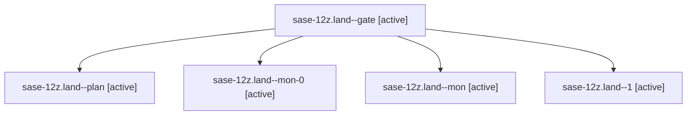

# Family: sase-12z.land

[Agent Hoods](../README.md) / [bbugyi200](../users/bbugyi200/README.md) / [athena](../users/bbugyi200/machines/athena/README.md) / [sase-12z](../users/bbugyi200/machines/athena/hoods/sase-12z/README.md) / sase-12z.land

Owner: `bbugyi200.athena` · Hood: `sase-12z` · Members: 5 · Bead: [sase-12z](https://github.com/sase-org/sase--beads/blob/main/pages/sase-12z/README.md)

## Lineage

The diagram is an optional enhancement; the ordered table below contains the same lineage in accessible text.

| Role | Agent | State | Model / provider | Timing | Commits | Prompt | Chat |
|---|---|---|---|---|---:|---|---|
| gate | sase-12z.land--gate | active | gpt-5.6-sol / codex | 2026-09-19T00:30:09.937649+00:00 | 0 | — | [Chat](../agents/bbugyi200.athena.sase-12z.land--gate/chat.md) |
| plan | sase-12z.land--plan | active | gpt-5.6-sol / codex | 2026-09-18T23:35:34.908215+00:00 | 0 | [Prompt](../agents/bbugyi200.athena.sase-12z.land--plan/prompt.md) | [Chat](../agents/bbugyi200.athena.sase-12z.land--plan/chat.md) |
| mon-0 | sase-12z.land--mon-0 | active | gpt-5.6-sol / codex | 2026-09-19T00:31:24.673317+00:00 | 0 | — | [Chat](../agents/bbugyi200.athena.sase-12z.land--mon-0/chat.md) |
| mon | sase-12z.land--mon | active | gpt-5.6-sol / codex | 2026-09-18T23:47:56.580494+00:00 | 0 | — | [Chat](../agents/bbugyi200.athena.sase-12z.land--mon/chat.md) |
| 1 | sase-12z.land--1 | active | gpt-5.6-sol / codex | 2026-09-19T00:18:45.716934+00:00 | 0 | [Prompt](../agents/bbugyi200.athena.sase-12z.land--1/prompt.md) | [Chat](../agents/bbugyi200.athena.sase-12z.land--1/chat.md) |

## Neighbors

| Agent | Relation | State |
|---|---|---|
| [sase-12z.1](../agents/bbugyi200.athena.sase-12z.1/README.md) | sase-12z hood | active |
| [sase-12z.2](bbugyi200.athena.sase-12z.2.md) (family · 9) | sase-12z hood | active 9 |
| [sase-12z.3](../agents/bbugyi200.athena.sase-12z.3/README.md) | sase-12z hood | active |
| [sase-12z.4](bbugyi200.athena.sase-12z.4.md) (family · 13) | sase-12z hood | active 13 |
| [sase-12z.5.1](../agents/bbugyi200.athena.sase-12z.5.1/README.md) | sase-12z hood | active |
| [sase-12z.5.2](../agents/bbugyi200.athena.sase-12z.5.2/README.md) | sase-12z hood | active |
| [sase-12z.5.land](../agents/bbugyi200.athena.sase-12z.5.land/README.md) | sase-12z hood | active |
