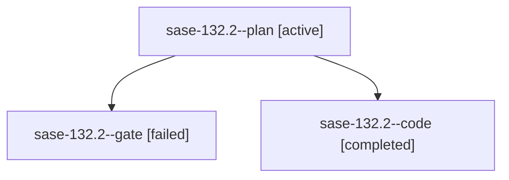

# Family: sase-132.2

[Agent Hoods](../README.md) / [bbugyi200](../users/bbugyi200/README.md) / [athena](../users/bbugyi200/machines/athena/README.md) / [sase-132](../users/bbugyi200/machines/athena/hoods/sase-132/README.md) / sase-132.2

Owner: `bbugyi200.athena` · Hood: `sase-132` · Members: 3 · Bead: [sase-132.2](https://github.com/sase-org/sase--beads/blob/main/pages/sase-132/sase-132.2.md)

## Lineage

The diagram is an optional enhancement; the ordered table below contains the same lineage in accessible text.

| Role | Agent | State | Model / provider | Timing | Commits | Prompt | Chat |
|---|---|---|---|---|---:|---|---|
| plan | sase-132.2--plan | active | gpt-5.6-sol / codex | 2026-09-18T20:35:56.751023+00:00 | 0 | [Prompt](../agents/bbugyi200.athena.sase-132.2--plan/prompt.md) | [Chat](../agents/bbugyi200.athena.sase-132.2--plan/chat.md) |
| gate | sase-132.2--gate | failed | gpt-5.6-sol / codex | 2026-09-18T20:42:50.549800+00:00 → 2026-09-18T20:43:34.231707+00:00 | 0 | — | [Chat](../agents/bbugyi200.athena.sase-132.2--gate/chat.md) |
| code | sase-132.2--code | completed | gpt-5.5 / codex | 2026-09-18T20:43:51.752160+00:00 → 2026-09-19T00:18:14.850442+00:00 | [1](../agents/bbugyi200.athena.sase-132.2--code/README.md#commits) | — | [Chat](../agents/bbugyi200.athena.sase-132.2--code/chat.md) |

## Commits

| Role | Repo | Commit | Subject | Committed |
|---|---|---|---|---|
| code | sase | [`67614ee`](https://github.com/sase-org/sase/commit/67614ee2b01e6f2e6e2b8c6fe9fd21e4394b0956) | feat(fleet): consume owner presentation facts | 2026-09-18 20:08:07 EDT |
| — | sase | [`59c82a3`](https://github.com/sase-org/sase/commit/59c82a36e85f282c10aaaeb51e5d30656686161c) | feat(tui): prioritize visible startup surface | 2026-09-18 20:16:08 EDT |

## Neighbors

| Agent | Relation | State |
|---|---|---|
| [sase-132.1](../agents/bbugyi200.athena.sase-132.1/README.md) | sase-132 hood | active |
| [sase-132.3](bbugyi200.athena.sase-132.3.md) (family · 5) | sase-132 hood | active 2, completed 1, failed 2 |
| [sase-132.4](../agents/bbugyi200.athena.sase-132.4/README.md) | sase-132 hood | active |
| [sase-132.5](../agents/bbugyi200.athena.sase-132.5/README.md) | sase-132 hood | active |
| [sase-132.6](../agents/bbugyi200.athena.sase-132.6/README.md) | sase-132 hood | active |
| [sase-132.7](../agents/bbugyi200.athena.sase-132.7/README.md) | sase-132 hood | active |
| [sase-132.land](../agents/bbugyi200.athena.sase-132.land/README.md) | sase-132 hood | active |
