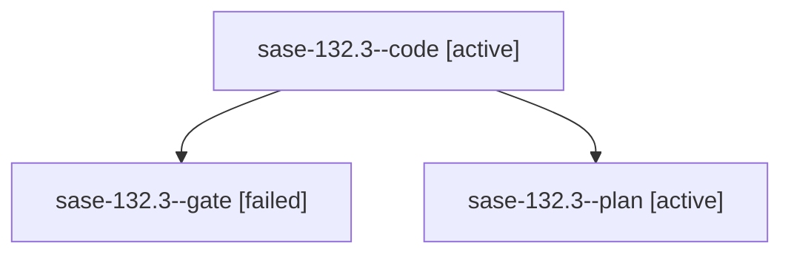

# Family: sase-132.3

[Agent Hoods](../README.md) / [bbugyi200](../users/bbugyi200/README.md) / [athena](../users/bbugyi200/machines/athena/README.md) / [sase-132](../users/bbugyi200/machines/athena/hoods/sase-132/README.md) / sase-132.3

Owner: `bbugyi200.athena` · Hood: `sase-132` · Members: 3 · Bead: [sase-132.3](https://github.com/sase-org/sase--beads/blob/main/pages/sase-132/sase-132.3.md)

## Lineage

The diagram is an optional enhancement; the ordered table below contains the same lineage in accessible text.

| Role | Agent | State | Model / provider | Timing | Commits | Prompt | Chat |
|---|---|---|---|---|---:|---|---|
| code | sase-132.3--code | active | grok-4.6 / grok | 2026-09-18T20:45:29.806789+00:00 | [1](../agents/bbugyi200.athena.sase-132.3--code/README.md#commits) | — | — |
| gate | sase-132.3--gate | failed | gpt-5.6-sol / codex | 2026-09-18T20:44:24.758964+00:00 → 2026-09-18T20:45:10.068147+00:00 | 0 | — | [Chat](../agents/bbugyi200.athena.sase-132.3--gate/chat.md) |
| plan | sase-132.3--plan | active | gpt-5.6-sol / codex | 2026-09-18T20:36:06.474811+00:00 | 0 | [Prompt](../agents/bbugyi200.athena.sase-132.3--plan/prompt.md) | [Chat](../agents/bbugyi200.athena.sase-132.3--plan/chat.md) |

## Commits

| Role | Repo | Commit | Subject | Committed |
|---|---|---|---|---|
| code | sase | [`13a8efb`](https://github.com/sase-org/sase/commit/13a8efbb4ad4adc7a1694238b27a2613cf78553f) | feat(tui): project Agents-list index rows before JSON hydration | 2026-09-18 18:06:08 EDT |

## Neighbors

| Agent | Relation | State |
|---|---|---|
| [sase-132.1](../agents/bbugyi200.athena.sase-132.1/README.md) | sase-132 hood | completed |
| [sase-132.2](bbugyi200.athena.sase-132.2.md) (family · 3) | sase-132 hood | active 2, failed 1 |
| [sase-132.4](../agents/bbugyi200.athena.sase-132.4/README.md) | sase-132 hood | completed |
| [sase-132.5](../agents/bbugyi200.athena.sase-132.5/README.md) | sase-132 hood | completed |
| [sase-132.6](../agents/bbugyi200.athena.sase-132.6/README.md) | sase-132 hood | completed |
| [sase-132.7](../agents/bbugyi200.athena.sase-132.7/README.md) | sase-132 hood | waiting |
| [sase-132.land](../agents/bbugyi200.athena.sase-132.land/README.md) | sase-132 hood | waiting |
