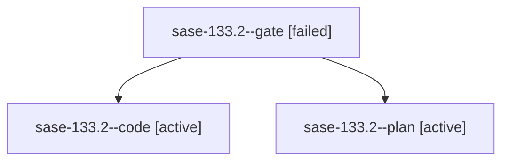

# Family: sase-133.2

[Agent Hoods](../README.md) / [bbugyi200](../users/bbugyi200/README.md) / [athena](../users/bbugyi200/machines/athena/README.md) / [sase-133](../users/bbugyi200/machines/athena/hoods/sase-133/README.md) / sase-133.2

Owner: `bbugyi200.athena` · Hood: `sase-133` · Members: 3 · Bead: [sase-133.2](https://github.com/sase-org/sase--beads/blob/main/pages/sase-133/sase-133.2.md)

## Lineage

The diagram is an optional enhancement; the ordered table below contains the same lineage in accessible text.

| Role | Agent | State | Model / provider | Timing | Commits | Prompt | Chat |
|---|---|---|---|---|---:|---|---|
| gate | sase-133.2--gate | failed | gpt-5.6-sol / codex | 2026-09-18T21:58:28.208787+00:00 → 2026-09-18T21:59:18.586938+00:00 | 0 | — | [Chat](../agents/bbugyi200.athena.sase-133.2--gate/chat.md) |
| code | sase-133.2--code | active | gpt-5.5 / codex | 2026-09-18T21:59:50.292637+00:00 | 0 | — | — |
| plan | sase-133.2--plan | active | gpt-5.6-sol / codex | 2026-09-18T21:54:29.456714+00:00 | 0 | [Prompt](../agents/bbugyi200.athena.sase-133.2--plan/prompt.md) | [Chat](../agents/bbugyi200.athena.sase-133.2--plan/chat.md) |

## Neighbors

| Agent | Relation | State |
|---|---|---|
| [sase-133.1](bbugyi200.athena.sase-133.1.md) (family · 3) | sase-133 hood | completed 2, failed 1 |
| [sase-133.3](../agents/bbugyi200.athena.sase-133.3/README.md) | sase-133 hood | waiting |
| [sase-133.4](../agents/bbugyi200.athena.sase-133.4/README.md) | sase-133 hood | completed |
| [sase-133.land](../agents/bbugyi200.athena.sase-133.land/README.md) | sase-133 hood | waiting |
