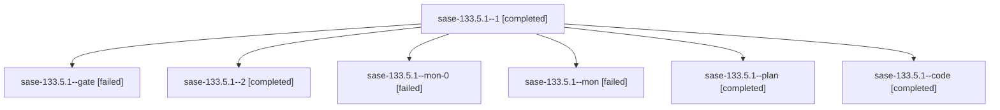

# Family: sase-133.5.1

[Agent Hoods](../README.md) / [bbugyi200](../users/bbugyi200/README.md) / [athena](../users/bbugyi200/machines/athena/README.md) / [sase-133](../users/bbugyi200/machines/athena/hoods/sase-133/README.md) / sase-133.5.1

Owner: `bbugyi200.athena` · Hood: `sase-133` · Members: 7 · Bead: [sase-133.5.1](https://github.com/sase-org/sase--beads/blob/main/pages/sase-133/sase-133.5.1.md)

## Lineage

The diagram is an optional enhancement; the ordered table below contains the same lineage in accessible text.

| Role | Agent | State | Model / provider | Timing | Commits | Prompt | Chat |
|---|---|---|---|---|---:|---|---|
| 1 | sase-133.5.1--1 | completed | grok-4.6 / grok | 2026-09-19T14:16:37.931044+00:00 → 2026-09-19T14:19:29.338977+00:00 | 0 | [Prompt](../agents/bbugyi200.athena.sase-133.5.1--1/prompt.md) | [Chat](../agents/bbugyi200.athena.sase-133.5.1--1/chat.md) |
| gate | sase-133.5.1--gate | failed | grok-4.6 / grok | 2026-09-19T12:56:07.835949+00:00 → 2026-09-19T12:57:27.238245+00:00 | 0 | — | [Chat](../agents/bbugyi200.athena.sase-133.5.1--gate/chat.md) |
| 2 | sase-133.5.1--2 | completed | grok-4.6 / grok | 2026-09-19T15:34:25.389114+00:00 → 2026-09-19T15:45:52.597148+00:00 | [1](../agents/bbugyi200.athena.sase-133.5.1--2/README.md#commits) | [Prompt](../agents/bbugyi200.athena.sase-133.5.1--2/prompt.md) | [Chat](../agents/bbugyi200.athena.sase-133.5.1--2/chat.md) |
| mon-0 | sase-133.5.1--mon-0 | failed | grok-4.6 / grok | 2026-09-19T14:18:49.799863+00:00 → 2026-09-19T14:49:34.247872+00:00 | 0 | — | [Chat](../agents/bbugyi200.athena.sase-133.5.1--mon-0/chat.md) |
| mon | sase-133.5.1--mon | failed | grok-4.6 / grok | 2026-09-19T13:48:41.476253+00:00 → 2026-09-19T13:55:02.783886+00:00 | 0 | — | [Chat](../agents/bbugyi200.athena.sase-133.5.1--mon/chat.md) |
| plan | sase-133.5.1--plan | completed | grok-4.6 / grok | 2026-09-19T12:26:30.461938+00:00 → 2026-09-19T13:50:06.322992+00:00 | 0 | [Prompt](../agents/bbugyi200.athena.sase-133.5.1--plan/prompt.md) | [Chat](../agents/bbugyi200.athena.sase-133.5.1--plan/chat.md) |
| code | sase-133.5.1--code | completed | grok-4.6 / grok | 2026-09-19T12:57:49.106156+00:00 → 2026-09-19T13:50:06.322992+00:00 | 0 | — | [Chat](../agents/bbugyi200.athena.sase-133.5.1--code/chat.md) |

## Commits

| Role | Repo | Commit | Subject | Committed |
|---|---|---|---|---|
| 2 | sase | [`7d6ec55`](https://github.com/sase-org/sase/commit/7d6ec552b5d0650e06682075b422b98fc3d6727e) | feat(tui): attach unparented family shells and oracle owner-roster parity | 2026-09-19 11:38:22 EDT |

## Neighbors

| Agent | Relation | State |
|---|---|---|
| [sase-133.5.2](bbugyi200.athena.sase-133.5.2.md) (family · 3) | sase-133.5 hood | active 2, failed 1 |
| [sase-133.5.2](../agents/bbugyi200.athena.sase-133.5.2/README.md) | sase-133.5 hood | waiting |
| [sase-133.5.3](bbugyi200.athena.sase-133.5.3.md) (family · 5) | sase-133.5 hood | completed 3, failed 2 |
| [sase-133.5.4](../agents/bbugyi200.athena.sase-133.5.4/README.md) | sase-133.5 hood | waiting |
| [sase-133.5.land](../agents/bbugyi200.athena.sase-133.5.land/README.md) | sase-133.5 hood | waiting |
| [sase-133.1](bbugyi200.athena.sase-133.1.md) (family · 3) | sase-133 hood | active 2, completed 1 |
| [sase-133.2](bbugyi200.athena.sase-133.2.md) (family · 3) | sase-133 hood | active 2, completed 1 |
| [sase-133.3](bbugyi200.athena.sase-133.3.md) (family · 3) | sase-133 hood | active 2, completed 1 |
| [sase-133.4](../agents/bbugyi200.athena.sase-133.4/README.md) | sase-133 hood | active |
| [sase-133.land](bbugyi200.athena.sase-133.land.md) (family · 3) | sase-133 hood | active 3 |
| [sase-133.land](../agents/bbugyi200.athena.sase-133.land/README.md) | sase-133 hood | waiting |
