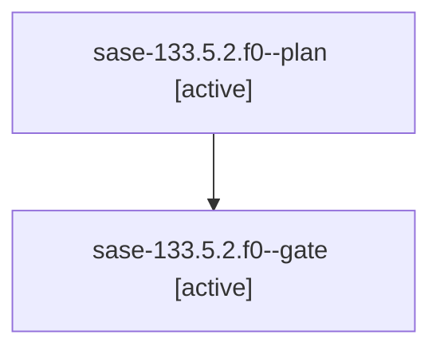

# Family: sase-133.5.2.f0

[Agent Hoods](../README.md) / [bbugyi200](../users/bbugyi200/README.md) / [athena](../users/bbugyi200/machines/athena/README.md) / [sase-133](../users/bbugyi200/machines/athena/hoods/sase-133/README.md) / sase-133.5.2.f0

Owner: `bbugyi200.athena` · Hood: `sase-133` · Members: 2

## Lineage

The diagram is an optional enhancement; the ordered table below contains the same lineage in accessible text.

| Role | Agent | State | Model / provider | Timing | Commits | Prompt | Chat |
|---|---|---|---|---|---:|---|---|
| plan | sase-133.5.2.f0--plan | active | opus / claude | 2026-09-20T12:31:15.064497+00:00 | 0 | [Prompt](../agents/bbugyi200.athena.sase-133.5.2.f0--plan/prompt.md) | [Chat](../agents/bbugyi200.athena.sase-133.5.2.f0--plan/chat.md) |
| gate | sase-133.5.2.f0--gate | active | opus / claude | 2026-09-20T13:02:14.339907+00:00 | 0 | — | — |

## Neighbors

| Agent | Relation | State |
|---|---|---|
| [sase-133.5.2](../agents/bbugyi200.athena.sase-133.5.2/README.md) | ancestor | waiting |
| [sase-133.5.1](bbugyi200.athena.sase-133.5.1.md) (family · 7) | sase-133.5 hood | active 3, completed 1, failed 3 |
| [sase-133.5.3](bbugyi200.athena.sase-133.5.3.md) (family · 5) | sase-133.5 hood | active 3, failed 2 |
| [sase-133.5.4](../agents/bbugyi200.athena.sase-133.5.4/README.md) | sase-133.5 hood | active |
| [sase-133.5.land](../agents/bbugyi200.athena.sase-133.5.land/README.md) | sase-133.5 hood | active |
| [sase-133.1](bbugyi200.athena.sase-133.1.md) (family · 3) | sase-133 hood | active 2, completed 1 |
| [sase-133.2](bbugyi200.athena.sase-133.2.md) (family · 3) | sase-133 hood | active 2, completed 1 |
| [sase-133.3](bbugyi200.athena.sase-133.3.md) (family · 3) | sase-133 hood | active 2, completed 1 |
| [sase-133.4](../agents/bbugyi200.athena.sase-133.4/README.md) | sase-133 hood | active |
| [sase-133.land](bbugyi200.athena.sase-133.land.md) (family · 3) | sase-133 hood | active 3 |
| [sase-133.land](../agents/bbugyi200.athena.sase-133.land/README.md) | sase-133 hood | waiting |
