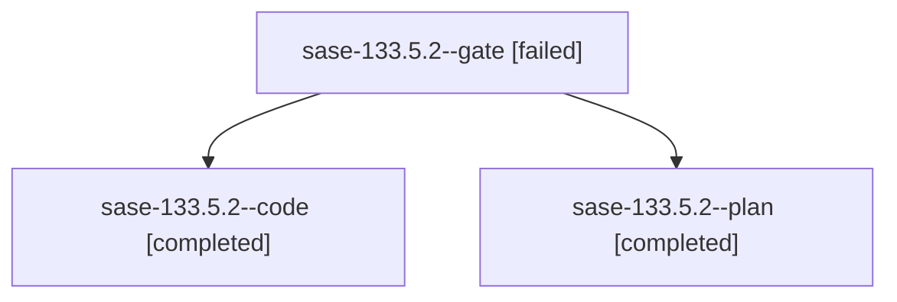

# Family: sase-133.5.2

[Agent Hoods](../README.md) / [bbugyi200](../users/bbugyi200/README.md) / [athena](../users/bbugyi200/machines/athena/README.md) / [sase-133](../users/bbugyi200/machines/athena/hoods/sase-133/README.md) / sase-133.5.2

Owner: `bbugyi200.athena` · Hood: `sase-133` · Members: 3 · Bead: [sase-133.5.2](https://github.com/sase-org/sase--beads/blob/main/pages/sase-133/sase-133.5.2.md)

## Lineage

The diagram is an optional enhancement; the ordered table below contains the same lineage in accessible text.

| Role | Agent | State | Model / provider | Timing | Commits | Prompt | Chat |
|---|---|---|---|---|---:|---|---|
| gate | sase-133.5.2--gate | failed | opus / claude | 2026-09-20T10:41:50.177820+00:00 → 2026-09-20T10:42:05.364365+00:00 | 0 | — | [Chat](../agents/bbugyi200.athena.sase-133.5.2--gate/chat.md) |
| code | sase-133.5.2--code | completed | sonnet / claude | 2026-09-20T10:42:22.933700+00:00 → 2026-09-20T12:22:40.376232+00:00 | [1](../agents/bbugyi200.athena.sase-133.5.2--code/README.md#commits) | — | [Chat](../agents/bbugyi200.athena.sase-133.5.2--code/chat.md) |
| plan | sase-133.5.2--plan | completed | opus / claude | 2026-09-20T10:34:12.397001+00:00 → 2026-09-20T12:22:40.376232+00:00 | 0 | [Prompt](../agents/bbugyi200.athena.sase-133.5.2--plan/prompt.md) | [Chat](../agents/bbugyi200.athena.sase-133.5.2--plan/chat.md) |

## Commits

| Role | Repo | Commit | Subject | Committed |
|---|---|---|---|---|
| code | sase | [`2631449`](https://github.com/sase-org/sase/commit/263144991496900af018d7470257dc841555d873) | feat(fleet): carry owner presentation facts through the viewer catalog adapter | 2026-09-20 08:17:33 EDT |

## Neighbors

| Agent | Relation | State |
|---|---|---|
| [sase-133.5.2.f0](bbugyi200.athena.sase-133.5.2.f0.md) (family · 2) | descendant | active 2 |
| [sase-133.5.1](bbugyi200.athena.sase-133.5.1.md) (family · 7) | sase-133.5 hood | completed 4, failed 3 |
| [sase-133.5.3](bbugyi200.athena.sase-133.5.3.md) (family · 5) | sase-133.5 hood | completed 3, failed 2 |
| [sase-133.5.4](../agents/bbugyi200.athena.sase-133.5.4/README.md) | sase-133.5 hood | active |
| [sase-133.5.land](../agents/bbugyi200.athena.sase-133.5.land/README.md) | sase-133.5 hood | waiting |
| [sase-133.1](bbugyi200.athena.sase-133.1.md) (family · 3) | sase-133 hood | active 2, completed 1 |
| [sase-133.2](bbugyi200.athena.sase-133.2.md) (family · 3) | sase-133 hood | active 2, completed 1 |
| [sase-133.3](bbugyi200.athena.sase-133.3.md) (family · 3) | sase-133 hood | active 2, completed 1 |
| [sase-133.4](../agents/bbugyi200.athena.sase-133.4/README.md) | sase-133 hood | active |
| [sase-133.land](bbugyi200.athena.sase-133.land.md) (family · 3) | sase-133 hood | active 3 |
| [sase-133.land](../agents/bbugyi200.athena.sase-133.land/README.md) | sase-133 hood | waiting |
