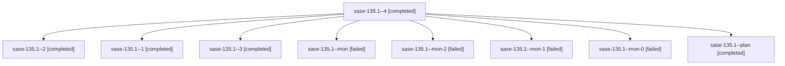

# Family: sase-135.1

[Agent Hoods](../README.md) / [bbugyi200](../users/bbugyi200/README.md) / [athena](../users/bbugyi200/machines/athena/README.md) / [sase-135](../users/bbugyi200/machines/athena/hoods/sase-135/README.md) / sase-135.1

Owner: `bbugyi200.athena` · Hood: `sase-135` · Members: 9 · Bead: [sase-135.1](https://github.com/sase-org/sase--beads/blob/main/pages/sase-135/sase-135.1.md)

## Lineage

The diagram is an optional enhancement; the ordered table below contains the same lineage in accessible text.

| Role | Agent | State | Model / provider | Timing | Commits | Prompt | Chat |
|---|---|---|---|---|---:|---|---|
| 4 | sase-135.1--4 | completed | grok-4.6 / grok | 2026-09-19T07:00:45.650745+00:00 → 2026-09-19T08:59:35.072830+00:00 | [1](../agents/bbugyi200.athena.sase-135.1--4/README.md#commits) | [Prompt](../agents/bbugyi200.athena.sase-135.1--4/prompt.md) | [Chat](../agents/bbugyi200.athena.sase-135.1--4/chat.md) |
| 2 | sase-135.1--2 | completed | grok-4.6 / grok | 2026-09-19T05:25:10.758177+00:00 → 2026-09-19T05:41:29.672809+00:00 | 0 | [Prompt](../agents/bbugyi200.athena.sase-135.1--2/prompt.md) | [Chat](../agents/bbugyi200.athena.sase-135.1--2/chat.md) |
| 1 | sase-135.1--1 | completed | grok-4.6 / grok | 2026-09-19T04:36:50.226016+00:00 → 2026-09-19T04:48:44.976377+00:00 | 0 | [Prompt](../agents/bbugyi200.athena.sase-135.1--1/prompt.md) | [Chat](../agents/bbugyi200.athena.sase-135.1--1/chat.md) |
| 3 | sase-135.1--3 | completed | grok-4.6 / grok | 2026-09-19T06:18:05.090712+00:00 → 2026-09-19T06:25:25.933459+00:00 | 0 | [Prompt](../agents/bbugyi200.athena.sase-135.1--3/prompt.md) | [Chat](../agents/bbugyi200.athena.sase-135.1--3/chat.md) |
| mon | sase-135.1--mon | failed | grok-4.6 / grok | 2026-09-19T04:27:37.892245+00:00 → 2026-09-19T04:36:43.282907+00:00 | 0 | — | [Chat](../agents/bbugyi200.athena.sase-135.1--mon/chat.md) |
| mon-2 | sase-135.1--mon-2 | failed | grok-4.6 / grok | 2026-09-19T06:24:58.652639+00:00 → 2026-09-19T07:00:42.463641+00:00 | 0 | — | [Chat](../agents/bbugyi200.athena.sase-135.1--mon-2/chat.md) |
| mon-1 | sase-135.1--mon-1 | failed | grok-4.6 / grok | 2026-09-19T05:40:30.390110+00:00 → 2026-09-19T06:18:18.418905+00:00 | 0 | — | [Chat](../agents/bbugyi200.athena.sase-135.1--mon-1/chat.md) |
| mon-0 | sase-135.1--mon-0 | failed | grok-4.6 / grok | 2026-09-19T04:47:46.641428+00:00 → 2026-09-19T05:25:03.725851+00:00 | 0 | — | [Chat](../agents/bbugyi200.athena.sase-135.1--mon-0/chat.md) |
| plan | sase-135.1--plan | completed | grok-4.6 / grok | 2026-09-19T02:29:59.365030+00:00 → 2026-09-19T04:28:43.460580+00:00 | 0 | [Prompt](../agents/bbugyi200.athena.sase-135.1--plan/prompt.md) | [Chat](../agents/bbugyi200.athena.sase-135.1--plan/chat.md) |

## Commits

| Role | Repo | Commit | Subject | Committed |
|---|---|---|---|---|
| 4 | sase | [`9cfa200`](https://github.com/sase-org/sase/commit/9cfa20067519122b6737890dff68a883d43e49d2) | feat(tool-run): land V1 ToolRun bindings, disk owner, and smokes | 2026-09-19 04:46:06 EDT |

## Neighbors

| Agent | Relation | State |
|---|---|---|
| [sase-135.2](../agents/bbugyi200.athena.sase-135.2/README.md) | sase-135 hood | completed |
| [sase-135.3](../agents/bbugyi200.athena.sase-135.3/README.md) | sase-135 hood | completed |
| [sase-135.4](../agents/bbugyi200.athena.sase-135.4/README.md) | sase-135 hood | completed |
| [sase-135.5](../agents/bbugyi200.athena.sase-135.5/README.md) | sase-135 hood | completed |
| [sase-135.6](../agents/bbugyi200.athena.sase-135.6/README.md) | sase-135 hood | completed |
| [sase-135.7](bbugyi200.athena.sase-135.7.md) (family · 3) | sase-135 hood | completed 2, failed 1 |
| [sase-135.land](../agents/bbugyi200.athena.sase-135.land/README.md) | sase-135 hood | active |
