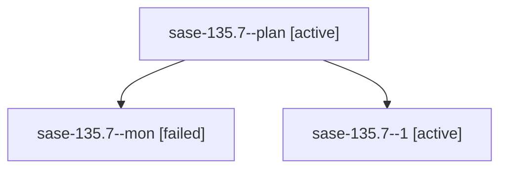

# Family: sase-135.7

[Agent Hoods](../README.md) / [bbugyi200](../users/bbugyi200/README.md) / [athena](../users/bbugyi200/machines/athena/README.md) / [sase-135](../users/bbugyi200/machines/athena/hoods/sase-135/README.md) / sase-135.7

Owner: `bbugyi200.athena` · Hood: `sase-135` · Members: 3 · Bead: [sase-135.7](https://github.com/sase-org/sase--beads/blob/main/pages/sase-135/sase-135.7.md)

## Lineage

The diagram is an optional enhancement; the ordered table below contains the same lineage in accessible text.

| Role | Agent | State | Model / provider | Timing | Commits | Prompt | Chat |
|---|---|---|---|---|---:|---|---|
| plan | sase-135.7--plan | active | sonnet / claude | 2026-09-20T11:00:18.301348+00:00 | 0 | [Prompt](../agents/bbugyi200.athena.sase-135.7--plan/prompt.md) | [Chat](../agents/bbugyi200.athena.sase-135.7--plan/chat.md) |
| mon | sase-135.7--mon | failed | sonnet / claude | 2026-09-20T14:23:29.641413+00:00 → 2026-09-20T14:25:20.289144+00:00 | 0 | — | [Chat](../agents/bbugyi200.athena.sase-135.7--mon/chat.md) |
| 1 | sase-135.7--1 | active | sonnet / claude | 2026-09-20T14:25:20.016949+00:00 | [1](../agents/bbugyi200.athena.sase-135.7--1/README.md#commits) | [Prompt](../agents/bbugyi200.athena.sase-135.7--1/prompt.md) | [Chat](../agents/bbugyi200.athena.sase-135.7--1/chat.md) |

## Commits

| Role | Repo | Commit | Subject | Committed |
|---|---|---|---|---|
| 1 | sase | [`58f2de8`](https://github.com/sase-org/sase/commit/58f2de8f80e88754ca4905322855f463e3f0d840) | feat(tool): make ToolRun output truncation explicit and prove E1 end to end | 2026-09-20 10:34:36 EDT |

## Neighbors

| Agent | Relation | State |
|---|---|---|
| [sase-135.1](bbugyi200.athena.sase-135.1.md) (family · 9) | sase-135 hood | active 5, failed 4 |
| [sase-135.2](../agents/bbugyi200.athena.sase-135.2/README.md) | sase-135 hood | active |
| [sase-135.3](../agents/bbugyi200.athena.sase-135.3/README.md) | sase-135 hood | active |
| [sase-135.4](../agents/bbugyi200.athena.sase-135.4/README.md) | sase-135 hood | active |
| [sase-135.5](../agents/bbugyi200.athena.sase-135.5/README.md) | sase-135 hood | active |
| [sase-135.6](../agents/bbugyi200.athena.sase-135.6/README.md) | sase-135 hood | active |
| [sase-135.land](../agents/bbugyi200.athena.sase-135.land/README.md) | sase-135 hood | active |
