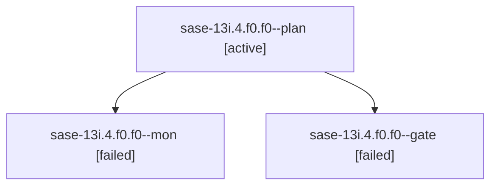

# Family: sase-13i.4.f0.f0

[Agent Hoods](../README.md) / [bbugyi200](../users/bbugyi200/README.md) / [athena](../users/bbugyi200/machines/athena/README.md) / [sase-13i](../users/bbugyi200/machines/athena/hoods/sase-13i/README.md) / sase-13i.4.f0.f0

Owner: `bbugyi200.athena` · Hood: `sase-13i` · Members: 3

## Lineage

The diagram is an optional enhancement; the ordered table below contains the same lineage in accessible text.

| Role | Agent | State | Model / provider | Timing | Commits | Prompt | Chat |
|---|---|---|---|---|---:|---|---|
| plan | sase-13i.4.f0.f0--plan | active | opus / claude | 2026-09-20T16:00:55.330026+00:00 | 0 | [Prompt](../agents/bbugyi200.athena.sase-13i.4.f0.f0--plan/prompt.md) | [Chat](../agents/bbugyi200.athena.sase-13i.4.f0.f0--plan/chat.md) |
| mon | sase-13i.4.f0.f0--mon | failed | opus / claude | 2026-09-20T16:14:12.338136+00:00 → 2026-09-20T16:16:29.202707+00:00 | 0 | — | [Chat](../agents/bbugyi200.athena.sase-13i.4.f0.f0--mon/chat.md) |
| gate | sase-13i.4.f0.f0--gate | failed | opus / claude | 2026-09-20T16:13:20.374249+00:00 → 2026-09-20T16:14:21.751837+00:00 | 0 | — | [Chat](../agents/bbugyi200.athena.sase-13i.4.f0.f0--gate/chat.md) |

## Neighbors

| Agent | Relation | State |
|---|---|---|
| [sase-13i.4.f0](bbugyi200.athena.sase-13i.4.f0.md) (family · 3) | ancestor | active 1, completed 1, failed 1 |
| [sase-13i.4](../agents/bbugyi200.athena.sase-13i.4/README.md) | ancestor | active |
| [sase-13i.1](../agents/bbugyi200.athena.sase-13i.1/README.md) | sase-13i hood | active |
| [sase-13i.2](../agents/bbugyi200.athena.sase-13i.2/README.md) | sase-13i hood | active |
| [sase-13i.3](../agents/bbugyi200.athena.sase-13i.3/README.md) | sase-13i hood | active |
| [sase-13i.land](../agents/bbugyi200.athena.sase-13i.land/README.md) | sase-13i hood | active |
