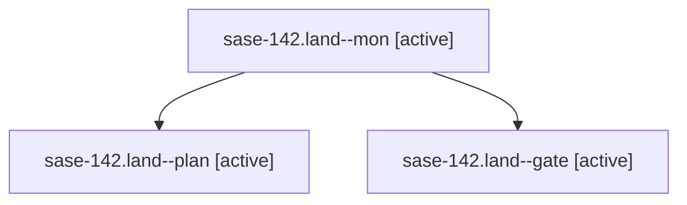

# Family: sase-142.land

[Agent Hoods](../README.md) / [bbugyi200](../users/bbugyi200/README.md) / [athena](../users/bbugyi200/machines/athena/README.md) / [sase-142](../users/bbugyi200/machines/athena/hoods/sase-142/README.md) / sase-142.land

Owner: `bbugyi200.athena` · Hood: `sase-142` · Members: 3 · Bead: [sase-142](https://github.com/sase-org/sase--beads/blob/main/pages/sase-142/README.md)

## Lineage

The diagram is an optional enhancement; the ordered table below contains the same lineage in accessible text.

| Role | Agent | State | Model / provider | Timing | Commits | Prompt | Chat |
|---|---|---|---|---|---:|---|---|
| mon | sase-142.land--mon | active | opus / claude | 2026-09-20T21:09:20.711109+00:00 | 0 | — | [Chat](../agents/bbugyi200.athena.sase-142.land--mon/chat.md) |
| plan | sase-142.land--plan | active | opus / claude | 2026-09-20T20:50:30.881859+00:00 | 0 | [Prompt](../agents/bbugyi200.athena.sase-142.land--plan/prompt.md) | [Chat](../agents/bbugyi200.athena.sase-142.land--plan/chat.md) |
| gate | sase-142.land--gate | active | opus / claude | 2026-09-20T21:08:25.071347+00:00 | 0 | — | [Chat](../agents/bbugyi200.athena.sase-142.land--gate/chat.md) |

## Neighbors

| Agent | Relation | State |
|---|---|---|
| [sase-142.1](../agents/bbugyi200.athena.sase-142.1/README.md) | sase-142 hood | active |
| [sase-142.2](../agents/bbugyi200.athena.sase-142.2/README.md) | sase-142 hood | active |
| [sase-142.3](../agents/bbugyi200.athena.sase-142.3/README.md) | sase-142 hood | active |
| [sase-142.4](bbugyi200.athena.sase-142.4.md) (family · 3) | sase-142 hood | active 3 |
| [sase-142.5.1](../agents/bbugyi200.athena.sase-142.5.1/README.md) | sase-142 hood | active |
| [sase-142.5.2](../agents/bbugyi200.athena.sase-142.5.2/README.md) | sase-142 hood | active |
| [sase-142.5.3](../agents/bbugyi200.athena.sase-142.5.3/README.md) | sase-142 hood | active |
| [sase-142.5.4](../agents/bbugyi200.athena.sase-142.5.4/README.md) | sase-142 hood | active |
| [sase-142.5.land](../agents/bbugyi200.athena.sase-142.5.land/README.md) | sase-142 hood | active |
