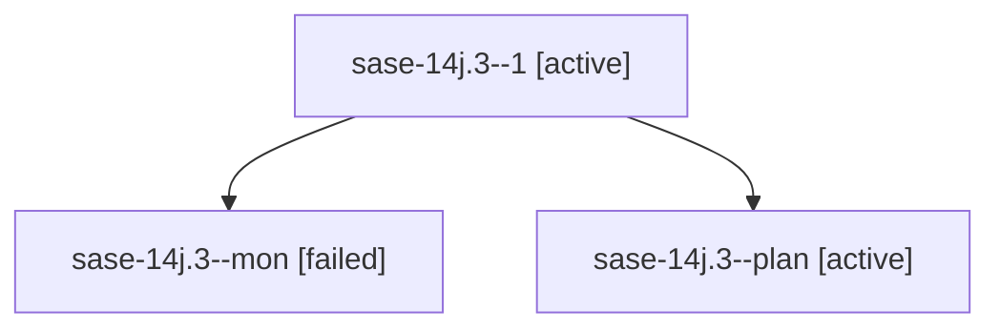

# Family: sase-14j.3

[Agent Hoods](../README.md) / [bbugyi200](../users/bbugyi200/README.md) / [athena](../users/bbugyi200/machines/athena/README.md) / [sase-14j](../users/bbugyi200/machines/athena/hoods/sase-14j/README.md) / sase-14j.3

Owner: `bbugyi200.athena` · Hood: `sase-14j` · Members: 3 · Bead: [sase-14j.3](https://github.com/sase-org/sase--beads/blob/main/pages/sase-14j/sase-14j.3.md)

## Lineage

The diagram is an optional enhancement; the ordered table below contains the same lineage in accessible text.

| Role | Agent | State | Model / provider | Timing | Commits | Prompt | Chat |
|---|---|---|---|---|---:|---|---|
| 1 | sase-14j.3--1 | active | muse-spark-1.3-contributor / muse | 2026-09-21T02:13:31.440591+00:00 | 0 | [Prompt](../agents/bbugyi200.athena.sase-14j.3--1/prompt.md) | [Chat](../agents/bbugyi200.athena.sase-14j.3--1/chat.md) |
| mon | sase-14j.3--mon | failed | muse-spark-1.3-contributor / muse | 2026-09-21T01:24:04.261492+00:00 → 2026-09-21T02:11:57.848743+00:00 | 0 | — | [Chat](../agents/bbugyi200.athena.sase-14j.3--mon/chat.md) |
| plan | sase-14j.3--plan | active | muse-spark-1.3-contributor / muse | 2026-09-20T23:21:31.129697+00:00 | 0 | [Prompt](../agents/bbugyi200.athena.sase-14j.3--plan/prompt.md) | [Chat](../agents/bbugyi200.athena.sase-14j.3--plan/chat.md) |

## Neighbors

| Agent | Relation | State |
|---|---|---|
| [sase-14j.1](../agents/bbugyi200.athena.sase-14j.1/README.md) | sase-14j hood | active |
| [sase-14j.2](../agents/bbugyi200.athena.sase-14j.2/README.md) | sase-14j hood | active |
| [sase-14j.4](bbugyi200.athena.sase-14j.4.md) (family · 3) | sase-14j hood | active 2, failed 1 |
| [sase-14j.5](../agents/bbugyi200.athena.sase-14j.5/README.md) | sase-14j hood | active |
| [sase-14j.6](../agents/bbugyi200.athena.sase-14j.6/README.md) | sase-14j hood | active |
| [sase-14j.land](bbugyi200.athena.sase-14j.land.md) (family · 3) | sase-14j hood | active 1, completed 1, failed 1 |
