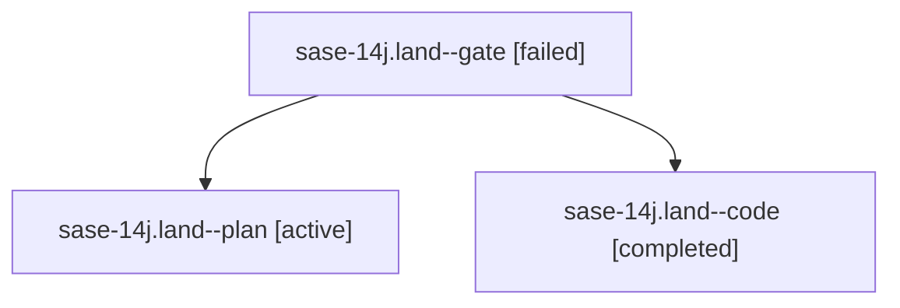

# Family: sase-14j.land

[Agent Hoods](../README.md) / [bbugyi200](../users/bbugyi200/README.md) / [athena](../users/bbugyi200/machines/athena/README.md) / [sase-14j](../users/bbugyi200/machines/athena/hoods/sase-14j/README.md) / sase-14j.land

Owner: `bbugyi200.athena` · Hood: `sase-14j` · Members: 3 · Bead: [sase-14j](https://github.com/sase-org/sase--beads/blob/main/pages/sase-14j/README.md)

## Lineage

The diagram is an optional enhancement; the ordered table below contains the same lineage in accessible text.

| Role | Agent | State | Model / provider | Timing | Commits | Prompt | Chat |
|---|---|---|---|---|---:|---|---|
| gate | sase-14j.land--gate | failed | opus / claude | 2026-09-21T13:31:29.396657+00:00 → 2026-09-21T13:32:13.330959+00:00 | 0 | — | [Chat](../agents/bbugyi200.athena.sase-14j.land--gate/chat.md) |
| plan | sase-14j.land--plan | active | opus / claude | 2026-09-21T13:03:09.974162+00:00 | 0 | [Prompt](../agents/bbugyi200.athena.sase-14j.land--plan/prompt.md) | [Chat](../agents/bbugyi200.athena.sase-14j.land--plan/chat.md) |
| code | sase-14j.land--code | completed | muse-spark-1.3-contributor / muse | 2026-09-21T13:32:29.193429+00:00 → 2026-09-21T14:59:51.807861+00:00 | [1](../agents/bbugyi200.athena.sase-14j.land--code/README.md#commits) | — | [Chat](../agents/bbugyi200.athena.sase-14j.land--code/chat.md) |

## Commits

| Role | Repo | Commit | Subject | Committed |
|---|---|---|---|---|
| code | sase | [`319fe6b`](https://github.com/sase-org/sase/commit/319fe6b246fa09f4c8fa509a98f4a8b9e4c9f10f) | feat(beads): land sase bead touched with panel-agreeing rows, core pin, and Beads goldens | 2026-09-21 10:55:32 EDT |

## Neighbors

| Agent | Relation | State |
|---|---|---|
| [sase-14j.1](../agents/bbugyi200.athena.sase-14j.1/README.md) | sase-14j hood | active |
| [sase-14j.2](../agents/bbugyi200.athena.sase-14j.2/README.md) | sase-14j hood | active |
| [sase-14j.3](bbugyi200.athena.sase-14j.3.md) (family · 3) | sase-14j hood | active 2, failed 1 |
| [sase-14j.4](bbugyi200.athena.sase-14j.4.md) (family · 3) | sase-14j hood | active 2, failed 1 |
| [sase-14j.5](../agents/bbugyi200.athena.sase-14j.5/README.md) | sase-14j hood | active |
| [sase-14j.6](../agents/bbugyi200.athena.sase-14j.6/README.md) | sase-14j hood | active |
