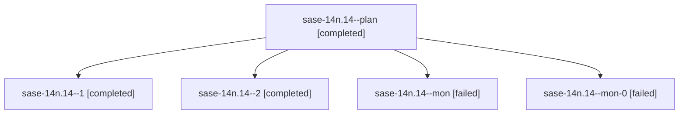

# Family: sase-14n.14

[Agent Hoods](../README.md) / [bbugyi200](../users/bbugyi200/README.md) / [athena](../users/bbugyi200/machines/athena/README.md) / [sase-14n](../users/bbugyi200/machines/athena/hoods/sase-14n/README.md) / sase-14n.14

Owner: `bbugyi200.athena` · Hood: `sase-14n` · Members: 5 · Bead: [sase-14n.14](https://github.com/sase-org/sase--beads/blob/main/pages/sase-14n/sase-14n.14.md)

## Lineage

The diagram is an optional enhancement; the ordered table below contains the same lineage in accessible text.

| Role | Agent | State | Model / provider | Timing | Commits | Prompt | Chat |
|---|---|---|---|---|---:|---|---|
| plan | sase-14n.14--plan | completed | muse-spark-1.3-contributor / muse | 2026-09-20T21:55:27.417893+00:00 → 2026-09-20T23:07:35.529067+00:00 | 0 | [Prompt](../agents/bbugyi200.athena.sase-14n.14--plan/prompt.md) | [Chat](../agents/bbugyi200.athena.sase-14n.14--plan/chat.md) |
| 1 | sase-14n.14--1 | completed | muse-spark-1.3-contributor / muse | 2026-09-20T23:30:49.219814+00:00 → 2026-09-20T23:44:34.771398+00:00 | 0 | [Prompt](../agents/bbugyi200.athena.sase-14n.14--1/prompt.md) | [Chat](../agents/bbugyi200.athena.sase-14n.14--1/chat.md) |
| 2 | sase-14n.14--2 | completed | muse-spark-1.3-contributor / muse | 2026-09-20T23:53:58.804133+00:00 → 2026-09-21T00:02:03.009235+00:00 | [1](../agents/bbugyi200.athena.sase-14n.14--2/README.md#commits) | [Prompt](../agents/bbugyi200.athena.sase-14n.14--2/prompt.md) | [Chat](../agents/bbugyi200.athena.sase-14n.14--2/chat.md) |
| mon | sase-14n.14--mon | failed | muse-spark-1.3-contributor / muse | 2026-09-20T23:05:43.417038+00:00 → 2026-09-20T23:18:28.922966+00:00 | 0 | — | [Chat](../agents/bbugyi200.athena.sase-14n.14--mon/chat.md) |
| mon-0 | sase-14n.14--mon-0 | failed | muse-spark-1.3-contributor / muse | 2026-09-20T23:43:10.730627+00:00 → 2026-09-20T23:53:23.939072+00:00 | 0 | — | [Chat](../agents/bbugyi200.athena.sase-14n.14--mon-0/chat.md) |

## Commits

| Role | Repo | Commit | Subject | Committed |
|---|---|---|---|---|
| 2 | sase | [`090f3ad`](https://github.com/sase-org/sase/commit/090f3add5a36095f441d4319fbe024d7f83d49cd) | fix(axe): surface underlying workspace preparation failure reason | 2026-09-20 19:57:35 EDT |

## Neighbors

| Agent | Relation | State |
|---|---|---|
| [sase-14n.1](../agents/bbugyi200.athena.sase-14n.1/README.md) | sase-14n hood | completed |
| [sase-14n.10](../agents/bbugyi200.athena.sase-14n.10/README.md) | sase-14n hood | completed |
| [sase-14n.11](../agents/bbugyi200.athena.sase-14n.11/README.md) | sase-14n hood | completed |
| [sase-14n.12](../agents/bbugyi200.athena.sase-14n.12/README.md) | sase-14n hood | completed |
| [sase-14n.13](bbugyi200.athena.sase-14n.13.md) (family · 3) | sase-14n hood | completed 2, failed 1 |
| [sase-14n.15.1](../agents/bbugyi200.athena.sase-14n.15.1/README.md) | sase-14n hood | completed |
| [sase-14n.15.2](../agents/bbugyi200.athena.sase-14n.15.2/README.md) | sase-14n hood | completed |
| [sase-14n.15.3](../agents/bbugyi200.athena.sase-14n.15.3/README.md) | sase-14n hood | completed |
| [sase-14n.15.land](../agents/bbugyi200.athena.sase-14n.15.land/README.md) | sase-14n hood | active |
| [sase-14n.2](../agents/bbugyi200.athena.sase-14n.2/README.md) | sase-14n hood | completed |
| [sase-14n.3](bbugyi200.athena.sase-14n.3.md) (family · 3) | sase-14n hood | completed 2, failed 1 |
| [sase-14n.4](../agents/bbugyi200.athena.sase-14n.4/README.md) | sase-14n hood | completed |
| [sase-14n.5](../agents/bbugyi200.athena.sase-14n.5/README.md) | sase-14n hood | completed |
| [sase-14n.6](../agents/bbugyi200.athena.sase-14n.6/README.md) | sase-14n hood | completed |
| [sase-14n.7](../agents/bbugyi200.athena.sase-14n.7/README.md) | sase-14n hood | completed |
| [sase-14n.8](bbugyi200.athena.sase-14n.8.md) (family · 3) | sase-14n hood | completed 2, failed 1 |
| [sase-14n.9](../agents/bbugyi200.athena.sase-14n.9/README.md) | sase-14n hood | completed |
| [sase-14n.land](bbugyi200.athena.sase-14n.land.md) (family · 3) | sase-14n hood | failed 3 |
