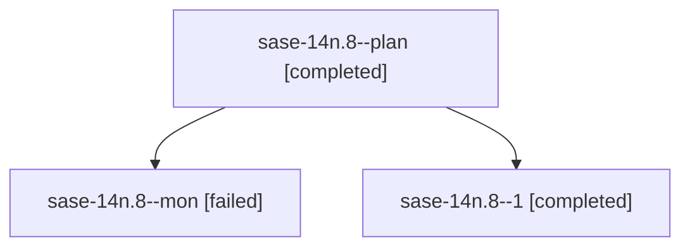

# Family: sase-14n.8

[Agent Hoods](../README.md) / [bbugyi200](../users/bbugyi200/README.md) / [athena](../users/bbugyi200/machines/athena/README.md) / [sase-14n](../users/bbugyi200/machines/athena/hoods/sase-14n/README.md) / sase-14n.8

Owner: `bbugyi200.athena` · Hood: `sase-14n` · Members: 3 · Bead: [sase-14n.8](https://github.com/sase-org/sase--beads/blob/main/pages/sase-14n/sase-14n.8.md)

## Lineage

The diagram is an optional enhancement; the ordered table below contains the same lineage in accessible text.

| Role | Agent | State | Model / provider | Timing | Commits | Prompt | Chat |
|---|---|---|---|---|---:|---|---|
| plan | sase-14n.8--plan | completed | muse-spark-1.3-contributor / muse | 2026-09-21T15:58:13.106558+00:00 → 2026-09-21T16:49:51.871047+00:00 | 0 | [Prompt](../agents/bbugyi200.athena.sase-14n.8--plan/prompt.md) | [Chat](../agents/bbugyi200.athena.sase-14n.8--plan/chat.md) |
| mon | sase-14n.8--mon | failed | muse-spark-1.3-contributor / muse | 2026-09-21T16:45:45.801594+00:00 → 2026-09-21T16:57:27.776470+00:00 | 0 | — | [Chat](../agents/bbugyi200.athena.sase-14n.8--mon/chat.md) |
| 1 | sase-14n.8--1 | completed | muse-spark-1.3-contributor / muse | 2026-09-21T16:58:06.347661+00:00 → 2026-09-21T17:27:10.523596+00:00 | [1](../agents/bbugyi200.athena.sase-14n.8--1/README.md#commits) | [Prompt](../agents/bbugyi200.athena.sase-14n.8--1/prompt.md) | [Chat](../agents/bbugyi200.athena.sase-14n.8--1/chat.md) |

## Commits

| Role | Repo | Commit | Subject | Committed |
|---|---|---|---|---|
| 1 | sase | [`03fff9d`](https://github.com/sase-org/sase/commit/03fff9dcbcad9c17e62cbc2217033c6be30a6a18) | fix(ace): fit notification modal footer to modal width so close and +1 stay visible | 2026-09-21 13:20:25 EDT |

## Neighbors

| Agent | Relation | State |
|---|---|---|
| [sase-14n.1](../agents/bbugyi200.athena.sase-14n.1/README.md) | sase-14n hood | completed |
| [sase-14n.10](../agents/bbugyi200.athena.sase-14n.10/README.md) | sase-14n hood | completed |
| [sase-14n.11](../agents/bbugyi200.athena.sase-14n.11/README.md) | sase-14n hood | completed |
| [sase-14n.12](../agents/bbugyi200.athena.sase-14n.12/README.md) | sase-14n hood | completed |
| [sase-14n.13](bbugyi200.athena.sase-14n.13.md) (family · 3) | sase-14n hood | completed 2, failed 1 |
| [sase-14n.14](bbugyi200.athena.sase-14n.14.md) (family · 5) | sase-14n hood | completed 3, failed 2 |
| [sase-14n.15.1](../agents/bbugyi200.athena.sase-14n.15.1/README.md) | sase-14n hood | active |
| [sase-14n.15.2](../agents/bbugyi200.athena.sase-14n.15.2/README.md) | sase-14n hood | waiting |
| [sase-14n.15.3](../agents/bbugyi200.athena.sase-14n.15.3/README.md) | sase-14n hood | waiting |
| [sase-14n.15.land](../agents/bbugyi200.athena.sase-14n.15.land/README.md) | sase-14n hood | waiting |
| [sase-14n.2](../agents/bbugyi200.athena.sase-14n.2/README.md) | sase-14n hood | completed |
| [sase-14n.3](bbugyi200.athena.sase-14n.3.md) (family · 3) | sase-14n hood | completed 2, failed 1 |
| [sase-14n.4](../agents/bbugyi200.athena.sase-14n.4/README.md) | sase-14n hood | completed |
| [sase-14n.5](../agents/bbugyi200.athena.sase-14n.5/README.md) | sase-14n hood | completed |
| [sase-14n.6](../agents/bbugyi200.athena.sase-14n.6/README.md) | sase-14n hood | completed |
| [sase-14n.7](../agents/bbugyi200.athena.sase-14n.7/README.md) | sase-14n hood | completed |
| [sase-14n.9](../agents/bbugyi200.athena.sase-14n.9/README.md) | sase-14n hood | completed |
| [sase-14n.land](bbugyi200.athena.sase-14n.land.md) (family · 3) | sase-14n hood | failed 3 |
