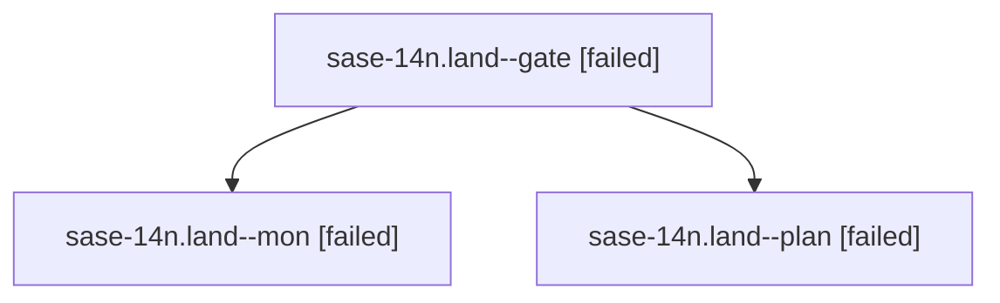

# Family: sase-14n.land

[Agent Hoods](../README.md) / [bbugyi200](../users/bbugyi200/README.md) / [athena](../users/bbugyi200/machines/athena/README.md) / [sase-14n](../users/bbugyi200/machines/athena/hoods/sase-14n/README.md) / sase-14n.land

Owner: `bbugyi200.athena` · Hood: `sase-14n` · Members: 3 · Bead: [sase-14n](https://github.com/sase-org/sase--beads/blob/main/pages/sase-14n/README.md)

## Lineage

The diagram is an optional enhancement; the ordered table below contains the same lineage in accessible text.

| Role | Agent | State | Model / provider | Timing | Commits | Prompt | Chat |
|---|---|---|---|---|---:|---|---|
| gate | sase-14n.land--gate | failed | opus / claude | 2026-09-21T19:10:09.472086+00:00 → 2026-09-21T19:11:16.820586+00:00 | 0 | — | [Chat](../agents/bbugyi200.athena.sase-14n.land--gate/chat.md) |
| mon | sase-14n.land--mon | failed | opus / claude | 2026-09-21T19:11:15.885984+00:00 → 2026-09-21T19:13:30.024513+00:00 | 0 | — | [Chat](../agents/bbugyi200.athena.sase-14n.land--mon/chat.md) |
| plan | sase-14n.land--plan | failed | opus / claude | 2026-09-21T17:33:31.839083+00:00 → 2026-09-21T19:11:28.050885+00:00 | 0 | [Prompt](../agents/bbugyi200.athena.sase-14n.land--plan/prompt.md) | [Chat](../agents/bbugyi200.athena.sase-14n.land--plan/chat.md) |

## Neighbors

| Agent | Relation | State |
|---|---|---|
| [sase-14n.1](../agents/bbugyi200.athena.sase-14n.1/README.md) | sase-14n hood | completed |
| [sase-14n.10](../agents/bbugyi200.athena.sase-14n.10/README.md) | sase-14n hood | completed |
| [sase-14n.11](../agents/bbugyi200.athena.sase-14n.11/README.md) | sase-14n hood | completed |
| [sase-14n.12](../agents/bbugyi200.athena.sase-14n.12/README.md) | sase-14n hood | completed |
| [sase-14n.13](bbugyi200.athena.sase-14n.13.md) (family · 3) | sase-14n hood | completed 2, failed 1 |
| [sase-14n.14](bbugyi200.athena.sase-14n.14.md) (family · 5) | sase-14n hood | completed 3, failed 2 |
| [sase-14n.15.1](../agents/bbugyi200.athena.sase-14n.15.1/README.md) | sase-14n hood | completed |
| [sase-14n.15.2](../agents/bbugyi200.athena.sase-14n.15.2/README.md) | sase-14n hood | completed |
| [sase-14n.15.3](../agents/bbugyi200.athena.sase-14n.15.3/README.md) | sase-14n hood | completed |
| [sase-14n.15.land](../agents/bbugyi200.athena.sase-14n.15.land/README.md) | sase-14n hood | completed |
| [sase-14n.2](../agents/bbugyi200.athena.sase-14n.2/README.md) | sase-14n hood | completed |
| [sase-14n.3](bbugyi200.athena.sase-14n.3.md) (family · 3) | sase-14n hood | completed 2, failed 1 |
| [sase-14n.4](../agents/bbugyi200.athena.sase-14n.4/README.md) | sase-14n hood | completed |
| [sase-14n.5](../agents/bbugyi200.athena.sase-14n.5/README.md) | sase-14n hood | completed |
| [sase-14n.6](../agents/bbugyi200.athena.sase-14n.6/README.md) | sase-14n hood | completed |
| [sase-14n.7](../agents/bbugyi200.athena.sase-14n.7/README.md) | sase-14n hood | completed |
| [sase-14n.8](bbugyi200.athena.sase-14n.8.md) (family · 3) | sase-14n hood | completed 2, failed 1 |
| [sase-14n.9](../agents/bbugyi200.athena.sase-14n.9/README.md) | sase-14n hood | completed |
