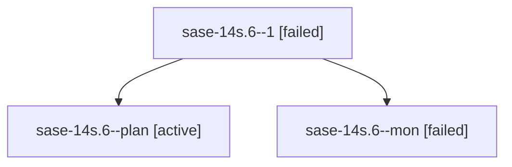

# Family: sase-14s.6

[Agent Hoods](../README.md) / [bbugyi200](../users/bbugyi200/README.md) / [athena](../users/bbugyi200/machines/athena/README.md) / [sase-14s](../users/bbugyi200/machines/athena/hoods/sase-14s/README.md) / sase-14s.6

Owner: `bbugyi200.athena` · Hood: `sase-14s` · Members: 3 · Bead: [sase-14s.6](https://github.com/sase-org/sase--beads/blob/main/pages/sase-14s/sase-14s.6.md)

## Lineage

The diagram is an optional enhancement; the ordered table below contains the same lineage in accessible text.

| Role | Agent | State | Model / provider | Timing | Commits | Prompt | Chat |
|---|---|---|---|---|---:|---|---|
| 1 | sase-14s.6--1 | failed | muse-spark-1.3-contributor / muse | 2026-09-21T05:14:40.017342+00:00 → 2026-09-21T05:26:57.617574+00:00 | 0 | [Prompt](../agents/bbugyi200.athena.sase-14s.6--1/prompt.md) | — |
| plan | sase-14s.6--plan | active | muse-spark-1.3-contributor / muse | 2026-09-21T04:27:52.496161+00:00 | 0 | [Prompt](../agents/bbugyi200.athena.sase-14s.6--plan/prompt.md) | [Chat](../agents/bbugyi200.athena.sase-14s.6--plan/chat.md) |
| mon | sase-14s.6--mon | failed | muse-spark-1.3-contributor / muse | 2026-09-21T05:08:31.856204+00:00 → 2026-09-21T05:14:40.533368+00:00 | 0 | — | [Chat](../agents/bbugyi200.athena.sase-14s.6--mon/chat.md) |

## Neighbors

| Agent | Relation | State |
|---|---|---|
| [sase-14s.1](../agents/bbugyi200.athena.sase-14s.1/README.md) | sase-14s hood | active |
| [sase-14s.10](../agents/bbugyi200.athena.sase-14s.10/README.md) | sase-14s hood | active |
| [sase-14s.2](../agents/bbugyi200.athena.sase-14s.2/README.md) | sase-14s hood | active |
| [sase-14s.3](../agents/bbugyi200.athena.sase-14s.3/README.md) | sase-14s hood | active |
| [sase-14s.4](../agents/bbugyi200.athena.sase-14s.4/README.md) | sase-14s hood | active |
| [sase-14s.5](../agents/bbugyi200.athena.sase-14s.5/README.md) | sase-14s hood | active |
| [sase-14s.7](../agents/bbugyi200.athena.sase-14s.7/README.md) | sase-14s hood | active |
| [sase-14s.8](../agents/bbugyi200.athena.sase-14s.8/README.md) | sase-14s hood | active |
| [sase-14s.9](../agents/bbugyi200.athena.sase-14s.9/README.md) | sase-14s hood | active |
| [sase-14s.land](../agents/bbugyi200.athena.sase-14s.land/README.md) | sase-14s hood | active |
