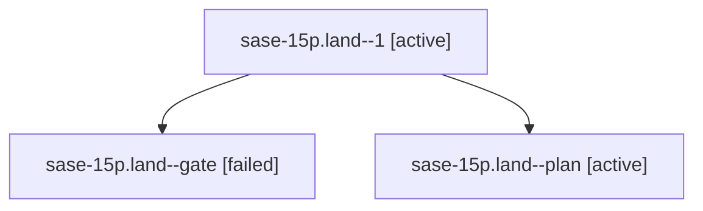

# Family: sase-15p.land

[Agent Hoods](../README.md) / [bbugyi200](../users/bbugyi200/README.md) / [athena](../users/bbugyi200/machines/athena/README.md) / [sase-15p](../users/bbugyi200/machines/athena/hoods/sase-15p/README.md) / sase-15p.land

Owner: `bbugyi200.athena` · Hood: `sase-15p` · Members: 3 · Bead: [sase-15p](https://github.com/sase-org/sase--beads/blob/main/pages/sase-15p/README.md)

## Lineage

The diagram is an optional enhancement; the ordered table below contains the same lineage in accessible text.

| Role | Agent | State | Model / provider | Timing | Commits | Prompt | Chat |
|---|---|---|---|---|---:|---|---|
| 1 | sase-15p.land--1 | active | opus / claude | 2026-09-21T23:10:04.905789+00:00 | [1](../agents/bbugyi200.athena.sase-15p.land--1/README.md#commits) | [Prompt](../agents/bbugyi200.athena.sase-15p.land--1/prompt.md) | [Chat](../agents/bbugyi200.athena.sase-15p.land--1/chat.md) |
| gate | sase-15p.land--gate | failed | opus / claude | 2026-09-21T23:08:20.827999+00:00 → 2026-09-21T23:09:12.263719+00:00 | 0 | — | [Chat](../agents/bbugyi200.athena.sase-15p.land--gate/chat.md) |
| plan | sase-15p.land--plan | active | opus / claude | 2026-09-21T22:01:06.868935+00:00 | 0 | [Prompt](../agents/bbugyi200.athena.sase-15p.land--plan/prompt.md) | [Chat](../agents/bbugyi200.athena.sase-15p.land--plan/chat.md) |

## Commits

| Role | Repo | Commit | Subject | Committed |
|---|---|---|---|---|
| 1 | sase | [`fa61ece`](https://github.com/sase-org/sase/commit/fa61ece5a3621806b843be99affe04ef756444d3) | fix(agy): unblock usage probe stderr reads and require sase-core-rs 0.34.71 | 2026-09-21 20:06:33 EDT |

## Neighbors

| Agent | Relation | State |
|---|---|---|
| [sase-15p.1](../agents/bbugyi200.athena.sase-15p.1/README.md) | sase-15p hood | active |
| [sase-15p.2](../agents/bbugyi200.athena.sase-15p.2/README.md) | sase-15p hood | active |
| [sase-15p.3](../agents/bbugyi200.athena.sase-15p.3/README.md) | sase-15p hood | active |
