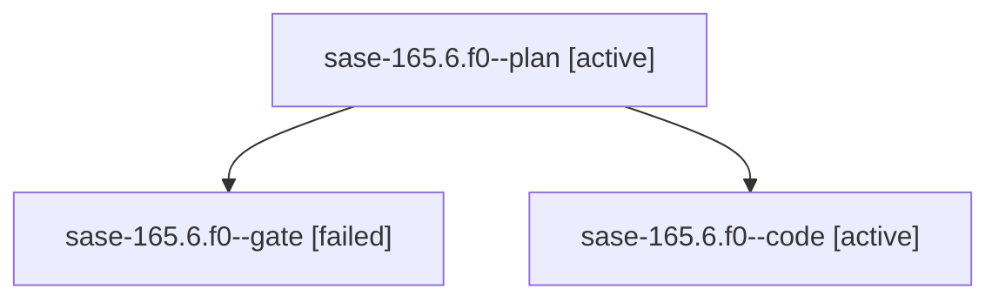

# Family: sase-165.6.f0

[Agent Hoods](../README.md) / [bbugyi200](../users/bbugyi200/README.md) / [athena](../users/bbugyi200/machines/athena/README.md) / [sase-165](../users/bbugyi200/machines/athena/hoods/sase-165/README.md) / sase-165.6.f0

Owner: `bbugyi200.athena` · Hood: `sase-165` · Members: 3

## Lineage

The diagram is an optional enhancement; the ordered table below contains the same lineage in accessible text.

| Role | Agent | State | Model / provider | Timing | Commits | Prompt | Chat |
|---|---|---|---|---|---:|---|---|
| plan | sase-165.6.f0--plan | active | opus / claude | 2026-09-22T15:01:21.969398+00:00 | 0 | [Prompt](../agents/bbugyi200.athena.sase-165.6.f0--plan/prompt.md) | [Chat](../agents/bbugyi200.athena.sase-165.6.f0--plan/chat.md) |
| gate | sase-165.6.f0--gate | failed | opus / claude | 2026-09-22T15:12:06.115440+00:00 → 2026-09-22T15:12:32.515126+00:00 | 0 | — | [Chat](../agents/bbugyi200.athena.sase-165.6.f0--gate/chat.md) |
| code | sase-165.6.f0--code | active | muse-spark-1.3-contributor / muse | 2026-09-22T15:12:54.744872+00:00 | 0 | — | — |

## Neighbors

| Agent | Relation | State |
|---|---|---|
| [sase-165.6](bbugyi200.athena.sase-165.6.md) (family · 3) | ancestor | completed 2, failed 1 |
| [sase-165.1](../agents/bbugyi200.athena.sase-165.1/README.md) | sase-165 hood | completed |
| [sase-165.2](../agents/bbugyi200.athena.sase-165.2/README.md) | sase-165 hood | completed |
| [sase-165.3](../agents/bbugyi200.athena.sase-165.3/README.md) | sase-165 hood | completed |
| [sase-165.4](../agents/bbugyi200.athena.sase-165.4/README.md) | sase-165 hood | completed |
| [sase-165.5](../agents/bbugyi200.athena.sase-165.5/README.md) | sase-165 hood | completed |
| [sase-165.7](bbugyi200.athena.sase-165.7.md) (family · 3) | sase-165 hood | active 1, completed 1, failed 1 |
| [sase-165.land](../agents/bbugyi200.athena.sase-165.land/README.md) | sase-165 hood | waiting |
