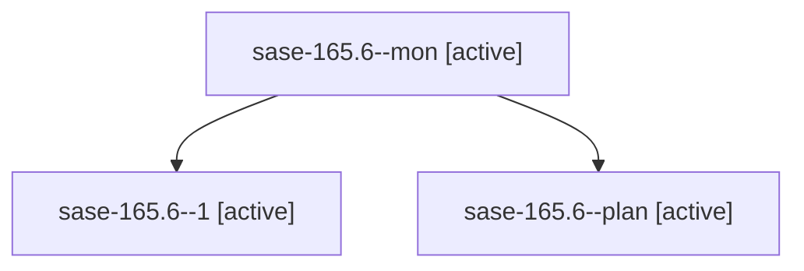

# Family: sase-165.6

[Agent Hoods](../README.md) / [bbugyi200](../users/bbugyi200/README.md) / [athena](../users/bbugyi200/machines/athena/README.md) / [sase-165](../users/bbugyi200/machines/athena/hoods/sase-165/README.md) / sase-165.6

Owner: `bbugyi200.athena` · Hood: `sase-165` · Members: 3 · Bead: [sase-165.6](https://github.com/sase-org/sase--beads/blob/main/pages/sase-165/sase-165.6.md)

## Lineage

The diagram is an optional enhancement; the ordered table below contains the same lineage in accessible text.

| Role | Agent | State | Model / provider | Timing | Commits | Prompt | Chat |
|---|---|---|---|---|---:|---|---|
| mon | sase-165.6--mon | active | muse-spark-1.3-contributor / muse | 2026-09-22T14:10:06.979861+00:00 | 0 | — | [Chat](../agents/bbugyi200.athena.sase-165.6--mon/chat.md) |
| 1 | sase-165.6--1 | active | muse-spark-1.3-contributor / muse | 2026-09-22T14:47:50.485570+00:00 | [1](../agents/bbugyi200.athena.sase-165.6--1/README.md#commits) | [Prompt](../agents/bbugyi200.athena.sase-165.6--1/prompt.md) | [Chat](../agents/bbugyi200.athena.sase-165.6--1/chat.md) |
| plan | sase-165.6--plan | active | muse-spark-1.3-contributor / muse | 2026-09-22T13:13:13.116233+00:00 | 0 | [Prompt](../agents/bbugyi200.athena.sase-165.6--plan/prompt.md) | [Chat](../agents/bbugyi200.athena.sase-165.6--plan/chat.md) |

## Commits

| Role | Repo | Commit | Subject | Committed |
|---|---|---|---|---|
| 1 | sase | [`529d7d3`](https://github.com/sase-org/sase/commit/529d7d325f050dc8af08d55d49e8251df4492160) | feat(reaper): capture SASE\_TMPDIR in service env and warn on managed-root mismatch | 2026-09-22 10:51:48 EDT |

## Neighbors

| Agent | Relation | State |
|---|---|---|
| [sase-165.6.f0](bbugyi200.athena.sase-165.6.f0.md) (family · 3) | descendant | active 1, completed 1, failed 1 |
| [sase-165.1](../agents/bbugyi200.athena.sase-165.1/README.md) | sase-165 hood | active |
| [sase-165.2](../agents/bbugyi200.athena.sase-165.2/README.md) | sase-165 hood | active |
| [sase-165.3](../agents/bbugyi200.athena.sase-165.3/README.md) | sase-165 hood | active |
| [sase-165.4](../agents/bbugyi200.athena.sase-165.4/README.md) | sase-165 hood | active |
| [sase-165.5](../agents/bbugyi200.athena.sase-165.5/README.md) | sase-165 hood | active |
| [sase-165.7](bbugyi200.athena.sase-165.7.md) (family · 3) | sase-165 hood | active 3 |
| [sase-165.land](bbugyi200.athena.sase-165.land.md) (family · 5) | sase-165 hood | active 3, completed 1, failed 1 |
