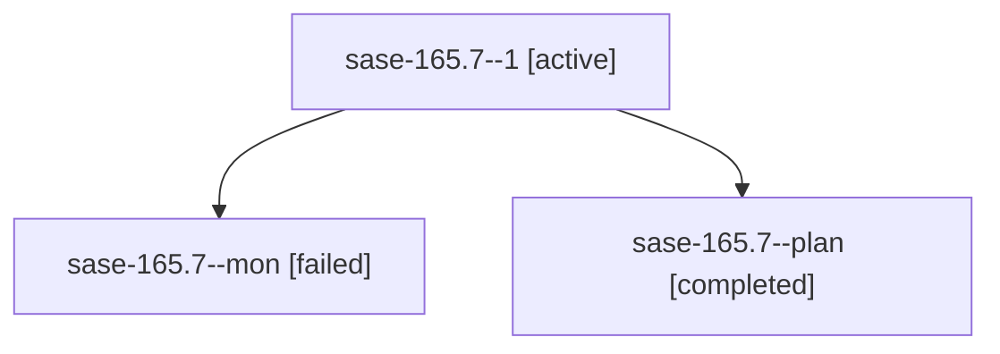

# Family: sase-165.7

[Agent Hoods](../README.md) / [bbugyi200](../users/bbugyi200/README.md) / [athena](../users/bbugyi200/machines/athena/README.md) / [sase-165](../users/bbugyi200/machines/athena/hoods/sase-165/README.md) / sase-165.7

Owner: `bbugyi200.athena` · Hood: `sase-165` · Members: 3 · Bead: [sase-165.7](https://github.com/sase-org/sase--beads/blob/main/pages/sase-165/sase-165.7.md)

## Lineage

The diagram is an optional enhancement; the ordered table below contains the same lineage in accessible text.

| Role | Agent | State | Model / provider | Timing | Commits | Prompt | Chat |
|---|---|---|---|---|---:|---|---|
| 1 | sase-165.7--1 | active | muse-spark-1.3-contributor / muse | 2026-09-22T15:21:11.869068+00:00 | 0 | [Prompt](../agents/bbugyi200.athena.sase-165.7--1/prompt.md) | — |
| mon | sase-165.7--mon | failed | muse-spark-1.3-contributor / muse | 2026-09-22T15:17:55.451609+00:00 → 2026-09-22T15:21:12.602661+00:00 | 0 | — | [Chat](../agents/bbugyi200.athena.sase-165.7--mon/chat.md) |
| plan | sase-165.7--plan | completed | muse-spark-1.3-contributor / muse | 2026-09-22T15:02:25.171099+00:00 → 2026-09-22T15:20:32.004870+00:00 | 0 | [Prompt](../agents/bbugyi200.athena.sase-165.7--plan/prompt.md) | [Chat](../agents/bbugyi200.athena.sase-165.7--plan/chat.md) |

## Neighbors

| Agent | Relation | State |
|---|---|---|
| [sase-165.1](../agents/bbugyi200.athena.sase-165.1/README.md) | sase-165 hood | completed |
| [sase-165.2](../agents/bbugyi200.athena.sase-165.2/README.md) | sase-165 hood | completed |
| [sase-165.3](../agents/bbugyi200.athena.sase-165.3/README.md) | sase-165 hood | completed |
| [sase-165.4](../agents/bbugyi200.athena.sase-165.4/README.md) | sase-165 hood | completed |
| [sase-165.5](../agents/bbugyi200.athena.sase-165.5/README.md) | sase-165 hood | completed |
| [sase-165.6](bbugyi200.athena.sase-165.6.md) (family · 3) | sase-165 hood | completed 2, failed 1 |
| [sase-165.6.f0](bbugyi200.athena.sase-165.6.f0.md) (family · 3) | sase-165 hood | active 2, failed 1 |
| [sase-165.land](../agents/bbugyi200.athena.sase-165.land/README.md) | sase-165 hood | waiting |
