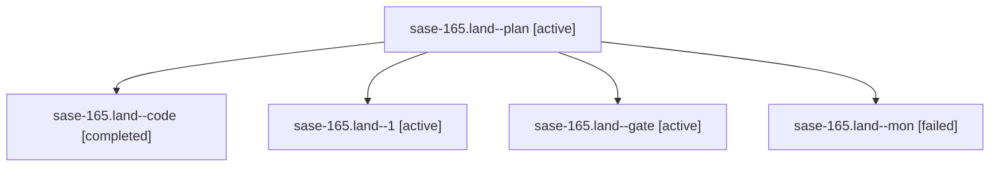

# Family: sase-165.land

[Agent Hoods](../README.md) / [bbugyi200](../users/bbugyi200/README.md) / [athena](../users/bbugyi200/machines/athena/README.md) / [sase-165](../users/bbugyi200/machines/athena/hoods/sase-165/README.md) / sase-165.land

Owner: `bbugyi200.athena` · Hood: `sase-165` · Members: 5 · Bead: [sase-165](https://github.com/sase-org/sase--beads/blob/main/pages/sase-165/README.md)

## Lineage

The diagram is an optional enhancement; the ordered table below contains the same lineage in accessible text.

| Role | Agent | State | Model / provider | Timing | Commits | Prompt | Chat |
|---|---|---|---|---|---:|---|---|
| plan | sase-165.land--plan | active | opus / claude | 2026-09-22T16:10:31.985447+00:00 | 0 | [Prompt](../agents/bbugyi200.athena.sase-165.land--plan/prompt.md) | [Chat](../agents/bbugyi200.athena.sase-165.land--plan/chat.md) |
| code | sase-165.land--code | completed | muse-spark-1.3-contributor / muse | 2026-09-22T16:44:48.172119+00:00 → 2026-09-22T17:10:34.874916+00:00 | 0 | — | [Chat](../agents/bbugyi200.athena.sase-165.land--code/chat.md) |
| 1 | sase-165.land--1 | active | muse-spark-1.3-contributor / muse | 2026-09-22T17:13:33.774786+00:00 | [1](../agents/bbugyi200.athena.sase-165.land--1/README.md#commits) | [Prompt](../agents/bbugyi200.athena.sase-165.land--1/prompt.md) | [Chat](../agents/bbugyi200.athena.sase-165.land--1/chat.md) |
| gate | sase-165.land--gate | active | opus / claude | 2026-09-22T16:44:10.507568+00:00 | 0 | — | [Chat](../agents/bbugyi200.athena.sase-165.land--gate/chat.md) |
| mon | sase-165.land--mon | failed | muse-spark-1.3-contributor / muse | 2026-09-22T17:09:59.239970+00:00 → 2026-09-22T17:13:17.743425+00:00 | 0 | — | [Chat](../agents/bbugyi200.athena.sase-165.land--mon/chat.md) |

## Commits

| Role | Repo | Commit | Subject | Committed |
|---|---|---|---|---|
| 1 | sase | [`8d085d0`](https://github.com/sase-org/sase/commit/8d085d03c641a4904a06433bca64619e0cd45472) | fix: widen dev-extension freshness identity INPUT\_PATHS to Cargo.toml, Cargo.lock, rust-toolchain.toml and crates/ | 2026-09-22 13:15:50 EDT |

## Neighbors

| Agent | Relation | State |
|---|---|---|
| [sase-165.1](../agents/bbugyi200.athena.sase-165.1/README.md) | sase-165 hood | active |
| [sase-165.2](../agents/bbugyi200.athena.sase-165.2/README.md) | sase-165 hood | active |
| [sase-165.3](../agents/bbugyi200.athena.sase-165.3/README.md) | sase-165 hood | active |
| [sase-165.4](../agents/bbugyi200.athena.sase-165.4/README.md) | sase-165 hood | active |
| [sase-165.5](../agents/bbugyi200.athena.sase-165.5/README.md) | sase-165 hood | active |
| [sase-165.6](bbugyi200.athena.sase-165.6.md) (family · 3) | sase-165 hood | active 3 |
| [sase-165.6.f0](bbugyi200.athena.sase-165.6.f0.md) (family · 3) | sase-165 hood | active 1, completed 1, failed 1 |
| [sase-165.7](bbugyi200.athena.sase-165.7.md) (family · 3) | sase-165 hood | active 3 |
