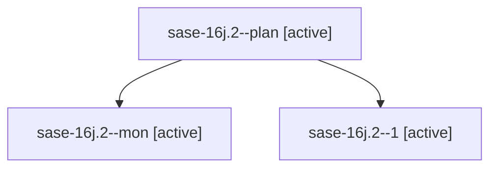

# Family: sase-16j.2

[Agent Hoods](../README.md) / [bbugyi200](../users/bbugyi200/README.md) / [athena](../users/bbugyi200/machines/athena/README.md) / [sase-16j](../users/bbugyi200/machines/athena/hoods/sase-16j/README.md) / sase-16j.2

Owner: `bbugyi200.athena` · Hood: `sase-16j` · Members: 3 · Bead: [sase-16j.2](https://github.com/sase-org/sase--beads/blob/main/pages/sase-16j/sase-16j.2.md)

## Lineage

The diagram is an optional enhancement; the ordered table below contains the same lineage in accessible text.

| Role | Agent | State | Model / provider | Timing | Commits | Prompt | Chat |
|---|---|---|---|---|---:|---|---|
| plan | sase-16j.2--plan | active | muse-spark-1.3-contributor / muse | 2026-09-22T17:40:44.526795+00:00 | 0 | [Prompt](../agents/bbugyi200.athena.sase-16j.2--plan/prompt.md) | [Chat](../agents/bbugyi200.athena.sase-16j.2--plan/chat.md) |
| mon | sase-16j.2--mon | active | muse-spark-1.3-contributor / muse | 2026-09-22T18:28:20.742728+00:00 | 0 | — | [Chat](../agents/bbugyi200.athena.sase-16j.2--mon/chat.md) |
| 1 | sase-16j.2--1 | active | muse-spark-1.3-contributor / muse | 2026-09-22T18:46:39.694118+00:00 | [1](../agents/bbugyi200.athena.sase-16j.2--1/README.md#commits) | [Prompt](../agents/bbugyi200.athena.sase-16j.2--1/prompt.md) | [Chat](../agents/bbugyi200.athena.sase-16j.2--1/chat.md) |

## Commits

| Role | Repo | Commit | Subject | Committed |
|---|---|---|---|---|
| 1 | sase | [`d163dfa`](https://github.com/sase-org/sase/commit/d163dfa2b6db768a04a7814d1bb306c121fd8736) | feat(tool): add tool\_run\_observe adapter, smoke round trip, and symvision epic whitelist | 2026-09-22 15:00:28 EDT |
| — | sase | [`1b2f41d`](https://github.com/sase-org/sase/commit/1b2f41d7dbd58ee7e4a28e411fa50ac3a19a88e1) | feat(ace): add AgentActionChooserModal single-keypress chooser with tests and PNG golden | 2026-09-22 15:22:50 EDT |

## Neighbors

| Agent | Relation | State |
|---|---|---|
| [sase-16j.1](../agents/bbugyi200.athena.sase-16j.1/README.md) | sase-16j hood | active |
| [sase-16j.3](../agents/bbugyi200.athena.sase-16j.3/README.md) | sase-16j hood | active |
| [sase-16j.land](../agents/bbugyi200.athena.sase-16j.land/README.md) | sase-16j hood | active |
