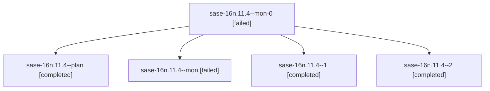

# Family: sase-16n.11.4

[Agent Hoods](../README.md) / [bbugyi200](../users/bbugyi200/README.md) / [athena](../users/bbugyi200/machines/athena/README.md) / [sase-16n](../users/bbugyi200/machines/athena/hoods/sase-16n/README.md) / sase-16n.11.4

Owner: `bbugyi200.athena` · Hood: `sase-16n` · Members: 5 · Bead: [sase-16n.11.4](https://github.com/sase-org/sase--beads/blob/main/pages/sase-16n/sase-16n.11.4.md)

## Lineage

The diagram is an optional enhancement; the ordered table below contains the same lineage in accessible text.

| Role | Agent | State | Model / provider | Timing | Commits | Prompt | Chat |
|---|---|---|---|---|---:|---|---|
| mon-0 | sase-16n.11.4--mon-0 | failed | muse-spark-1.3-contributor / muse | 2026-09-23T16:34:08.722454+00:00 → 2026-09-23T16:53:12.827791+00:00 | 0 | — | [Chat](../agents/bbugyi200.athena.sase-16n.11.4--mon-0/chat.md) |
| plan | sase-16n.11.4--plan | completed | muse-spark-1.3-contributor / muse | 2026-09-23T15:40:45.849956+00:00 → 2026-09-23T15:52:06.974683+00:00 | 0 | [Prompt](../agents/bbugyi200.athena.sase-16n.11.4--plan/prompt.md) | [Chat](../agents/bbugyi200.athena.sase-16n.11.4--plan/chat.md) |
| mon | sase-16n.11.4--mon | failed | muse-spark-1.3-contributor / muse | 2026-09-23T15:51:35.824416+00:00 → 2026-09-23T15:53:31.256693+00:00 | 0 | — | [Chat](../agents/bbugyi200.athena.sase-16n.11.4--mon/chat.md) |
| 1 | sase-16n.11.4--1 | completed | muse-spark-1.3-contributor / muse | 2026-09-23T16:23:23.131423+00:00 → 2026-09-23T16:36:30.469676+00:00 | 0 | [Prompt](../agents/bbugyi200.athena.sase-16n.11.4--1/prompt.md) | [Chat](../agents/bbugyi200.athena.sase-16n.11.4--1/chat.md) |
| 2 | sase-16n.11.4--2 | completed | muse-spark-1.3-contributor / muse | 2026-09-23T16:53:23.261100+00:00 → 2026-09-23T17:34:32.816520+00:00 | [1](../agents/bbugyi200.athena.sase-16n.11.4--2/README.md#commits) | [Prompt](../agents/bbugyi200.athena.sase-16n.11.4--2/prompt.md) | [Chat](../agents/bbugyi200.athena.sase-16n.11.4--2/chat.md) |

## Commits

| Role | Repo | Commit | Subject | Committed |
|---|---|---|---|---|
| 2 | sase | [`848a90a`](https://github.com/sase-org/sase/commit/848a90a1ba6550faca8c29b8d9dcde81d4decb65) | fix(ace-tui): pin project-tag catalog in PNG snapshot fixtures | 2026-09-23 13:31:59 EDT |

## Neighbors

| Agent | Relation | State |
|---|---|---|
| [sase-16n.11.1](../agents/bbugyi200.athena.sase-16n.11.1/README.md) | sase-16n.11 hood | completed |
| [sase-16n.11.2](../agents/bbugyi200.athena.sase-16n.11.2/README.md) | sase-16n.11 hood | completed |
| [sase-16n.11.3](../agents/bbugyi200.athena.sase-16n.11.3/README.md) | sase-16n.11 hood | completed |
| [sase-16n.11.5](../agents/bbugyi200.athena.sase-16n.11.5/README.md) | sase-16n.11 hood | completed |
| [sase-16n.11.6](../agents/bbugyi200.athena.sase-16n.11.6/README.md) | sase-16n.11 hood | completed |
| [sase-16n.11.7.1](../agents/bbugyi200.athena.sase-16n.11.7.1/README.md) | sase-16n.11 hood | completed |
| [sase-16n.11.7.2](../agents/bbugyi200.athena.sase-16n.11.7.2/README.md) | sase-16n.11 hood | completed |
| [sase-16n.11.7.3](../agents/bbugyi200.athena.sase-16n.11.7.3/README.md) | sase-16n.11 hood | completed |
| [sase-16n.11.7.4](../agents/bbugyi200.athena.sase-16n.11.7.4/README.md) | sase-16n.11 hood | completed |
| [sase-16n.11.7.land](../agents/bbugyi200.athena.sase-16n.11.7.land/README.md) | sase-16n.11 hood | active |
| [sase-16n.11.land](bbugyi200.athena.sase-16n.11.land.md) (family · 3) | sase-16n.11 hood | failed 3 |
| [sase-16n.1](../agents/bbugyi200.athena.sase-16n.1/README.md) | sase-16n hood | completed |
| [sase-16n.10](../agents/bbugyi200.athena.sase-16n.10/README.md) | sase-16n hood | completed |
| [sase-16n.2](../agents/bbugyi200.athena.sase-16n.2/README.md) | sase-16n hood | completed |
| [sase-16n.3](../agents/bbugyi200.athena.sase-16n.3/README.md) | sase-16n hood | completed |
| [sase-16n.4](../agents/bbugyi200.athena.sase-16n.4/README.md) | sase-16n hood | completed |
| [sase-16n.5](../agents/bbugyi200.athena.sase-16n.5/README.md) | sase-16n hood | completed |
| [sase-16n.6](../agents/bbugyi200.athena.sase-16n.6/README.md) | sase-16n hood | completed |
| [sase-16n.7](../agents/bbugyi200.athena.sase-16n.7/README.md) | sase-16n hood | completed |
| [sase-16n.8](../agents/bbugyi200.athena.sase-16n.8/README.md) | sase-16n hood | completed |
| [sase-16n.9](../agents/bbugyi200.athena.sase-16n.9/README.md) | sase-16n hood | completed |
| [sase-16n.land](bbugyi200.athena.sase-16n.land.md) (family · 3) | sase-16n hood | failed 3 |
