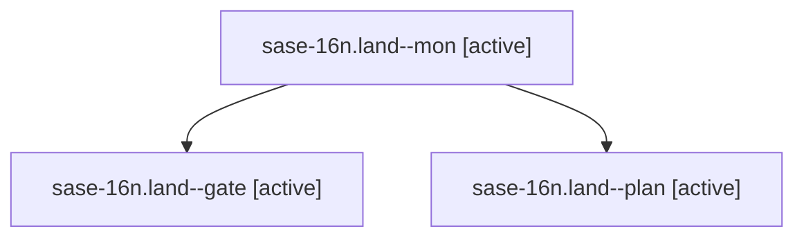

# Family: sase-16n.land

[Agent Hoods](../README.md) / [bbugyi200](../users/bbugyi200/README.md) / [athena](../users/bbugyi200/machines/athena/README.md) / [sase-16n](../users/bbugyi200/machines/athena/hoods/sase-16n/README.md) / sase-16n.land

Owner: `bbugyi200.athena` · Hood: `sase-16n` · Members: 3 · Bead: [sase-16n](https://github.com/sase-org/sase--beads/blob/main/pages/sase-16n/README.md)

## Lineage

The diagram is an optional enhancement; the ordered table below contains the same lineage in accessible text.

| Role | Agent | State | Model / provider | Timing | Commits | Prompt | Chat |
|---|---|---|---|---|---:|---|---|
| mon | sase-16n.land--mon | active | opus / claude | 2026-09-23T12:51:38.215387+00:00 | 0 | — | [Chat](../agents/bbugyi200.athena.sase-16n.land--mon/chat.md) |
| gate | sase-16n.land--gate | active | opus / claude | 2026-09-23T12:51:01.053411+00:00 | 0 | — | [Chat](../agents/bbugyi200.athena.sase-16n.land--gate/chat.md) |
| plan | sase-16n.land--plan | active | opus / claude | 2026-09-23T12:15:07.896149+00:00 | 0 | [Prompt](../agents/bbugyi200.athena.sase-16n.land--plan/prompt.md) | [Chat](../agents/bbugyi200.athena.sase-16n.land--plan/chat.md) |

## Neighbors

| Agent | Relation | State |
|---|---|---|
| [sase-16n.1](../agents/bbugyi200.athena.sase-16n.1/README.md) | sase-16n hood | active |
| [sase-16n.10](../agents/bbugyi200.athena.sase-16n.10/README.md) | sase-16n hood | active |
| [sase-16n.11.1](../agents/bbugyi200.athena.sase-16n.11.1/README.md) | sase-16n hood | active |
| [sase-16n.11.2](../agents/bbugyi200.athena.sase-16n.11.2/README.md) | sase-16n hood | active |
| [sase-16n.11.3](../agents/bbugyi200.athena.sase-16n.11.3/README.md) | sase-16n hood | active |
| [sase-16n.11.4](bbugyi200.athena.sase-16n.11.4.md) (family · 5) | sase-16n hood | active 5 |
| [sase-16n.11.5](../agents/bbugyi200.athena.sase-16n.11.5/README.md) | sase-16n hood | active |
| [sase-16n.11.6](../agents/bbugyi200.athena.sase-16n.11.6/README.md) | sase-16n hood | active |
| [sase-16n.11.7.1](../agents/bbugyi200.athena.sase-16n.11.7.1/README.md) | sase-16n hood | active |
| [sase-16n.11.7.2](../agents/bbugyi200.athena.sase-16n.11.7.2/README.md) | sase-16n hood | active |
| [sase-16n.11.7.3](../agents/bbugyi200.athena.sase-16n.11.7.3/README.md) | sase-16n hood | active |
| [sase-16n.11.7.4](../agents/bbugyi200.athena.sase-16n.11.7.4/README.md) | sase-16n hood | active |
| [sase-16n.11.7.land](../agents/bbugyi200.athena.sase-16n.11.7.land/README.md) | sase-16n hood | active |
| [sase-16n.11.land](bbugyi200.athena.sase-16n.11.land.md) (family · 3) | sase-16n hood | active 3 |
| [sase-16n.2](../agents/bbugyi200.athena.sase-16n.2/README.md) | sase-16n hood | active |
| [sase-16n.3](../agents/bbugyi200.athena.sase-16n.3/README.md) | sase-16n hood | active |
| [sase-16n.4](../agents/bbugyi200.athena.sase-16n.4/README.md) | sase-16n hood | active |
| [sase-16n.5](../agents/bbugyi200.athena.sase-16n.5/README.md) | sase-16n hood | active |
| [sase-16n.6](../agents/bbugyi200.athena.sase-16n.6/README.md) | sase-16n hood | active |
| [sase-16n.7](../agents/bbugyi200.athena.sase-16n.7/README.md) | sase-16n hood | active |
| [sase-16n.8](../agents/bbugyi200.athena.sase-16n.8/README.md) | sase-16n hood | active |
| [sase-16n.9](../agents/bbugyi200.athena.sase-16n.9/README.md) | sase-16n hood | active |
