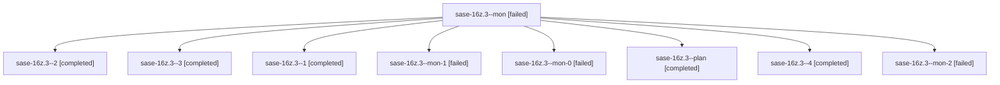

# Family: sase-16z.3

[Agent Hoods](../README.md) / [bbugyi200](../users/bbugyi200/README.md) / [athena](../users/bbugyi200/machines/athena/README.md) / [sase-16z](../users/bbugyi200/machines/athena/hoods/sase-16z/README.md) / sase-16z.3

Owner: `bbugyi200.athena` · Hood: `sase-16z` · Members: 9 · Bead: [sase-16z.3](https://github.com/sase-org/sase--beads/blob/main/pages/sase-16z/sase-16z.3.md)

## Lineage

The diagram is an optional enhancement; the ordered table below contains the same lineage in accessible text.

| Role | Agent | State | Model / provider | Timing | Commits | Prompt | Chat |
|---|---|---|---|---|---:|---|---|
| mon | sase-16z.3--mon | failed | muse-spark-1.3-contributor / muse | 2026-09-23T15:53:27.449350+00:00 → 2026-09-23T16:24:21.189887+00:00 | 0 | — | [Chat](../agents/bbugyi200.athena.sase-16z.3--mon/chat.md) |
| 2 | sase-16z.3--2 | completed | muse-spark-1.3-contributor / muse | 2026-09-23T16:55:19.169231+00:00 → 2026-09-23T16:57:34.622728+00:00 | 0 | [Prompt](../agents/bbugyi200.athena.sase-16z.3--2/prompt.md) | [Chat](../agents/bbugyi200.athena.sase-16z.3--2/chat.md) |
| 3 | sase-16z.3--3 | completed | muse-spark-1.3-contributor / muse | 2026-09-23T17:01:17.803020+00:00 → 2026-09-23T17:04:15.376842+00:00 | 0 | [Prompt](../agents/bbugyi200.athena.sase-16z.3--3/prompt.md) | [Chat](../agents/bbugyi200.athena.sase-16z.3--3/chat.md) |
| 1 | sase-16z.3--1 | completed | muse-spark-1.3-contributor / muse | 2026-09-23T16:31:54.449120+00:00 → 2026-09-23T16:36:27.949433+00:00 | 0 | [Prompt](../agents/bbugyi200.athena.sase-16z.3--1/prompt.md) | [Chat](../agents/bbugyi200.athena.sase-16z.3--1/chat.md) |
| mon-1 | sase-16z.3--mon-1 | failed | muse-spark-1.3-contributor / muse | 2026-09-23T16:57:09.940754+00:00 → 2026-09-23T17:01:11.368942+00:00 | 0 | — | [Chat](../agents/bbugyi200.athena.sase-16z.3--mon-1/chat.md) |
| mon-0 | sase-16z.3--mon-0 | failed | muse-spark-1.3-contributor / muse | 2026-09-23T16:34:09.369566+00:00 → 2026-09-23T16:55:12.350995+00:00 | 0 | — | [Chat](../agents/bbugyi200.athena.sase-16z.3--mon-0/chat.md) |
| plan | sase-16z.3--plan | completed | muse-spark-1.3-contributor / muse | 2026-09-23T15:14:03.377069+00:00 → 2026-09-23T15:53:49.878293+00:00 | 0 | [Prompt](../agents/bbugyi200.athena.sase-16z.3--plan/prompt.md) | [Chat](../agents/bbugyi200.athena.sase-16z.3--plan/chat.md) |
| 4 | sase-16z.3--4 | completed | muse-spark-1.3-contributor / muse | 2026-09-23T17:14:22.355233+00:00 → 2026-09-23T17:22:22.848868+00:00 | [1](../agents/bbugyi200.athena.sase-16z.3--4/README.md#commits) | [Prompt](../agents/bbugyi200.athena.sase-16z.3--4/prompt.md) | [Chat](../agents/bbugyi200.athena.sase-16z.3--4/chat.md) |
| mon-2 | sase-16z.3--mon-2 | failed | muse-spark-1.3-contributor / muse | 2026-09-23T17:03:51.689445+00:00 → 2026-09-23T17:13:55.509586+00:00 | 0 | — | [Chat](../agents/bbugyi200.athena.sase-16z.3--mon-2/chat.md) |

## Commits

| Role | Repo | Commit | Subject | Committed |
|---|---|---|---|---|
| 4 | sase | [`caca6b6`](https://github.com/sase-org/sase/commit/caca6b60f9a2263ea29073be42fee94c1b88c52f) | fix(llm-provider): harden usage probe and refresh-runner robustness | 2026-09-23 13:18:02 EDT |

## Neighbors

| Agent | Relation | State |
|---|---|---|
| [sase-16z.1](../agents/bbugyi200.athena.sase-16z.1/README.md) | sase-16z hood | completed |
| [sase-16z.2](../agents/bbugyi200.athena.sase-16z.2/README.md) | sase-16z hood | completed |
| [sase-16z.4](../agents/bbugyi200.athena.sase-16z.4/README.md) | sase-16z hood | completed |
| [sase-16z.5](../agents/bbugyi200.athena.sase-16z.5/README.md) | sase-16z hood | completed |
| [sase-16z.6](../agents/bbugyi200.athena.sase-16z.6/README.md) | sase-16z hood | completed |
| [sase-16z.7](../agents/bbugyi200.athena.sase-16z.7/README.md) | sase-16z hood | completed |
| [sase-16z.8](../agents/bbugyi200.athena.sase-16z.8/README.md) | sase-16z hood | completed |
| [sase-16z.9.1](../agents/bbugyi200.athena.sase-16z.9.1/README.md) | sase-16z hood | active |
| [sase-16z.9.2](../agents/bbugyi200.athena.sase-16z.9.2/README.md) | sase-16z hood | completed |
| [sase-16z.9.3](../agents/bbugyi200.athena.sase-16z.9.3/README.md) | sase-16z hood | waiting |
| [sase-16z.9.land](../agents/bbugyi200.athena.sase-16z.9.land/README.md) | sase-16z hood | waiting |
| [sase-16z.land](bbugyi200.athena.sase-16z.land.md) (family · 3) | sase-16z hood | failed 3 |
| [sase-16z.land](../agents/bbugyi200.athena.sase-16z.land/README.md) | sase-16z hood | active |
