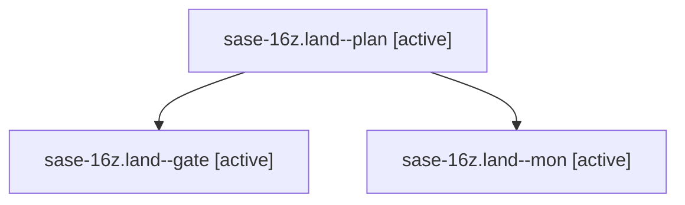

# Family: sase-16z.land

[Agent Hoods](../README.md) / [bbugyi200](../users/bbugyi200/README.md) / [athena](../users/bbugyi200/machines/athena/README.md) / [sase-16z](../users/bbugyi200/machines/athena/hoods/sase-16z/README.md) / sase-16z.land

Owner: `bbugyi200.athena` · Hood: `sase-16z` · Members: 3 · Bead: [sase-16z](https://github.com/sase-org/sase--beads/blob/main/pages/sase-16z/README.md)

## Lineage

The diagram is an optional enhancement; the ordered table below contains the same lineage in accessible text.

| Role | Agent | State | Model / provider | Timing | Commits | Prompt | Chat |
|---|---|---|---|---|---:|---|---|
| plan | sase-16z.land--plan | active | opus / claude | 2026-09-23T19:57:17.678048+00:00 | 0 | [Prompt](../agents/bbugyi200.athena.sase-16z.land--plan/prompt.md) | [Chat](../agents/bbugyi200.athena.sase-16z.land--plan/chat.md) |
| gate | sase-16z.land--gate | active | opus / claude | 2026-09-23T20:30:55.674685+00:00 | 0 | — | [Chat](../agents/bbugyi200.athena.sase-16z.land--gate/chat.md) |
| mon | sase-16z.land--mon | active | opus / claude | 2026-09-23T20:32:11.714655+00:00 | 0 | — | [Chat](../agents/bbugyi200.athena.sase-16z.land--mon/chat.md) |

## Neighbors

| Agent | Relation | State |
|---|---|---|
| [sase-16z.1](../agents/bbugyi200.athena.sase-16z.1/README.md) | sase-16z hood | active |
| [sase-16z.2](../agents/bbugyi200.athena.sase-16z.2/README.md) | sase-16z hood | active |
| [sase-16z.3](bbugyi200.athena.sase-16z.3.md) (family · 9) | sase-16z hood | active 9 |
| [sase-16z.4](../agents/bbugyi200.athena.sase-16z.4/README.md) | sase-16z hood | active |
| [sase-16z.5](../agents/bbugyi200.athena.sase-16z.5/README.md) | sase-16z hood | active |
| [sase-16z.6](../agents/bbugyi200.athena.sase-16z.6/README.md) | sase-16z hood | active |
| [sase-16z.7](../agents/bbugyi200.athena.sase-16z.7/README.md) | sase-16z hood | active |
| [sase-16z.8](../agents/bbugyi200.athena.sase-16z.8/README.md) | sase-16z hood | active |
| [sase-16z.9.1](../agents/bbugyi200.athena.sase-16z.9.1/README.md) | sase-16z hood | active |
| [sase-16z.9.2](../agents/bbugyi200.athena.sase-16z.9.2/README.md) | sase-16z hood | active |
| [sase-16z.9.3](../agents/bbugyi200.athena.sase-16z.9.3/README.md) | sase-16z hood | active |
| [sase-16z.9.land](../agents/bbugyi200.athena.sase-16z.9.land/README.md) | sase-16z hood | active |
