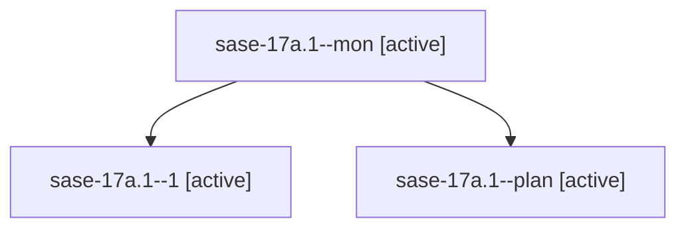

# Family: sase-17a.1

[Agent Hoods](../README.md) / [bbugyi200](../users/bbugyi200/README.md) / [athena](../users/bbugyi200/machines/athena/README.md) / [sase-17a](../users/bbugyi200/machines/athena/hoods/sase-17a/README.md) / sase-17a.1

Owner: `bbugyi200.athena` · Hood: `sase-17a` · Members: 3 · Bead: [sase-17a.1](https://github.com/sase-org/sase--beads/blob/main/pages/sase-17a/sase-17a.1.md)

## Lineage

The diagram is an optional enhancement; the ordered table below contains the same lineage in accessible text.

| Role | Agent | State | Model / provider | Timing | Commits | Prompt | Chat |
|---|---|---|---|---|---:|---|---|
| mon | sase-17a.1--mon | active | muse-spark-1.3-contributor / muse | 2026-09-23T23:03:11.941738+00:00 | 0 | — | [Chat](../agents/bbugyi200.athena.sase-17a.1--mon/chat.md) |
| 1 | sase-17a.1--1 | active | muse-spark-1.3-contributor / muse | 2026-09-23T23:08:09.132324+00:00 | [1](../agents/bbugyi200.athena.sase-17a.1--1/README.md#commits) | [Prompt](../agents/bbugyi200.athena.sase-17a.1--1/prompt.md) | [Chat](../agents/bbugyi200.athena.sase-17a.1--1/chat.md) |
| plan | sase-17a.1--plan | active | muse-spark-1.3-contributor / muse | 2026-09-23T22:28:51.083271+00:00 | 0 | [Prompt](../agents/bbugyi200.athena.sase-17a.1--plan/prompt.md) | [Chat](../agents/bbugyi200.athena.sase-17a.1--plan/chat.md) |

## Commits

| Role | Repo | Commit | Subject | Committed |
|---|---|---|---|---|
| 1 | sase | [`3f5d34e`](https://github.com/sase-org/sase/commit/3f5d34e9fde31be2c0a8cc393f1db464e2cfa14d) | feat(axe): two-panel Services sidebar with titled panels | 2026-09-23 19:44:56 EDT |

## Neighbors

| Agent | Relation | State |
|---|---|---|
| [sase-17a.2](../agents/bbugyi200.athena.sase-17a.2/README.md) | sase-17a hood | active |
| [sase-17a.land](../agents/bbugyi200.athena.sase-17a.land/README.md) | sase-17a hood | active |
