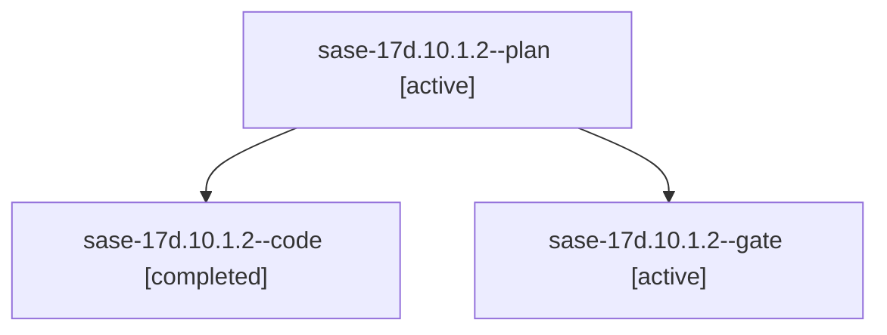

# Family: sase-17d.10.1.2

[Agent Hoods](../README.md) / [bbugyi200](../users/bbugyi200/README.md) / [athena](../users/bbugyi200/machines/athena/README.md) / [sase-17d](../users/bbugyi200/machines/athena/hoods/sase-17d/README.md) / sase-17d.10.1.2

Owner: `bbugyi200.athena` · Hood: `sase-17d` · Members: 3 · Bead: [sase-17d.10.1.2](https://github.com/sase-org/sase--beads/blob/main/pages/sase-17d/sase-17d.10.1.2.md)

## Lineage

The diagram is an optional enhancement; the ordered table below contains the same lineage in accessible text.

| Role | Agent | State | Model / provider | Timing | Commits | Prompt | Chat |
|---|---|---|---|---|---:|---|---|
| plan | sase-17d.10.1.2--plan | active | gpt-5.6-sol / codex | 2026-09-24T17:57:52.387127+00:00 | 0 | [Prompt](../agents/bbugyi200.athena.sase-17d.10.1.2--plan/prompt.md) | [Chat](../agents/bbugyi200.athena.sase-17d.10.1.2--plan/chat.md) |
| code | sase-17d.10.1.2--code | completed | gpt-5.6-terra / codex | 2026-09-24T18:04:11.815672+00:00 → 2026-09-24T18:41:20.684323+00:00 | [1](../agents/bbugyi200.athena.sase-17d.10.1.2--code/README.md#commits) | — | [Chat](../agents/bbugyi200.athena.sase-17d.10.1.2--code/chat.md) |
| gate | sase-17d.10.1.2--gate | active | gpt-5.6-sol / codex | 2026-09-24T18:03:24.046445+00:00 | 0 | — | [Chat](../agents/bbugyi200.athena.sase-17d.10.1.2--gate/chat.md) |

## Commits

| Role | Repo | Commit | Subject | Committed |
|---|---|---|---|---|
| code | sase | [`742c1df`](https://github.com/sase-org/sase/commit/742c1df38b04d1b190a5102168f0cf2ab37e6840) | feat(ace): remove legacy agents UI | 2026-09-24 14:37:20 EDT |

## Neighbors

| Agent | Relation | State |
|---|---|---|
| [sase-17d.10](../agents/bbugyi200.athena.sase-17d.10/README.md) | ancestor | waiting |
| [sase-17d.10.1.1](bbugyi200.athena.sase-17d.10.1.1.md) (family · 7) | sase-17d.10.1 hood | active 1, completed 2, failed 4 |
| [sase-17d.10.1.3](bbugyi200.athena.sase-17d.10.1.3.md) (family · 3) | sase-17d.10.1 hood | active 3 |
| [sase-17d.10.1.4.1](../agents/bbugyi200.athena.sase-17d.10.1.4.1/README.md) | sase-17d.10.1 hood | dismissed |
| [sase-17d.10.1.4.3](../agents/bbugyi200.athena.sase-17d.10.1.4.3/README.md) | sase-17d.10.1 hood | active |
| [sase-17d.10.1.4.land](../agents/bbugyi200.athena.sase-17d.10.1.4.land/README.md) | sase-17d.10.1 hood | active |
| [sase-17d.10.1.land](bbugyi200.athena.sase-17d.10.1.land.md) (family · 3) | sase-17d.10.1 hood | active 3 |
| [sase-17d.1](../agents/bbugyi200.athena.sase-17d.1/README.md) | sase-17d hood | completed |
| [sase-17d.11](../agents/bbugyi200.athena.sase-17d.11/README.md) | sase-17d hood | completed |
| [sase-17d.12.1](../agents/bbugyi200.athena.sase-17d.12.1/README.md) | sase-17d hood | completed |
| [sase-17d.12.2](bbugyi200.athena.sase-17d.12.2.md) (family · 7) | sase-17d hood | completed 4, failed 3 |
| [sase-17d.12.3](../agents/bbugyi200.athena.sase-17d.12.3/README.md) | sase-17d hood | waiting |
| [sase-17d.12.land](../agents/bbugyi200.athena.sase-17d.12.land/README.md) | sase-17d hood | waiting |
| [sase-17d.2](bbugyi200.athena.sase-17d.2.md) (family · 3) | sase-17d hood | completed 2, failed 1 |
| [sase-17d.3](bbugyi200.athena.sase-17d.3.md) (family · 3) | sase-17d hood | completed 2, failed 1 |
| [sase-17d.4](../agents/bbugyi200.athena.sase-17d.4/README.md) | sase-17d hood | waiting |
| [sase-17d.5](bbugyi200.athena.sase-17d.5.md) (family · 5) | sase-17d hood | completed 3, failed 2 |
| [sase-17d.5](../agents/bbugyi200.athena.sase-17d.5/README.md) | sase-17d hood | waiting |
| [sase-17d.6](bbugyi200.athena.sase-17d.6.md) (family · 5) | sase-17d hood | completed 3, failed 2 |
| [sase-17d.6](../agents/bbugyi200.athena.sase-17d.6/README.md) | sase-17d hood | waiting |
| [sase-17d.7](../agents/bbugyi200.athena.sase-17d.7/README.md) | sase-17d hood | completed |
| [sase-17d.8](bbugyi200.athena.sase-17d.8.md) (family · 3) | sase-17d hood | completed 2, failed 1 |
| [sase-17d.8](../agents/bbugyi200.athena.sase-17d.8/README.md) | sase-17d hood | waiting |
| [sase-17d.8.f0](../agents/bbugyi200.athena.sase-17d.8.f0/README.md) | sase-17d hood | active |
| [sase-17d.8.f0.f0](../agents/bbugyi200.athena.sase-17d.8.f0.f0/README.md) | sase-17d hood | active |
| [sase-17d.9](../agents/bbugyi200.athena.sase-17d.9/README.md) | sase-17d hood | completed |
| [sase-17d.land](bbugyi200.athena.sase-17d.land.md) (family · 3) | sase-17d hood | failed 3 |
