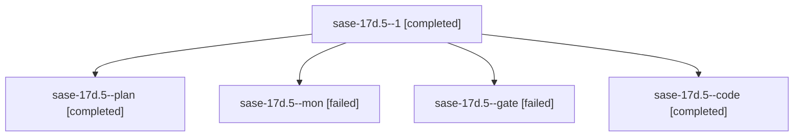

# Family: sase-17d.5

[Agent Hoods](../README.md) / [bbugyi200](../users/bbugyi200/README.md) / [athena](../users/bbugyi200/machines/athena/README.md) / [sase-17d](../users/bbugyi200/machines/athena/hoods/sase-17d/README.md) / sase-17d.5

Owner: `bbugyi200.athena` · Hood: `sase-17d` · Members: 5 · Bead: [sase-17d.5](https://github.com/sase-org/sase--beads/blob/main/pages/sase-17d/sase-17d.5.md)

## Lineage

The diagram is an optional enhancement; the ordered table below contains the same lineage in accessible text.

| Role | Agent | State | Model / provider | Timing | Commits | Prompt | Chat |
|---|---|---|---|---|---:|---|---|
| 1 | sase-17d.5--1 | completed | muse-spark-1.3-contributor / muse | 2026-09-24T11:57:26.221918+00:00 → 2026-09-24T12:29:43.862720+00:00 | [1](../agents/bbugyi200.athena.sase-17d.5--1/README.md#commits) | [Prompt](../agents/bbugyi200.athena.sase-17d.5--1/prompt.md) | [Chat](../agents/bbugyi200.athena.sase-17d.5--1/chat.md) |
| plan | sase-17d.5--plan | completed | opus / claude | 2026-09-24T11:26:53.779866+00:00 → 2026-09-24T11:53:33.163227+00:00 | 0 | [Prompt](../agents/bbugyi200.athena.sase-17d.5--plan/prompt.md) | [Chat](../agents/bbugyi200.athena.sase-17d.5--plan/chat.md) |
| mon | sase-17d.5--mon | failed | muse-spark-1.3-contributor / muse | 2026-09-24T11:53:09.419609+00:00 → 2026-09-24T11:57:26.280486+00:00 | 0 | — | [Chat](../agents/bbugyi200.athena.sase-17d.5--mon/chat.md) |
| gate | sase-17d.5--gate | failed | opus / claude | 2026-09-24T11:35:52.269005+00:00 → 2026-09-24T11:36:10.386405+00:00 | 0 | — | [Chat](../agents/bbugyi200.athena.sase-17d.5--gate/chat.md) |
| code | sase-17d.5--code | completed | muse-spark-1.3-contributor / muse | 2026-09-24T11:36:31.469613+00:00 → 2026-09-24T11:53:33.163227+00:00 | 0 | — | [Chat](../agents/bbugyi200.athena.sase-17d.5--code/chat.md) |

## Commits

| Role | Repo | Commit | Subject | Committed |
|---|---|---|---|---|
| 1 | sase | [`075225d`](https://github.com/sase-org/sase/commit/075225d53795b20eb18dd4a8f32a421ebaa8caad) | feat(ace): implement deck splits focus layout state machine | 2026-09-24 08:27:07 EDT |

## Neighbors

| Agent | Relation | State |
|---|---|---|
| [sase-17d.1](../agents/bbugyi200.athena.sase-17d.1/README.md) | sase-17d hood | completed |
| [sase-17d.10](../agents/bbugyi200.athena.sase-17d.10/README.md) | sase-17d hood | waiting |
| [sase-17d.11](../agents/bbugyi200.athena.sase-17d.11/README.md) | sase-17d hood | waiting |
| [sase-17d.2](bbugyi200.athena.sase-17d.2.md) (family · 3) | sase-17d hood | completed 2, failed 1 |
| [sase-17d.3](bbugyi200.athena.sase-17d.3.md) (family · 3) | sase-17d hood | completed 2, failed 1 |
| [sase-17d.4](../agents/bbugyi200.athena.sase-17d.4/README.md) | sase-17d hood | waiting |
| [sase-17d.6](bbugyi200.athena.sase-17d.6.md) (family · 5) | sase-17d hood | completed 3, failed 2 |
| [sase-17d.6](../agents/bbugyi200.athena.sase-17d.6/README.md) | sase-17d hood | waiting |
| [sase-17d.7](../agents/bbugyi200.athena.sase-17d.7/README.md) | sase-17d hood | completed |
| [sase-17d.8](bbugyi200.athena.sase-17d.8.md) (family · 3) | sase-17d hood | active 2, failed 1 |
| [sase-17d.8](../agents/bbugyi200.athena.sase-17d.8/README.md) | sase-17d hood | waiting |
| [sase-17d.9](../agents/bbugyi200.athena.sase-17d.9/README.md) | sase-17d hood | active |
| [sase-17d.land](../agents/bbugyi200.athena.sase-17d.land/README.md) | sase-17d hood | waiting |
