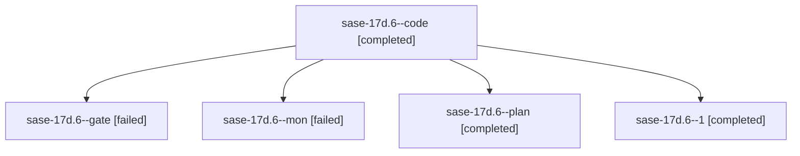

# Family: sase-17d.6

[Agent Hoods](../README.md) / [bbugyi200](../users/bbugyi200/README.md) / [athena](../users/bbugyi200/machines/athena/README.md) / [sase-17d](../users/bbugyi200/machines/athena/hoods/sase-17d/README.md) / sase-17d.6

Owner: `bbugyi200.athena` · Hood: `sase-17d` · Members: 5 · Bead: [sase-17d.6](https://github.com/sase-org/sase--beads/blob/main/pages/sase-17d/sase-17d.6.md)

## Lineage

The diagram is an optional enhancement; the ordered table below contains the same lineage in accessible text.

| Role | Agent | State | Model / provider | Timing | Commits | Prompt | Chat |
|---|---|---|---|---|---:|---|---|
| code | sase-17d.6--code | completed | muse-spark-1.3-contributor / muse | 2026-09-24T12:37:07.557086+00:00 → 2026-09-24T12:51:07.309533+00:00 | 0 | — | [Chat](../agents/bbugyi200.athena.sase-17d.6--code/chat.md) |
| gate | sase-17d.6--gate | failed | opus / claude | 2026-09-24T12:36:29.072732+00:00 → 2026-09-24T12:36:48.273813+00:00 | 0 | — | [Chat](../agents/bbugyi200.athena.sase-17d.6--gate/chat.md) |
| mon | sase-17d.6--mon | failed | muse-spark-1.3-contributor / muse | 2026-09-24T12:50:41.982524+00:00 → 2026-09-24T13:09:23.307885+00:00 | 0 | — | [Chat](../agents/bbugyi200.athena.sase-17d.6--mon/chat.md) |
| plan | sase-17d.6--plan | completed | opus / claude | 2026-09-24T12:29:27.109477+00:00 → 2026-09-24T12:51:07.309533+00:00 | 0 | [Prompt](../agents/bbugyi200.athena.sase-17d.6--plan/prompt.md) | [Chat](../agents/bbugyi200.athena.sase-17d.6--plan/chat.md) |
| 1 | sase-17d.6--1 | completed | muse-spark-1.3-contributor / muse | 2026-09-24T13:09:29.907768+00:00 → 2026-09-24T13:21:09.061965+00:00 | [1](../agents/bbugyi200.athena.sase-17d.6--1/README.md#commits) | [Prompt](../agents/bbugyi200.athena.sase-17d.6--1/prompt.md) | [Chat](../agents/bbugyi200.athena.sase-17d.6--1/chat.md) |

## Commits

| Role | Repo | Commit | Subject | Committed |
|---|---|---|---|---|
| 1 | sase | [`7d22725`](https://github.com/sase-org/sase/commit/7d2272588839582b01bcdeb789a26708ed0f1b8d) | feat(ace): retarget agents detail actions to focused deck panel | 2026-09-24 09:17:42 EDT |

## Neighbors

| Agent | Relation | State |
|---|---|---|
| [sase-17d.1](../agents/bbugyi200.athena.sase-17d.1/README.md) | sase-17d hood | completed |
| [sase-17d.10](../agents/bbugyi200.athena.sase-17d.10/README.md) | sase-17d hood | waiting |
| [sase-17d.11](../agents/bbugyi200.athena.sase-17d.11/README.md) | sase-17d hood | waiting |
| [sase-17d.2](bbugyi200.athena.sase-17d.2.md) (family · 3) | sase-17d hood | completed 2, failed 1 |
| [sase-17d.3](bbugyi200.athena.sase-17d.3.md) (family · 3) | sase-17d hood | completed 2, failed 1 |
| [sase-17d.4](../agents/bbugyi200.athena.sase-17d.4/README.md) | sase-17d hood | waiting |
| [sase-17d.5](bbugyi200.athena.sase-17d.5.md) (family · 5) | sase-17d hood | completed 3, failed 2 |
| [sase-17d.5](../agents/bbugyi200.athena.sase-17d.5/README.md) | sase-17d hood | waiting |
| [sase-17d.7](../agents/bbugyi200.athena.sase-17d.7/README.md) | sase-17d hood | completed |
| [sase-17d.8](bbugyi200.athena.sase-17d.8.md) (family · 3) | sase-17d hood | active 2, failed 1 |
| [sase-17d.8](../agents/bbugyi200.athena.sase-17d.8/README.md) | sase-17d hood | waiting |
| [sase-17d.9](../agents/bbugyi200.athena.sase-17d.9/README.md) | sase-17d hood | active |
| [sase-17d.land](../agents/bbugyi200.athena.sase-17d.land/README.md) | sase-17d hood | waiting |
