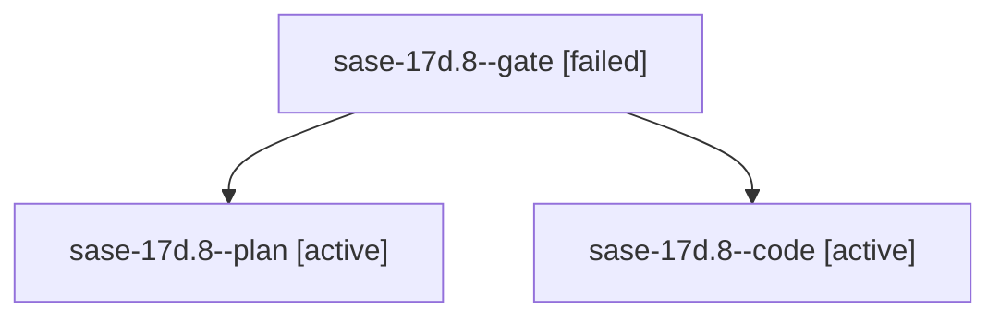

# Family: sase-17d.8

[Agent Hoods](../README.md) / [bbugyi200](../users/bbugyi200/README.md) / [athena](../users/bbugyi200/machines/athena/README.md) / [sase-17d](../users/bbugyi200/machines/athena/hoods/sase-17d/README.md) / sase-17d.8

Owner: `bbugyi200.athena` · Hood: `sase-17d` · Members: 3 · Bead: [sase-17d.8](https://github.com/sase-org/sase--beads/blob/main/pages/sase-17d/sase-17d.8.md)

## Lineage

The diagram is an optional enhancement; the ordered table below contains the same lineage in accessible text.

| Role | Agent | State | Model / provider | Timing | Commits | Prompt | Chat |
|---|---|---|---|---|---:|---|---|
| gate | sase-17d.8--gate | failed | opus / claude | 2026-09-24T12:57:09.095103+00:00 → 2026-09-24T12:57:27.564821+00:00 | 0 | — | [Chat](../agents/bbugyi200.athena.sase-17d.8--gate/chat.md) |
| plan | sase-17d.8--plan | active | opus / claude | 2026-09-24T12:51:09.502526+00:00 | 0 | [Prompt](../agents/bbugyi200.athena.sase-17d.8--plan/prompt.md) | [Chat](../agents/bbugyi200.athena.sase-17d.8--plan/chat.md) |
| code | sase-17d.8--code | active | muse-spark-1.3-contributor / muse | 2026-09-24T12:57:47.535399+00:00 | 0 | — | — |

## Neighbors

| Agent | Relation | State |
|---|---|---|
| [sase-17d.1](../agents/bbugyi200.athena.sase-17d.1/README.md) | sase-17d hood | completed |
| [sase-17d.10](../agents/bbugyi200.athena.sase-17d.10/README.md) | sase-17d hood | waiting |
| [sase-17d.11](../agents/bbugyi200.athena.sase-17d.11/README.md) | sase-17d hood | waiting |
| [sase-17d.2](bbugyi200.athena.sase-17d.2.md) (family · 3) | sase-17d hood | completed 2, failed 1 |
| [sase-17d.3](bbugyi200.athena.sase-17d.3.md) (family · 3) | sase-17d hood | completed 2, failed 1 |
| [sase-17d.4](../agents/bbugyi200.athena.sase-17d.4/README.md) | sase-17d hood | waiting |
| [sase-17d.5](bbugyi200.athena.sase-17d.5.md) (family · 5) | sase-17d hood | completed 3, failed 2 |
| [sase-17d.5](../agents/bbugyi200.athena.sase-17d.5/README.md) | sase-17d hood | waiting |
| [sase-17d.6](bbugyi200.athena.sase-17d.6.md) (family · 5) | sase-17d hood | completed 3, failed 2 |
| [sase-17d.6](../agents/bbugyi200.athena.sase-17d.6/README.md) | sase-17d hood | waiting |
| [sase-17d.7](../agents/bbugyi200.athena.sase-17d.7/README.md) | sase-17d hood | completed |
| [sase-17d.9](../agents/bbugyi200.athena.sase-17d.9/README.md) | sase-17d hood | active |
| [sase-17d.land](../agents/bbugyi200.athena.sase-17d.land/README.md) | sase-17d hood | waiting |
