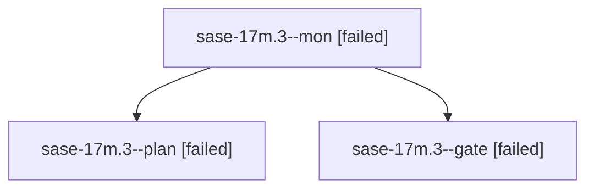

# Family: sase-17m.3

[Agent Hoods](../README.md) / [bbugyi200](../users/bbugyi200/README.md) / [athena](../users/bbugyi200/machines/athena/README.md) / [sase-17m](../users/bbugyi200/machines/athena/hoods/sase-17m/README.md) / sase-17m.3

Owner: `bbugyi200.athena` · Hood: `sase-17m` · Members: 3 · Bead: [sase-17m.3](https://github.com/sase-org/sase--beads/blob/main/pages/sase-17m/sase-17m.3.md)

## Lineage

The diagram is an optional enhancement; the ordered table below contains the same lineage in accessible text.

| Role | Agent | State | Model / provider | Timing | Commits | Prompt | Chat |
|---|---|---|---|---|---:|---|---|
| mon | sase-17m.3--mon | failed | opus / claude | 2026-09-24T06:56:36.302611+00:00 → 2026-09-24T06:59:48.694503+00:00 | 0 | — | [Chat](../agents/bbugyi200.athena.sase-17m.3--mon/chat.md) |
| plan | sase-17m.3--plan | failed | opus / claude | 2026-09-24T06:49:27.349149+00:00 → 2026-09-24T06:56:51.213479+00:00 | 0 | [Prompt](../agents/bbugyi200.athena.sase-17m.3--plan/prompt.md) | [Chat](../agents/bbugyi200.athena.sase-17m.3--plan/chat.md) |
| gate | sase-17m.3--gate | failed | opus / claude | 2026-09-24T06:55:57.674099+00:00 → 2026-09-24T06:56:37.770379+00:00 | 0 | — | [Chat](../agents/bbugyi200.athena.sase-17m.3--gate/chat.md) |

## Neighbors

| Agent | Relation | State |
|---|---|---|
| [sase-17m.3.1.1](../agents/bbugyi200.athena.sase-17m.3.1.1/README.md) | descendant | completed |
| [sase-17m.3.1.2](../agents/bbugyi200.athena.sase-17m.3.1.2/README.md) | descendant | completed |
| [sase-17m.3.1.3](../agents/bbugyi200.athena.sase-17m.3.1.3/README.md) | descendant | completed |
| [sase-17m.3.1.4](../agents/bbugyi200.athena.sase-17m.3.1.4/README.md) | descendant | completed |
| [sase-17m.3.1.5](../agents/bbugyi200.athena.sase-17m.3.1.5/README.md) | descendant | completed |
| [sase-17m.3.1.6](../agents/bbugyi200.athena.sase-17m.3.1.6/README.md) | descendant | completed |
| [sase-17m.3.1.7](../agents/bbugyi200.athena.sase-17m.3.1.7/README.md) | descendant | active |
| [sase-17m.3.1.land](../agents/bbugyi200.athena.sase-17m.3.1.land/README.md) | descendant | waiting |
| [sase-17m.1](../agents/bbugyi200.athena.sase-17m.1/README.md) | sase-17m hood | completed |
| [sase-17m.10](../agents/bbugyi200.athena.sase-17m.10/README.md) | sase-17m hood | waiting |
| [sase-17m.2](bbugyi200.athena.sase-17m.2.md) (family · 3) | sase-17m hood | failed 3 |
| [sase-17m.2.1.1](../agents/bbugyi200.athena.sase-17m.2.1.1/README.md) | sase-17m hood | active |
| [sase-17m.2.1.2](../agents/bbugyi200.athena.sase-17m.2.1.2/README.md) | sase-17m hood | active |
| [sase-17m.2.1.3](../agents/bbugyi200.athena.sase-17m.2.1.3/README.md) | sase-17m hood | active |
| [sase-17m.2.1.4](../agents/bbugyi200.athena.sase-17m.2.1.4/README.md) | sase-17m hood | active |
| [sase-17m.2.1.land](../agents/bbugyi200.athena.sase-17m.2.1.land/README.md) | sase-17m hood | active |
| [sase-17m.4](../agents/bbugyi200.athena.sase-17m.4/README.md) | sase-17m hood | waiting |
| [sase-17m.5](../agents/bbugyi200.athena.sase-17m.5/README.md) | sase-17m hood | waiting |
| [sase-17m.6](../agents/bbugyi200.athena.sase-17m.6/README.md) | sase-17m hood | waiting |
| [sase-17m.7](../agents/bbugyi200.athena.sase-17m.7/README.md) | sase-17m hood | waiting |
| [sase-17m.8](../agents/bbugyi200.athena.sase-17m.8/README.md) | sase-17m hood | waiting |
| [sase-17m.9](../agents/bbugyi200.athena.sase-17m.9/README.md) | sase-17m hood | waiting |
| [sase-17m.land](../agents/bbugyi200.athena.sase-17m.land/README.md) | sase-17m hood | waiting |
