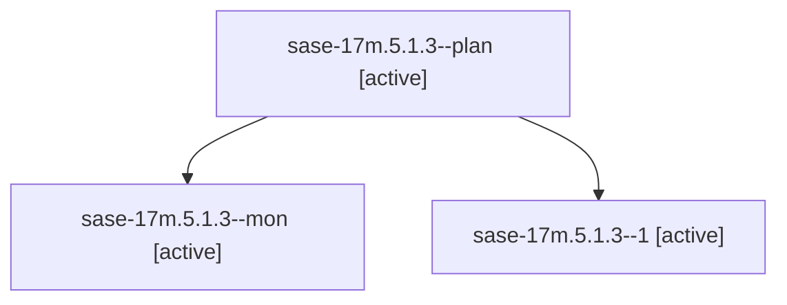

# Family: sase-17m.5.1.3

[Agent Hoods](../README.md) / [bbugyi200](../users/bbugyi200/README.md) / [athena](../users/bbugyi200/machines/athena/README.md) / [sase-17m](../users/bbugyi200/machines/athena/hoods/sase-17m/README.md) / sase-17m.5.1.3

Owner: `bbugyi200.athena` · Hood: `sase-17m` · Members: 3 · Bead: [sase-17m.5.1.3](https://github.com/sase-org/sase--beads/blob/main/pages/sase-17m/sase-17m.5.1.3.md)

## Lineage

The diagram is an optional enhancement; the ordered table below contains the same lineage in accessible text.

| Role | Agent | State | Model / provider | Timing | Commits | Prompt | Chat |
|---|---|---|---|---|---:|---|---|
| plan | sase-17m.5.1.3--plan | active | sonnet / claude | 2026-09-25T06:01:11.950394+00:00 | 0 | [Prompt](../agents/bbugyi200.athena.sase-17m.5.1.3--plan/prompt.md) | [Chat](../agents/bbugyi200.athena.sase-17m.5.1.3--plan/chat.md) |
| mon | sase-17m.5.1.3--mon | active | sonnet / claude | 2026-09-25T06:09:54.030996+00:00 | 0 | — | [Chat](../agents/bbugyi200.athena.sase-17m.5.1.3--mon/chat.md) |
| 1 | sase-17m.5.1.3--1 | active | sonnet / claude | 2026-09-25T06:14:37.738818+00:00 | [1](../agents/bbugyi200.athena.sase-17m.5.1.3--1/README.md#commits) | [Prompt](../agents/bbugyi200.athena.sase-17m.5.1.3--1/prompt.md) | [Chat](../agents/bbugyi200.athena.sase-17m.5.1.3--1/chat.md) |

## Commits

| Role | Repo | Commit | Subject | Committed |
|---|---|---|---|---|
| 1 | sase | [`f7cbb59`](https://github.com/sase-org/sase/commit/f7cbb59f3588c0dc2c921c0c06c17d7595365eb1) | refactor(agent-session): rename Artifacts-pane contract, row kinds, and completion kinds (sase-17m.5.1.3) | 2026-09-25 02:32:06 EDT |

## Neighbors

| Agent | Relation | State |
|---|---|---|
| [sase-17m.5](bbugyi200.athena.sase-17m.5.md) (family · 3) | ancestor | failed 3 |
| [sase-17m.5.1.1](../agents/bbugyi200.athena.sase-17m.5.1.1/README.md) | sase-17m.5.1 hood | active |
| [sase-17m.5.1.2](../agents/bbugyi200.athena.sase-17m.5.1.2/README.md) | sase-17m.5.1 hood | active |
| [sase-17m.5.1.4](bbugyi200.athena.sase-17m.5.1.4.md) (family · 5) | sase-17m.5.1 hood | active 5 |
| [sase-17m.5.1.5](../agents/bbugyi200.athena.sase-17m.5.1.5/README.md) | sase-17m.5.1 hood | active |
| [sase-17m.5.1.6.1](bbugyi200.athena.sase-17m.5.1.6.1.md) (family · 5) | sase-17m.5.1 hood | completed 3, failed 2 |
| [sase-17m.5.1.6.2](../agents/bbugyi200.athena.sase-17m.5.1.6.2/README.md) | sase-17m.5.1 hood | completed |
| [sase-17m.5.1.6.3](../agents/bbugyi200.athena.sase-17m.5.1.6.3/README.md) | sase-17m.5.1 hood | completed |
| [sase-17m.5.1.6.4](../agents/bbugyi200.athena.sase-17m.5.1.6.4/README.md) | sase-17m.5.1 hood | completed |
| [sase-17m.5.1.6.5.1](bbugyi200.athena.sase-17m.5.1.6.5.1.md) (family · 3) | sase-17m.5.1 hood | completed 2, failed 1 |
| [sase-17m.5.1.6.5.land](bbugyi200.athena.sase-17m.5.1.6.5.land.md) (family · 3) | sase-17m.5.1 hood | completed 2, failed 1 |
| [sase-17m.5.1.6.land](bbugyi200.athena.sase-17m.5.1.6.land.md) (family · 3) | sase-17m.5.1 hood | failed 3 |
| [sase-17m.5.1.land](bbugyi200.athena.sase-17m.5.1.land.md) (family · 3) | sase-17m.5.1 hood | active 3 |
| [sase-17m.1](../agents/bbugyi200.athena.sase-17m.1/README.md) | sase-17m hood | completed |
| [sase-17m.10](../agents/bbugyi200.athena.sase-17m.10/README.md) | sase-17m hood | waiting |
| [sase-17m.2](bbugyi200.athena.sase-17m.2.md) (family · 3) | sase-17m hood | failed 3 |
| [sase-17m.2.1.1](../agents/bbugyi200.athena.sase-17m.2.1.1/README.md) | sase-17m hood | active |
| [sase-17m.2.1.2](../agents/bbugyi200.athena.sase-17m.2.1.2/README.md) | sase-17m hood | active |
| [sase-17m.2.1.3](../agents/bbugyi200.athena.sase-17m.2.1.3/README.md) | sase-17m hood | active |
| [sase-17m.2.1.4](../agents/bbugyi200.athena.sase-17m.2.1.4/README.md) | sase-17m hood | active |
| [sase-17m.2.1.land](../agents/bbugyi200.athena.sase-17m.2.1.land/README.md) | sase-17m hood | active |
| [sase-17m.3](bbugyi200.athena.sase-17m.3.md) (family · 3) | sase-17m hood | failed 3 |
| [sase-17m.3.1.1](../agents/bbugyi200.athena.sase-17m.3.1.1/README.md) | sase-17m hood | active |
| [sase-17m.3.1.2](../agents/bbugyi200.athena.sase-17m.3.1.2/README.md) | sase-17m hood | active |
| [sase-17m.3.1.3](../agents/bbugyi200.athena.sase-17m.3.1.3/README.md) | sase-17m hood | active |
| [sase-17m.3.1.4](../agents/bbugyi200.athena.sase-17m.3.1.4/README.md) | sase-17m hood | active |
| [sase-17m.3.1.5](../agents/bbugyi200.athena.sase-17m.3.1.5/README.md) | sase-17m hood | active |
| [sase-17m.3.1.6](../agents/bbugyi200.athena.sase-17m.3.1.6/README.md) | sase-17m hood | active |
| [sase-17m.3.1.7](../agents/bbugyi200.athena.sase-17m.3.1.7/README.md) | sase-17m hood | active |
| [sase-17m.3.1.land](../agents/bbugyi200.athena.sase-17m.3.1.land/README.md) | sase-17m hood | active |
| [sase-17m.4](bbugyi200.athena.sase-17m.4.md) (family · 3) | sase-17m hood | failed 3 |
| [sase-17m.4.1.1](../agents/bbugyi200.athena.sase-17m.4.1.1/README.md) | sase-17m hood | active |
| [sase-17m.4.1.2](../agents/bbugyi200.athena.sase-17m.4.1.2/README.md) | sase-17m hood | active |
| [sase-17m.4.1.3](../agents/bbugyi200.athena.sase-17m.4.1.3/README.md) | sase-17m hood | active |
| [sase-17m.4.1.4](../agents/bbugyi200.athena.sase-17m.4.1.4/README.md) | sase-17m hood | active |
| [sase-17m.4.1.5](../agents/bbugyi200.athena.sase-17m.4.1.5/README.md) | sase-17m hood | active |
| [sase-17m.4.1.6](../agents/bbugyi200.athena.sase-17m.4.1.6/README.md) | sase-17m hood | active |
| [sase-17m.4.1.7](../agents/bbugyi200.athena.sase-17m.4.1.7/README.md) | sase-17m hood | active |
| [sase-17m.4.1.8](../agents/bbugyi200.athena.sase-17m.4.1.8/README.md) | sase-17m hood | active |
| [sase-17m.4.1.land](../agents/bbugyi200.athena.sase-17m.4.1.land/README.md) | sase-17m hood | active |
| [sase-17m.6](../agents/bbugyi200.athena.sase-17m.6/README.md) | sase-17m hood | completed |
| [sase-17m.7](bbugyi200.athena.sase-17m.7.md) (family · 3) | sase-17m hood | completed 2, failed 1 |
| [sase-17m.8](../agents/bbugyi200.athena.sase-17m.8/README.md) | sase-17m hood | completed |
| [sase-17m.9](../agents/bbugyi200.athena.sase-17m.9/README.md) | sase-17m hood | active |
| [sase-17m.land](../agents/bbugyi200.athena.sase-17m.land/README.md) | sase-17m hood | waiting |
